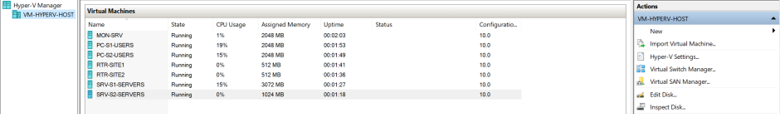
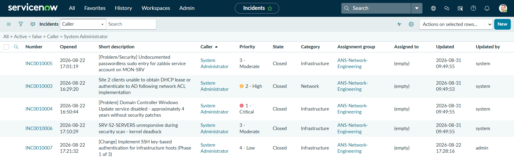

# IT Infrastructure Portfolio Lab

**4-phase Azure-hosted Hyper-V lab**  
Network → Servers → Monitoring → Security

A two-site Windows and Linux infrastructure lab covering routing, directory services, monitoring, and security in one connected environment.

---

## Overview

This repository documents a two-site infrastructure lab running as nested virtualization on an Azure Hyper-V host. I built the environment in four phases, with each phase adding to the same design rather than starting over.

The documentation includes the design choices, configuration steps, verification results, and troubleshooting from each phase.

## Quick Look

- Built a two-site VLAN network with 802.1Q trunking, inter-VLAN routing, static routing between sites, DHCP relay, and default-deny UFW rules on both routers
- Configured Windows Server 2022 for Active Directory Domain Services, DNS, and DHCP, with Windows clients and a Linux server joined to the domain
- Set up cross-platform file sharing with Samba and Active Directory group-based access
- Deployed Zabbix 7.0 LTS across all 7 lab VMs, including custom service and network monitoring
- Integrated Zabbix with ServiceNow through REST for automatic incident creation
- Added SSH key-only authentication, default-deny router rules, service-account cleanup, and ServiceNow incident documentation

---

## Architecture


*Final topology across both sites, including VLANs, routing, core services, and monitoring relationships.*

### Final Inventory

| Device | OS | Role / Key Services | IP / Addressing |
|---|---|---|---|
| RTR-SITE1 | Ubuntu Server | Site 1 router, VLAN sub-interfaces, DHCP relay, UFW ACLs | 10.10.11.1 / 10.10.12.1 / 10.10.0.1 |
| RTR-SITE2 | Ubuntu Server | Site 2 router, VLAN sub-interfaces, DHCP relay, UFW ACLs | 10.10.21.1 / 10.10.22.1 / 10.10.0.2 |
| PC-S1-USERS | Windows 11 | Domain-joined client, DHCP | 10.10.11.100 (DHCP) |
| SRV-S1-SERVERS | Windows Server 2022 | Domain Controller, DNS, DHCP, SMB, time source | 10.10.12.10 (static) |
| PC-S2-USERS | Windows 11 | Domain-joined client, DHCP via relay | 10.10.21.100 (DHCP) |
| SRV-S2-SERVERS | Ubuntu Server | Domain member (SSSD), Samba, chrony | 10.10.22.10 (static) |
| MON-SRV | Ubuntu Server | Zabbix 7.0 LTS + MySQL | 10.10.12.20 (static) |

**Domain:** `ans.local`  
**Addressing:** the third octet identifies the site and VLAN (`11` = Site 1 / VLAN 10)



*All 7 lab VMs running in Hyper-V Manager.*

---

## Project Phases

### Phase 1 — Network

Built the routed foundation for both sites using VLAN segmentation, 802.1Q trunks, Ubuntu router sub-interfaces, and static routing across the WAN link.

[Design decisions](phase1-network/01-decisions.md) · [Build log](phase1-network/02-build-log.md) · [Phase summary](phase1-network/03-phase-summary.md)

### Phase 2 — Servers

Added Active Directory Domain Services, AD-integrated DNS, centralized DHCP, time synchronization, Windows domain joins, a Linux domain member using SSSD, and cross-platform Samba file sharing.

[Design decisions](phase2-servers/01-decisions.md) · [Build log](phase2-servers/02-build-log.md) · [Phase summary](phase2-servers/03-phase-summary.md)

### Phase 3 — Monitoring

Deployed Zabbix 7.0 LTS across the lab and added monitoring for host availability, core services, DHCP, DNS, WAN latency and packet loss. Zabbix was also integrated with ServiceNow through REST for automatic incident creation.

[Design decisions](phase3-monitoring/01-decisions.md) · [Build log](phase3-monitoring/02-build-log.md) · [Phase summary](phase3-monitoring/03-phase-summary.md)


*Zabbix dashboard with all 7 lab hosts reporting.*

### Phase 4 — Security

Hardened the environment with router allow-lists and default-deny rules, SSH key-only authentication, and service-account cleanup. ServiceNow was also used to document and resolve incidents tied to the lab scenarios.

[Design decisions](phase4-security/01-decisions.md) · [Build log](phase4-security/02-build-log.md) · [Phase summary](phase4-security/03-phase-summary.md)



*ServiceNow incident records documenting lab issues and their resolution.*

---

## Technical Areas Covered

| Area | Work Completed |
|---|---|
| Networking | IPv4 addressing, subnetting, VLANs, 802.1Q trunking, inter-VLAN routing, static routing, DHCP relay |
| Windows Server | Active Directory Domain Services, AD-integrated DNS, DHCP, SMB, domain time |
| Linux Administration | Ubuntu Server, realmd/SSSD, Kerberos, Samba, chrony, SSH |
| Monitoring | Zabbix 7.0 LTS, agents, custom items and triggers, service checks, WAN latency and packet loss |
| ServiceNow | REST integration for Zabbix-triggered incidents, incident documentation and resolution |
| Security | UFW allow-lists, default-deny routing policy, SSH key authentication, service-account cleanup |
| Virtualization | Azure-hosted Hyper-V, nested virtualization, virtual switches, VLAN trunking, Dynamic Memory |
| Documentation | Design decisions, build logs, verification evidence, troubleshooting, final handover |

---

## Repository Layout

```text
/
├── README.md
├── screenshots/
│   ├── hyperv-manager.png
│   ├── servicenow-incidents.png
│   ├── topology.svg
│   └── zabbix-dashboard.png
├── phase1-network/
│   ├── 01-decisions.md
│   ├── 02-build-log.md
│   ├── 03-phase-summary.md
│   └── screenshots/
├── phase2-servers/
│   ├── 01-decisions.md
│   ├── 02-build-log.md
│   ├── 03-phase-summary.md
│   └── screenshots/
├── phase3-monitoring/
│   ├── 01-decisions.md
│   ├── 02-build-log.md
│   ├── 03-phase-summary.md
│   └── screenshots/
├── phase4-security/
│   ├── 01-decisions.md
│   ├── 02-build-log.md
│   ├── 03-phase-summary.md
│   └── screenshots/
└── docs/
    ├── final_handover.md
    └── notable-issues.md
```

The phase folders contain the detailed build work. For a shorter review, the best supporting documents are:

- [Notable issues](docs/notable-issues.md) — selected troubleshooting cases from across the project
- [Final handover](docs/final_handover.md) — final inventory, service details, verification steps, and lab scope

---

## Lab Scope

This is a portfolio lab running as nested virtualization on a 16 GB Azure Hyper-V host. The final environment was tested with all 7 VMs running together.

Detailed limitations and final verification steps are documented in [docs/final_handover.md](docs/final_handover.md).

---

## Why I Built This

I built this project to demonstrate the practical skills I’ve developed across networking and systems administration. The lab brings together routing, Windows Server, Linux, monitoring, and security in one working environment, with the design decisions, verification, and troubleshooting documented throughout.

**Contact:** [LinkedIn](https://www.linkedin.com/in/surosh-khaliqi/) · [Email](mailto:khaliqi.surosh@gmail.com)
