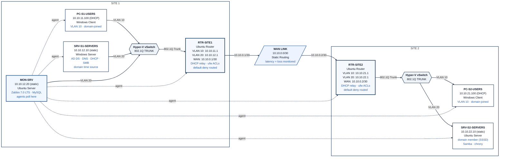

# IT Infrastructure Portfolio Project

**4-phase nested lab on Azure Hyper-V**  
Network → Servers → Monitoring → Security & Automation

A complete, self-directed infrastructure lab built as a portfolio piece for entry-level IT, junior systems administrator, and NOC-adjacent roles.

---

## Overview

This project documents a multi-site Windows + Linux environment that was designed, built, monitored, and hardened from scratch. It was never intended to be production infrastructure. It was built to prove practical skills, real troubleshooting ability, and clean documentation habits.

The lab runs as nested virtualization on an Azure Hyper-V host and progresses through four deliberate phases:

1. **Network** — routed multi-site topology with VLANs and 802.1Q trunking  
2. **Servers** — Active Directory, DNS, DHCP, cross-platform domain join, and file shares  
3. **Monitoring** — Zabbix coverage of every host and core service, plus ServiceNow integration  
4. **Security & Automation** — router ACLs, service-account hygiene, SSH hardening, and structured incident documentation

Every phase ends with verification evidence and an honest list of lab limitations. The troubleshooting sections deliberately keep the failed attempts and wrong turns — they are part of the learning record, not polished away.

---

## Architecture



This is the final as-built state after all four phases. Every major service, the monitoring relationships, and the ACL boundaries are shown.

**Final inventory (7 VMs)**

| Device            | OS                  | Role / Key Services                                      | IP / Addressing                  |
|-------------------|---------------------|----------------------------------------------------------|----------------------------------|
| RTR-SITE1         | Ubuntu Server       | Site 1 router, VLAN sub-interfaces, DHCP relay, ufw ACLs | 10.10.11.1 / 10.10.12.1 / 10.10.0.1 |
| RTR-SITE2         | Ubuntu Server       | Site 2 router, VLAN sub-interfaces, DHCP relay, ufw ACLs | 10.10.21.1 / 10.10.22.1 / 10.10.0.2 |
| PC-S1-USERS       | Windows 11          | Domain-joined client, DHCP                               | 10.10.11.100 (DHCP)             |
| SRV-S1-SERVERS    | Windows Server 2022 | Domain Controller, DNS, DHCP, SMB share, time source     | 10.10.12.10 (static)            |
| PC-S2-USERS       | Windows 11          | Domain-joined client, DHCP via relay                     | 10.10.21.100 (DHCP)             |
| SRV-S2-SERVERS    | Ubuntu Server       | Domain member (SSSD), Samba share, chrony                | 10.10.22.10 (static)            |
| MON-SRV           | Ubuntu Server       | Zabbix 7.0 LTS + MySQL                                   | 10.10.12.20 (static)            |

Domain: `ans.local`  
Addressing scheme: third octet encodes `{site}{vlan}` (e.g. 11 = Site 1 / VLAN 10)

---

## Skills Demonstrated

| Skill                                      | Primary Phase | Evidence |
|--------------------------------------------|---------------|----------|
| IP addressing & subnet design              | Phase 1       | [phase1-network/01-decisions.md](phase1-network/01-decisions.md) |
| Static routing + multi-hop verification    | Phase 1       | [phase1-network/02-build-log.md](phase1-network/02-build-log.md) |
| VLAN segmentation & 802.1Q trunking        | Phase 1       | [phase1-network/01-decisions.md](phase1-network/01-decisions.md) · [02-build-log.md](phase1-network/02-build-log.md) |
| Active Directory Domain Services           | Phase 2       | [phase2-servers/01-decisions.md](phase2-servers/01-decisions.md) |
| AD-integrated DNS (forward + reverse)      | Phase 2       | [phase2-servers/02-build-log.md](phase2-servers/02-build-log.md) |
| DHCP scopes + relay across WAN             | Phase 2       | [phase2-servers/01-decisions.md](phase2-servers/01-decisions.md) · [02-build-log.md](phase2-servers/02-build-log.md) |
| Linux domain join (realmd / SSSD)          | Phase 2       | [phase2-servers/02-build-log.md](phase2-servers/02-build-log.md) |
| Cross-platform file shares + AD group ACLs | Phase 2       | [phase2-servers/02-build-log.md](phase2-servers/02-build-log.md) |
| Zabbix server + agent deployment           | Phase 3       | [phase3-monitoring/01-decisions.md](phase3-monitoring/01-decisions.md) |
| Custom items, triggers, and alerting       | Phase 3       | [phase3-monitoring/02-build-log.md](phase3-monitoring/02-build-log.md) |
| ServiceNow REST integration                | Phase 3       | [phase3-monitoring/01-decisions.md](phase3-monitoring/01-decisions.md) · [02-build-log.md](phase3-monitoring/02-build-log.md) |
| Router ACLs (ufw allow-list + default deny)| Phase 4       | [phase4-security/01-decisions.md](phase4-security/01-decisions.md) |
| SSH key-only hardening                     | Phase 4       | [phase4-security/02-build-log.md](phase4-security/02-build-log.md) |
| Service-account hygiene & policy fixes     | Phase 4       | [phase4-security/02-build-log.md](phase4-security/02-build-log.md) |
| Structured incident documentation (ITIL)   | Phase 4       | [phase4-security/02-build-log.md](phase4-security/02-build-log.md) |
| Cross-platform administration (Win + Linux)| All phases    | Throughout |
| Technical documentation & decision records | All phases    | Every `01-decisions.md` and `03-phase-summary.md` |

---

## Repository Structure

```
/
├── README.md                          ← you are here
├── phase1-network/
│   ├── 01-decisions.md
│   ├── 02-build-log.md
│   ├── 03-phase-summary.md
│   └── screenshots/
├── phase2-servers/
│   ├── 01-decisions.md
│   ├── 02-build-log.md
│   ├── 03-phase-summary.md
│   └── screenshots/
├── phase3-monitoring/
│   ├── 01-decisions.md
│   ├── 02-build-log.md
│   ├── 03-phase-summary.md
│   └── screenshots/
├── phase4-security/
│   ├── 01-decisions.md
│   ├── 02-build-log.md
│   ├── 03-phase-summary.md
│   └── screenshots/
└── docs/
    ├── final-handover.md
    └── notable-issues.md
```

- [phase1-network/](phase1-network/)
- [phase2-servers/](phase2-servers/)
- [phase3-monitoring/](phase3-monitoring/)
- [phase4-security/](phase4-security/)
- [docs/final-handover.md](docs/final-handover.md) — end-state inventory + verification procedure
- [docs/notable-issues.md](docs/notable-issues.md) — curated troubleshooting stories across all phases

**Suggested reading order**

1. This README (orientation + skills map)  
2. Any phase’s `01-decisions.md` (design reasoning)  
3. The matching `02-build-log.md` (how it was actually built and validated)  
4. [docs/notable-issues.md](docs/notable-issues.md) (best troubleshooting stories)  
5. [docs/final-handover.md](docs/final-handover.md) (complete as-built reference)

---

## Lab Context & Limitations

This is a nested virtualization lab on a 16 GB Azure Hyper-V host. Memory constraints required Dynamic Memory and selective power-on of VMs during testing. Those constraints are documented honestly in every phase summary.

Key deliberate scope decisions (not oversights):

- Single Domain Controller — no redundancy by design  
- Static routing only (dynamic routing was a stretch goal left unimplemented)  
- Site 2 depends on the WAN link for directory, DNS, and DHCP services  
- Router ACLs are host/port allow-lists, not full Zero-Trust  
- Temporary NAT adapters used during agent installs were left in place for continuity and are noted for cleanup

Full consolidated limitations and the complete service inventory live in `docs/final-handover.md`.

---

## Why This Exists

The project was built to answer a practical question: can someone who is still early in their career design a coherent multi-site environment, stand it up, monitor it, harden it, and document the whole process clearly enough that a technical interviewer can trust the work?

The answer is in the phase folders.
