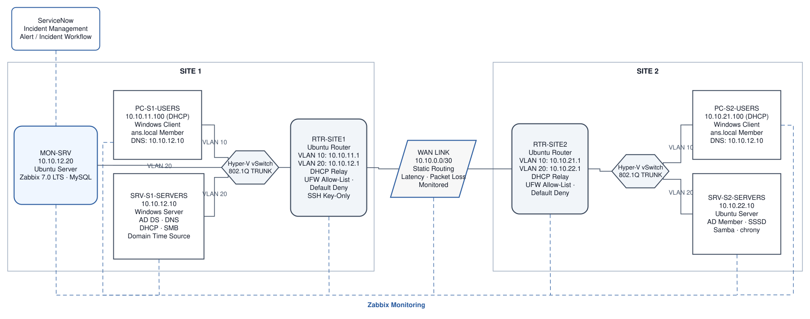

# Final Handover — IT Infrastructure Portfolio Lab

**Purpose:** This document records the final state of the lab after all four phases. It covers the network layout, systems and services, verification steps, known constraints, and remaining configuration.

The lab runs as nested virtualization on an Azure Hyper-V host. It is a portfolio environment rather than a production deployment.

---

## 1. As-Built Architecture



*Final as-built topology across both sites, including VLAN segmentation, routing, core services, monitoring relationships, and router filtering.*

The environment has two sites connected by a point-to-point WAN link. Each site has a Users VLAN (10) and a Servers VLAN (20) carried through Hyper-V virtual switches. Routing between VLANs and sites is static. Both Ubuntu routers use UFW route allow-lists with default-deny routed traffic, and Zabbix monitors all seven lab VMs from MON-SRV.

---

## 2. Device Inventory

| Device | OS | Role / Key Services | Addressing |
|---|---|---|---|
| RTR-SITE1 | Ubuntu Server | Site 1 router, VLAN sub-interfaces, DHCP relay, UFW route allow-list | 10.10.11.1 / 10.10.12.1 / 10.10.0.1 |
| RTR-SITE2 | Ubuntu Server | Site 2 router, VLAN sub-interfaces, DHCP relay, UFW route allow-list | 10.10.21.1 / 10.10.22.1 / 10.10.0.2 |
| PC-S1-USERS | Windows 11 | Domain-joined client | 10.10.11.100 (DHCP) |
| SRV-S1-SERVERS | Windows Server 2022 | Domain Controller, DNS, DHCP, SMB share, time source | 10.10.12.10 (static) |
| PC-S2-USERS | Windows 11 | Domain-joined client | 10.10.21.100 (DHCP) |
| SRV-S2-SERVERS | Ubuntu Server | Domain member (SSSD), Samba share, chrony | 10.10.22.10 (static) |
| MON-SRV | Ubuntu Server | Zabbix 7.0 LTS + MySQL | 10.10.12.20 (static) |

**Domain:** `ans.local`  
**DHCP note:** Client addresses shown are the leases observed during final validation. They remain dynamic within their configured scopes.

---

## 3. Network & Addressing

| Segment | Subnet | Gateway | Addressing |
|---|---|---|---|
| VLAN 10 — Users, Site 1 | 10.10.11.0/24 | 10.10.11.1 | DHCP (10.10.11.100–200) |
| VLAN 20 — Servers, Site 1 | 10.10.12.0/24 | 10.10.12.1 | Static |
| WAN link | 10.10.0.0/30 | — | Static (RTR-SITE1 .1, RTR-SITE2 .2) |
| VLAN 10 — Users, Site 2 | 10.10.21.0/24 | 10.10.21.1 | DHCP via relay (10.10.21.100–200) |
| VLAN 20 — Servers, Site 2 | 10.10.22.0/24 | 10.10.22.1 | Static |

The third octet follows a `{site}{vlan}` pattern: `11` = Site 1 / VLAN 10, `22` = Site 2 / VLAN 20.

### Hyper-V virtual switches

- `vSwitch-S1` — Site 1 trunk carrying VLANs 10 and 20
- `vSwitch-S2` — Site 2 trunk carrying VLANs 10 and 20
- `vSwitch-WAN` — untagged point-to-point WAN link

---

## 4. Services, Ports & Accounts

### 4.1 Core services by host

| Host | Services / Roles |
|---|---|
| SRV-S1-SERVERS | AD DS, AD-integrated DNS, DHCP Server for both user scopes, SMB share (`TechShare`), W32Time (Stratum 1) |
| SRV-S2-SERVERS | Domain member (realmd/SSSD), Samba share (`techshare`), chrony synchronized to the DC |
| RTR-SITE1 | Static routing, VLAN sub-interfaces, `isc-dhcp-relay`, UFW route allow-list |
| RTR-SITE2 | Static routing, VLAN sub-interfaces, `isc-dhcp-relay`, UFW route allow-list |
| MON-SRV | Zabbix 7.0 LTS server + agent, MySQL, Apache |
| PC-S1-USERS | Domain-joined Windows client |
| PC-S2-USERS | Domain-joined Windows client |

### 4.2 Notable listening ports

The following ports were observed during the Phase 4 audit.

| Host | Notable open ports |
|---|---|
| RTR-SITE1 / RTR-SITE2 | 22 (SSH), 10050 (Zabbix agent) |
| PC-S1-USERS / PC-S2-USERS | 135, 139, 445, 5040 (CDPSvc), 10050 + dynamic RPC |
| SRV-S1-SERVERS | 53, 88, 135, 139, 389, 445, 464, 593, 636, 3268, 3269, 5985, 9389, 10050 + dynamic RPC |
| SRV-S2-SERVERS | 22, 139/445 (Samba), 10050 |
| MON-SRV | 22, 80, 3306, 10050, 10051 |

Port `33060` (MySQL X Protocol) was observed on MON-SRV during the audit and disabled in Phase 4. Port `5040` on the Windows clients is CDPSvc and was left running.

### 4.3 Accounts & groups

| Type | Name / Detail | Notes |
|---|---|---|
| Domain | `ans.local` | Single domain, single DC |
| Sample users | `s1.user`, `s2.user` | Site 1 / Site 2 user OUs |
| Security groups | `SG-FileShare-ReadWrite`, `SG-FileShare-ReadOnly` | Control access to the Windows and Samba shares |
| Linux local | `netadmin` | Present on both routers and SRV-S2-SERVERS |
| SSH | Key-only authentication on RTR-SITE1 | Password authentication rejected |
| Service account | `zabbix` (MON-SRV) | Passwordless sudo grant for `nmap` removed in Phase 4 |
| ServiceNow | `monitoring-integration` | Integration account with platform roles `itil` and `rest_service` |

AD organizational units: `Site1/Users`, `Site1/Servers`, `Site2/Users`, `Site2/Servers`, plus a top-level `Groups` OU.

Passwords, API credentials, app passwords, and other secrets are intentionally excluded from the repository.

---

## 5. Environment Verification

Run the following checks in order. Dynamic Memory is enabled across the lab. Selective VM power-on was used during some memory-constrained testing, while final Phase 4 validation confirmed all seven VMs running and reachable together.

### 5.1 Network foundation

1. Confirm IP forwarding on both routers:

   ```bash
   sysctl net.ipv4.ip_forward
   ```

   Expected: `net.ipv4.ip_forward = 1`

2. From a Users-VLAN client, ping:
   - its local gateway
   - the opposite-site gateway
   - a host on the far Servers VLAN

3. Confirm the routed UFW policy on both routers:

   ```bash
   sudo ufw status verbose
   ```

   Expected: default-deny routed traffic with the documented allow-list present.

### 5.2 Directory, DNS & DHCP

1. On SRV-S1-SERVERS:

   ```powershell
   Get-Service NTDS, DNS, DHCPServer, Netlogon
   Get-DhcpServerv4Lease -ScopeId 10.10.11.0
   Get-DhcpServerv4Lease -ScopeId 10.10.21.0
   ```

2. From a domain-joined client:

   ```powershell
   nltest /dsgetdc:ans.local
   nslookup srv-s1-servers.ans.local
   nslookup srv-s2-servers.ans.local
   ```

3. Renew DHCP on a Users-VLAN client and confirm:
   - a lease from the correct scope
   - the correct default gateway
   - DNS server `10.10.12.10`

### 5.3 Time synchronization

On SRV-S1-SERVERS:

```powershell
w32tm /query /status
```

On SRV-S2-SERVERS:

```bash
chronyc tracking
chronyc sources -v
```

Expected: SRV-S1-SERVERS reports Stratum 1 and SRV-S2-SERVERS reports Stratum 2, synchronized to `10.10.12.10` with a small offset.

### 5.4 File shares

From a domain-joined client, test access with the documented ReadWrite and ReadOnly accounts:

- `\\SRV-S1-SERVERS\TechShare`
- `\\SRV-S2-SERVERS\techshare`

Expected:
- ReadWrite user can create or modify files
- ReadOnly user can read but cannot write

### 5.5 Monitoring

1. Open the Zabbix web UI on MON-SRV.
2. Confirm all seven hosts show healthy agent availability.
3. Check Latest data for:
   - NTDS, DNS, Netlogon
   - DHCP Server
   - W32Time
   - chrony
   - `smbd` / `nmbd`
   - DHCP lease counts
4. Confirm the `network-links` host object is reporting WAN latency and packet loss.

### 5.6 ServiceNow integration

Phase 3 validated the Zabbix-to-ServiceNow REST path using the `monitoring-integration` account.

1. Confirm the ServiceNow developer instance is reachable from MON-SRV.
2. Confirm the integration configuration still points to the current instance.
3. If the REST path is retested, verify the created incident has the expected category, subcategory, and assignment group.

Integration credentials are not stored in the repository.

### 5.7 SSH hardening — RTR-SITE1

```bash
ssh -o PreferredAuthentications=publickey -o PasswordAuthentication=no netadmin@10.10.0.1 "echo KEY-OK"
ssh -o PreferredAuthentications=password -o PubkeyAuthentication=no netadmin@10.10.0.1
```

Expected:
- key-based login succeeds
- password-only login returns `Permission denied (publickey)`

### 5.8 Domain Controller policy baseline

```powershell
Get-Service wuauserv
Get-ADDefaultDomainPasswordPolicy | Select LockoutThreshold
```

Expected:
- Windows Update service: Running / Automatic
- Lockout threshold: `5`

---

## 6. Known Scope & Constraints

### Architecture

- The lab has one Domain Controller. SRV-S1-SERVERS also hosts DNS, DHCP, and the Windows file share.
- Site 2 has no local Domain Controller or DHCP server. Loss of the WAN link affects authentication, DNS, and DHCP renewal for Site 2.
- Routing is static; no dynamic routing protocol was implemented.
- There is no router or WAN-link redundancy.

### Monitoring

- MON-SRV is the only monitoring server; there is no monitoring high availability.
- MON-SRV uses destination-specific `/32` routes for the external services required by email and the ServiceNow API. ServiceNow destination IPs can change, so these routes may need to be updated.

### Security

- Router filtering uses host/port allow-lists with default-deny routed traffic. It is not identity-aware or application-layer filtering.
- SSH key-only authentication was implemented on RTR-SITE1. Other Linux hosts still accept password authentication.
- Windows Firewall is enabled on the three Windows hosts with the rules required for AD, DNS, DHCP, file sharing, ICMP, and Zabbix. Broader endpoint hardening was outside the scope of the lab.

### Operational

- The Hyper-V host has 16 GB of memory and uses Dynamic Memory. Selective power-on was used for some tests to reduce memory pressure; final Phase 4 validation confirmed all seven VMs running and reachable together.
- SSSD dynamic DNS registration for SRV-S2-SERVERS was not reliable in this lab. Its A record was added manually.
- In the ServiceNow PDI used for the project, separate Problem and Change modules were unavailable. Phase 4 scenarios were documented in Incident records using type prefixes to preserve the intended classification.

---

## 7. Remaining Configuration & External Access

### 7.1 Windows TempNAT configuration

The following items were introduced during Phase 3 for package downloads and agent installation and remain in place for continuity:

- TempNAT adapters on SRV-S1-SERVERS, PC-S1-USERS, and PC-S2-USERS
- persistent split-default routes on those three Windows hosts
- the more-specific `10.10.0.0/16` exception route that keeps internal lab traffic on the correct interface

These items do not affect internal lab traffic while the exception routes remain in place.

### 7.2 MON-SRV external egress

MON-SRV uses an additional NAT-facing interface for outbound access required by monitoring integrations. Its external traffic is limited with destination-specific `/32` routes rather than a general-purpose default route.

This path is used for:
- email notifications
- the ServiceNow API

These routes are part of the final operating configuration rather than a leftover installation artifact. If the ServiceNow developer-instance destination changes, the related `/32` route may need to be refreshed.

---

## 8. Document Control

This handover reflects the final state after Phase 4 validation.

The phase documents remain the detailed source for design decisions, build steps, verification evidence, and troubleshooting:

- [Phase 1 — Network](../phase1-network/)
- [Phase 2 — Servers](../phase2-servers/)
- [Phase 3 — Monitoring](../phase3-monitoring/)
- [Phase 4 — Security](../phase4-security/)

For selected troubleshooting cases across the project, see [notable-issues.md](notable-issues.md).

Return to the [project README](../README.md).
