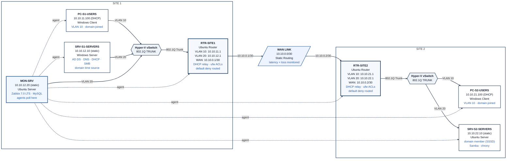

# Final Handover — IT Infrastructure Portfolio Project

**Purpose:** This document is the single end-state reference for the complete lab environment after all four phases. It is written for an administrator who must understand, verify, and operate the environment without the original builder present.

The lab is a nested virtualization environment on an Azure Hyper-V host. It is not production infrastructure. All design decisions, limitations, and residual temporary artifacts are stated explicitly.

---

## 1. As-Built Architecture



Two sites connected by a point-to-point WAN link. Each site has a Users VLAN (10) and a Servers VLAN (20) trunked via Hyper-V virtual switches. Routing is static. Both routers enforce an explicit ufw route allow-list with default-deny for inter-VLAN and inter-site traffic. Zabbix agents run on every host and report to MON-SRV.

---

## 2. Device Inventory

| Device            | OS                  | Role / Key Services                                      | Addressing                          |
|-------------------|---------------------|----------------------------------------------------------|-------------------------------------|
| RTR-SITE1         | Ubuntu Server       | Site 1 router, VLAN sub-interfaces, DHCP relay, ufw ACLs | 10.10.11.1 / 10.10.12.1 / 10.10.0.1 |
| RTR-SITE2         | Ubuntu Server       | Site 2 router, VLAN sub-interfaces, DHCP relay, ufw ACLs | 10.10.21.1 / 10.10.22.1 / 10.10.0.2 |
| PC-S1-USERS       | Windows 11          | Domain-joined client                                     | 10.10.11.100 (DHCP)                 |
| SRV-S1-SERVERS    | Windows Server 2022 | Domain Controller, DNS, DHCP, SMB share, time source     | 10.10.12.10 (static)                |
| PC-S2-USERS       | Windows 11          | Domain-joined client                                     | 10.10.21.100 (DHCP)                 |
| SRV-S2-SERVERS    | Ubuntu Server       | Domain member (SSSD), Samba share, chrony                | 10.10.22.10 (static)                |
| MON-SRV           | Ubuntu Server       | Zabbix 7.0 LTS + MySQL                                   | 10.10.12.20 (static)                |

Domain: `ans.local`  
DHCP client addresses shown are the leased values observed during final validation; they are dynamic within the defined scopes.

---

## 3. Network & Addressing Summary

| Segment                  | Subnet         | Gateway     | Addressing rule                          |
|--------------------------|----------------|-------------|------------------------------------------|
| VLAN 10 – Users, Site 1  | 10.10.11.0/24  | 10.10.11.1  | DHCP (scope 10.10.11.100–200)            |
| VLAN 20 – Servers, Site 1| 10.10.12.0/24  | 10.10.12.1  | Static only                              |
| WAN link                 | 10.10.0.0/30   | —           | Static (RTR-SITE1 .1, RTR-SITE2 .2)      |
| VLAN 10 – Users, Site 2  | 10.10.21.0/24  | 10.10.21.1  | DHCP via relay (scope 10.10.21.100–200)  |
| VLAN 20 – Servers, Site 2| 10.10.22.0/24  | 10.10.22.1  | Static only                              |

Third-octet scheme encodes `{site}{vlan}` (11 = Site 1 / VLAN 10, 22 = Site 2 / VLAN 20).

Hyper-V virtual switches:
- `vSwitch-S1` — trunked (VLANs 10 + 20), Site 1
- `vSwitch-S2` — trunked (VLANs 10 + 20), Site 2
- `vSwitch-WAN` — untagged, point-to-point link

---

## 4. Service, Port & Account Inventory (as documented)

### Core Services by Host

| Host              | Services / Roles                                                                 |
|-------------------|----------------------------------------------------------------------------------|
| SRV-S1-SERVERS    | AD DS (Domain Controller), AD-integrated DNS, DHCP Server (both scopes), SMB share (`TechShare`), W32Time (Stratum 1) |
| SRV-S2-SERVERS    | Domain member (realmd/SSSD), Samba share (`techshare`), chrony (synced to DC)    |
| RTR-SITE1         | Static routing, VLAN sub-interfaces, isc-dhcp-relay, ufw route allow-list        |
| RTR-SITE2         | Static routing, VLAN sub-interfaces, isc-dhcp-relay, ufw route allow-list        |
| MON-SRV           | Zabbix 7.0 LTS server + agent, MySQL, Apache                                     |
| PC-S1-USERS       | Domain-joined Windows client                                                     |
| PC-S2-USERS       | Domain-joined Windows client                                                     |

### Notable Listening Ports (from Phase 4 audit)

| Host              | Notable open ports (selected)                                      |
|-------------------|--------------------------------------------------------------------|
| RTR-SITE1 / RTR-SITE2 | 22 (SSH), 10050 (Zabbix agent)                                 |
| SRV-S1-SERVERS    | 53, 88, 135, 139, 389, 445, 464, 636, 3268, 3269, 10050 + dynamic RPC |
| SRV-S2-SERVERS    | 22, 139/445 (Samba), 10050                                         |
| MON-SRV           | 22, 80, 3306, 10050, 10051                                         |
| PC-S1-USERS / PC-S2-USERS | 135, 139, 445, 10050 + dynamic RPC                          |

Port 33060 (MySQL X Protocol) on MON-SRV was disabled during Phase 4. Port 5040 on the Windows clients is CDPSvc (benign, left running).

### Accounts & Groups (documented)

| Type                  | Name / Detail                                      | Notes                                      |
|-----------------------|----------------------------------------------------|--------------------------------------------|
| Domain                | `ans.local`                                        | Single domain, single DC                   |
| Sample users          | `s1.user`, `s2.user`                               | Site1 / Site2 OUs                          |
| Security groups       | `SG-FileShare-ReadWrite`, `SG-FileShare-ReadOnly`  | Control both SMB and Samba shares          |
| Linux local           | `netadmin`                                         | Present on routers and SRV-S2-SERVERS      |
| SSH                   | Key-only authentication on RTR-SITE1               | Password authentication rejected           |
| Service account       | `zabbix` (MON-SRV)                                 | Passwordless sudo grant for nmap removed   |
| ServiceNow            | `monitoring-integration`                           | Lab integration user (roles: itil, rest_service) |

AD organizational units: Site1/Users, Site1/Servers, Site2/Users, Site2/Servers, plus top-level Groups OU.

---

## 5. How to Verify the Whole Environment is Healthy

Run these checks in order. Because of host memory limits, power on only the VMs required for each group of tests.

### 5.1 Network foundation

1. Confirm both routers have IP forwarding enabled:
   ```bash
   sysctl net.ipv4.ip_forward
   ```
   Expected: `net.ipv4.ip_forward = 1`

2. From a Users-VLAN client, ping its local gateway, the opposite-site gateway, and a device on the far Servers VLAN.

3. Confirm ufw route policy on both routers:
   ```bash
   sudo ufw status verbose
   ```
   Expected: default deny routed, with the documented allow-list present.

### 5.2 Directory, DNS & DHCP

1. On SRV-S1-SERVERS:
   ```powershell
   Get-Service NTDS, DNS, DHCPServer, Netlogon
   Get-DhcpServerv4Lease -ScopeId 10.10.11.0
   Get-DhcpServerv4Lease -ScopeId 10.10.21.0
   ```

2. From any domain-joined client:
   ```powershell
   nltest /dsgetdc:ans.local
   nslookup srv-s1-servers.ans.local
   nslookup srv-s2-servers.ans.local
   ```

3. Renew DHCP on a Users-VLAN client and confirm a valid lease with correct gateway and DNS (10.10.12.10).

### 5.3 Time synchronization

```powershell
# On SRV-S1-SERVERS
w32tm /query /status
```
```bash
# On SRV-S2-SERVERS
chronyc tracking
```
Expected: DC at Stratum 1; Linux member at Stratum 2 with small offset.

### 5.4 File shares

From a domain-joined client logged in as `s1.user` (ReadWrite) and `s2.user` (ReadOnly):

- `\\SRV-S1-SERVERS\TechShare` — write succeeds for ReadWrite, denied for ReadOnly
- `\\SRV-S2-SERVERS\techshare` — same behaviour

### 5.5 Monitoring

1. Open the Zabbix web UI on MON-SRV.
2. Confirm all seven hosts show green availability.
3. Check Latest data for the custom service items (NTDS/DNS/Netlogon, DHCP, chrony, smbd/nmbd, lease counts).
4. Confirm the WAN link items on the `network-links` host object are populating.

### 5.6 SSH hardening check (RTR-SITE1)

```bash
ssh -o PreferredAuthentications=publickey -o PasswordAuthentication=no netadmin@10.10.0.1 "echo KEY-OK"
ssh -o PreferredAuthentications=password -o PubkeyAuthentication=no netadmin@10.10.0.1
```
Expected: key login succeeds; password login returns “Permission denied (publickey)”.

### 5.7 Domain Controller policy baseline

```powershell
Get-Service wuauserv          # Expected: Running, Automatic
Get-ADDefaultDomainPasswordPolicy | Select LockoutThreshold   # Expected: 5
```

---

## 6. Consolidated Known Limitations

These items are deliberate scope decisions or accepted lab constraints, not unresolved defects.

### Architecture
- Single Domain Controller. SRV-S1-SERVERS hosts AD DS, DNS, DHCP and the file server simultaneously. No redundancy.
- Site 2 has no local domain controller or DHCP server. Loss of the WAN link takes authentication, name resolution and address renewal offline for Site 2 devices.
- Static routing only. Dynamic routing was scoped as a stretch goal and not implemented.
- No router or WAN-link redundancy.

### Monitoring
- Single monitoring host (MON-SRV). No high availability for the monitoring plane.
- MON-SRV outbound internet is limited to scoped `/32` routes required for email and the ServiceNow API. ServiceNow developer-instance IPs can rotate and may require manual route refresh.

### Security posture
- Router ACLs are host/port allow-lists enforcing least privilege for the services the lab actually uses. They are not identity-aware or application-layer controls.
- SSH key-only authentication is applied only to RTR-SITE1. Other Linux hosts still accept password authentication.
- Windows Firewall was re-enabled on the three Windows hosts in Phase 3 with scoped rules for AD/DNS/DHCP/file-sharing/ICMP. Full hardening beyond those rules was not performed.

### Operational constraints
- Host memory (16 GB nested) requires Dynamic Memory and selective power-on of VMs. Full simultaneous operation of all seven guests is not practical.
- SSSD dynamic DNS registration for SRV-S2-SERVERS does not work reliably; the A record was added manually and is a known accepted limitation.
- ServiceNow Personal Developer Instance lacks native Problem and Change modules. All tickets from Phase 4 live in the Incident table with bracketed type prefixes.

### Residual temporary artifacts
See Section 7.

---

## 7. Temporary Artifacts Still Present

The following items were introduced during Phase 3 for package downloads and agent installation. They remain in place for continuity and are scheduled for cleanup:

- TempNAT adapters and associated persistent split-default routes (plus the more-specific `10.10.0.0/16` exception route) on SRV-S1-SERVERS, PC-S1-USERS and PC-S2-USERS.
- Scoped `/32` NAT routes on MON-SRV for external destinations required by email and the ServiceNow API.

These artifacts do not affect internal lab traffic provided the exception routes remain intact. They should be removed when the environment is no longer under active development.

---

## 8. Document Control

This handover reflects the final state after Phase 4 validation. All phase-level documentation (`01-decisions.md`, `02-build-log.md`, `03-phase-summary.md`) remains the authoritative source for design rationale, detailed build steps and individual troubleshooting stories.

For curated cross-phase troubleshooting narratives, see `docs/notable-issues.md`.
