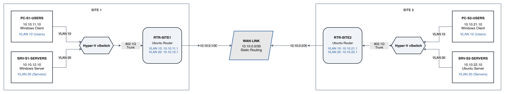

# Phase 1 — Network: Design & Decisions

## 1. Phase Goal

Phase 1 establishes the network foundation for the rest of the lab. It connects two sites through a routed WAN link, separates Users and Servers into VLANs at each site, and uses Ubuntu routers for inter-VLAN and inter-site routing.

At the end of this phase, the lab has:

- two sites connected through a point-to-point WAN link
- separate Users and Servers VLANs at each site
- 802.1Q trunking between the Hyper-V virtual switches and the Ubuntu routers
- static routing between both sites
- verified end-to-end connectivity across all four LAN subnets
- a documented IP addressing and naming scheme

DNS, DHCP, Active Directory, file sharing, and other server services are intentionally left for Phase 2.

### How this supports later phases

- **Phase 2 — Servers:** deploys Active Directory, DNS, DHCP, and file services onto the networks created here
- **Phase 3 — Monitoring:** adds Zabbix monitoring to the same routers, servers, clients, and WAN path
- **Phase 4 — Security:** adds router filtering, SSH hardening, and other security controls to the existing design

### Main technical areas

IP addressing, subnetting, VLAN segmentation, 802.1Q trunking, Linux routing, static routes, Windows/Linux administration, connectivity testing, and technical documentation.

---

## 2. Design Options

### Hypervisor

| Option | Advantages | Trade-offs |
|---|---|---|
| **Hyper-V — chosen** | Supports both Windows and Linux guests and carries directly into the later Windows Server phases | Requires a Windows Server host and nested virtualization support |
| KVM on Ubuntu | Strong Linux virtualization option with no Windows host requirement | Less aligned with the Windows Server work planned for later phases |
| VirtualBox | Simple desktop interface | Less suitable for the server-style nested lab design used here |

Hyper-V was selected because the same host could support the Linux routing work in Phase 1 and the Windows Server environment added in Phase 2.

### Router OS

| Option | Advantages | Trade-offs |
|---|---|---|
| **Ubuntu Server — chosen** | Uses standard Linux networking tools such as `iproute2`, supports VLAN sub-interfaces, and overlaps with general Linux administration | No router-specific CLI |
| VyOS | Purpose-built routing interface and network-focused CLI | Adds a separate platform and syntax that would be used only for the routers |

Ubuntu Server was chosen so the routing configuration could also build Linux administration experience instead of introducing a separate router-only platform.

### End-device and server mix

| Option | Advantages | Trade-offs |
|---|---|---|
| All Ubuntu | Simple and consistent | Does not include Windows administration |
| **Windows clients + Windows/Linux servers — chosen** | Covers both Windows and Linux administration and allows the Site 1 server to become the Phase 2 Domain Controller without rebuilding the lab | More resource usage than an all-Linux design |
| Mixed environment with an Ubuntu user endpoint | Adds another Linux endpoint | Does not add much beyond the Linux server already included |

The chosen mix keeps the user endpoints on Windows while using both Windows Server and Ubuntu Server on the Servers VLANs.

### Topology

| Option | Advantages | Trade-offs |
|---|---|---|
| One router with two subnets | Fastest to build | No inter-site routing and limited segmentation |
| Two routers with a flat LAN at each site | Adds a WAN path and multi-hop routing | No separation between users and servers |
| **Two routers + WAN + VLANs at each site — chosen** | Provides inter-site routing and VLAN segmentation in the same design | Requires trunking and router sub-interface configuration |

The final topology uses two routers, one point-to-point WAN link, and two VLANs per site. Hyper-V virtual switches carry the VLAN tags, so no additional switch VMs are required.

---

## 3. Final Design Decisions

| Decision | Final Choice | Reason |
|---|---|---|
| Cloud platform | Azure | Local hardware was not suitable for the nested lab, and Azure provided a host that could run Hyper-V |
| Hypervisor | Hyper-V | Supports the Windows and Linux guest mix used throughout the project |
| Host VM | Standard D4s v4, 4 vCPU / 16 GB RAM | This was the host used for the completed lab and supported nested virtualization |
| Phase 1 guest count | 6 VMs | Two routers plus one Users and one Servers endpoint at each site |
| Router OS | Ubuntu Server | Supports VLAN sub-interfaces, static routing, and standard Linux networking tools |
| User endpoints | Windows clients | Matches the Windows user environment used in later phases |
| Site 1 server | Windows Server | Carries forward into Phase 2 as the AD DS, DNS, and DHCP server |
| Site 2 server | Ubuntu Server | Provides a Linux server for later domain join and Samba work |
| VLANs | VLAN 10 — Users, VLAN 20 — Servers | Separates endpoint and server traffic at each site |
| Routing | Static routes | Appropriate for the small two-router topology and easy to verify |
| Server services | None in Phase 1 | AD DS, DNS, DHCP, and file services are added in Phase 2 |

### Host sizing note

The host was originally planned as `Standard D4s_v5`, but the deployed Azure VM was `Standard D4s v4`. Both provided 4 vCPU and 16 GB RAM, so the change did not affect the Phase 1 design.

### Naming convention

The device names identify both the role and the site:

- `RTR-SITE1`, `RTR-SITE2` — Ubuntu routers
- `PC-S1-USERS`, `PC-S2-USERS` — Windows user endpoints
- `SRV-S1-SERVERS` — Site 1 Windows Server
- `SRV-S2-SERVERS` — Site 2 Ubuntu Server
- `VLAN10-USERS`, `VLAN20-SERVERS` — VLAN roles used at both sites
- `WAN-LINK` — point-to-point router connection

### Hyper-V virtual switches

| Switch | Site | Purpose |
|---|---|---|
| `vSwitch-S1` | Site 1 | Trunk carrying VLANs 10 and 20 between Site 1 endpoints and `RTR-SITE1` |
| `vSwitch-S2` | Site 2 | Trunk carrying VLANs 10 and 20 between Site 2 endpoints and `RTR-SITE2` |
| `vSwitch-WAN` | — | Untagged point-to-point link between both routers |

Phase 1 uses three Linux guests and three Windows guests, in addition to the Windows Server Hyper-V host.

---

## 4. IP Addressing Plan

| Segment | Subnet | Gateway | Phase 1 Endpoint | OS |
|---|---|---|---|---|
| VLAN 10 — Users, Site 1 | 10.10.11.0/24 | 10.10.11.1 | PC-S1-USERS — 10.10.11.10 | Windows client |
| VLAN 20 — Servers, Site 1 | 10.10.12.0/24 | 10.10.12.1 | SRV-S1-SERVERS — 10.10.12.10 | Windows Server |
| WAN link | 10.10.0.0/30 | — | RTR-SITE1 — 10.10.0.1 / RTR-SITE2 — 10.10.0.2 | Ubuntu routers |
| VLAN 10 — Users, Site 2 | 10.10.21.0/24 | 10.10.21.1 | PC-S2-USERS — 10.10.21.10 | Windows client |
| VLAN 20 — Servers, Site 2 | 10.10.22.0/24 | 10.10.22.1 | SRV-S2-SERVERS — 10.10.22.10 | Ubuntu Server |

The third octet follows a `{site}{vlan}` pattern:

- `11` = Site 1 / VLAN 10
- `12` = Site 1 / VLAN 20
- `21` = Site 2 / VLAN 10
- `22` = Site 2 / VLAN 20

This makes the location and VLAN easy to identify from the address. `/24` networks are used for the LAN VLANs, while the WAN uses a `/30` point-to-point subnet.

> **Phase 1 addressing note:** The Windows clients use static `.10` addresses during this phase. In Phase 2, DHCP is introduced and the client addresses move into the `.100–200` DHCP scopes.

---

## 5. Phase 1 Topology

*Phase 1 topology showing both sites, VLAN 10 and VLAN 20, the Hyper-V trunks, and the routed WAN link.*

---

## 6. Phase 1 Outcome

Phase 1 finished with both sites routed successfully across the WAN link. VLAN 10 and VLAN 20 were separated at each site, router sub-interfaces handled inter-VLAN routing, and static routes provided connectivity between the four LAN subnets.

The configuration steps and validation results are documented in [02-build-log.md](02-build-log.md).

A shorter summary of the completed phase is available in [03-phase-summary.md](03-phase-summary.md).
