# Phase 1 — Network: Design & Decisions

## 1. Objectives

Phase 1 builds the routed network foundation for the whole project: multiple subnets
connected through real router configuration and routing logic, the way it would work on
physical/on-prem hardware — not relying on cloud-native routing shortcuts.

What exists when this phase is complete:

- A network topology diagram (subnets, VLANs, routers, IP addressing scheme)
- Working router configuration — inter-subnet routing plus VLAN trunking/sub-interfaces —
  with verified end-to-end connectivity
- Documentation covering design rationale, IP addressing plan, VLAN scheme, routing method,
  and the tests used to prove it works

No services (DNS, DHCP, file/print, etc.) are configured in this phase — those belong to
Phase 2.

**How this supports later phases:**

- Phase 2 (Servers) deploys onto the subnets built here
- Phase 3 (Monitoring) watches the links/devices established here
- Phase 4 (Security & Automation) layers firewalls, ACLs, and segmentation onto this
  structure

**Skills demonstrated:** IP addressing/subnetting design, static routing (with dynamic
routing as a stretch goal), VLAN segmentation and 802.1Q trunking, network troubleshooting
and connectivity validation, cross-platform administration (Windows Server, Windows client,
and Linux side by side), and technical documentation.

**Constraints:**

- Cloud credits: VMs run only while actively being worked on
- Hardware: nested virtualization limits how many VMs can run well at once
- Time: scope was deliberately capped so it wouldn't creep into Phase 2 (DNS/DHCP explicitly
  deferred)

## 2. Options Considered

### Hypervisor

| Option | Pros | Cons |
|---|---|---|
| **Hyper-V (chosen)** | Native to Windows Server; hosts both Windows and Linux guests; carries directly into Phase 2's Windows Server/AD work | Windows Server host VM costs more in licensing overhead |
| KVM (Ubuntu host) | Cheaper, no licensing overhead | Doesn't set up Phase 2's Windows Server work |
| VirtualBox | Easy GUI | Not built for server-style nested labs |

### Router OS

| Option | Pros | Cons |
|---|---|---|
| **Ubuntu Server (chosen)** | Real Linux routing skills (iproute2) transfer broadly; standard, expected choice for router/appliance duty | Not a router-specific CLI |
| VyOS | Router-like CLI, closer to real network gear | New syntax for one-time use; less overlap with general admin skills |

### End-Device / Server OS Mix

| Option | Pros | Cons |
|---|---|---|
| All Ubuntu | Cheapest, simplest, consistent | Doesn't demonstrate Windows admin skills at all |
| **Mixed — Windows clients + split Windows/Linux servers (chosen)** | Proves both Windows and Linux administration; realistic (real users run Windows); the Windows Server device becomes the actual Phase 2 AD/DNS/DHCP box with no rebuild needed | Adds Windows guest licensing overhead on top of the Windows Server Hyper-V host |
| Mixed but one Users-VLAN host on Ubuntu | Slightly cheaper | The Users VLAN isn't the tier being evaluated for OS variety — swapping it adds inconsistency without proving anything new |

### Topology

| Option | Pros | Cons |
|---|---|---|
| Simple hub (1 router, 2 subnets) | Fastest to build | Least impressive, weak story |
| Two-router simulated WAN link, flat LAN per site | Proves multi-hop routing | No segmentation within a site |
| **Two-router WAN link + VLANs per site (chosen)** | Adds VLAN segmentation and 802.1Q trunking on top of multi-hop routing — both are core networking-fundamentals skills; sets up Phase 4's ACL-at-VLAN-boundary work | More VMs/setup; router config gets more involved (sub-interfaces) |

VLANs weren't strictly required to prove the core objective, but they were a low-cost
addition — Hyper-V's virtual switch handles 802.1Q tagging natively, so no extra switch VMs
were needed — that meaningfully strengthened the networking-fundamentals story without
threatening the Phase 2–4 timeline.

**Sizing notes carried into the build:** nested virtualization requires an Intel-based VM
size (Dv3/Ev3 or newer); AMD-based sizes don't support it. VM Security Type must be
Standard, not Trusted Launch, since Trusted Launch is incompatible with nested
virtualization.

## 3. Final Design Decisions

| Decision | Choice | Why |
|---|---|---|
| Cloud platform | Azure | Local hardware couldn't handle nested virtualization; keeps continuity with Phase 2's Windows Server/AD work |
| Hypervisor | Hyper-V | No extra licensing beyond the host; hosts both Windows and Linux guests for Phase 1 (Ubuntu) and Phase 2 (Windows Server) |
| Host VM size | Standard D4s_v5 (4 vCPU / 16 GB RAM) planned | Enough headroom for host OS + nested VMs; Intel-based, confirmed nested-virtualization support. With 6 guests total, only the VMs actively under test were run at once |
| Guest VM count | 6 (2 routers + 4 end devices — 2 per site, 1 per VLAN) | Minimum needed to prove both multi-hop routing and real VLAN segmentation — each VLAN needs its own device to test against |
| Router OS | Ubuntu Server (both routers) | Standard, expected choice for routing duty; transferable Linux networking skills |
| End-device OS mix | Windows client on both Users-VLAN devices; Windows Server on Site 1's Servers-VLAN device; Ubuntu Server on Site 2's Servers-VLAN device | Demonstrates managing both Windows and Linux servers; Windows client is the realistic choice for a Users VLAN; the Windows Server device carries straight into Phase 2's AD/DNS/DHCP work |
| VLAN segmentation | 2 VLANs per site (Users / Servers), trunked via Hyper-V vSwitch | No extra switch VMs needed — Hyper-V's virtual switch natively supports 802.1Q tagging; routers get VLAN sub-interfaces (e.g. `eth0.10`, `eth0.20`) |
| Routing method | Static routes first; dynamic routing considered a stretch goal (not implemented this phase) | Guarantees a working baseline before attempting anything more complex |
| Services (DNS/DHCP/AD) | None this phase | Deferred to Phase 2 — the Servers VLAN is where those will land |

**Plan-vs-actual note:** the host was planned as Standard D4s_v5 but the deployed host
actually came up as Standard D4s v4. Both are 4 vCPU / 16 GB RAM, Intel-based, and support
nested virtualization, so the build wasn't affected — the discrepancy is only noted here for
accuracy.

Naming convention used throughout the build (chosen to avoid confusion between the
Hyper-V host machine and the lab's own "site" devices):

- `RTR-SITE1`, `RTR-SITE2` — routers (Ubuntu), each with a single trunked NIC plus one
  untagged WAN NIC
- `VLAN10-USERS`, `VLAN20-SERVERS` — the two VLANs at each site
- `PC-S1-USERS` (Windows client), `SRV-S1-SERVERS` (Windows Server) — Site 1 end devices
- `PC-S2-USERS` (Windows client), `SRV-S2-SERVERS` (Ubuntu Server) — Site 2 end devices
- `WAN-LINK` — the router-to-router point-to-point link

Three private Hyper-V virtual switches were used — one per site plus one for the WAN link:

| Switch | Site | Purpose |
|---|---|---|
| `vSwitch-S1` | Site 1 | Trunked (VLANs 10 + 20), connects Site 1 end devices to `RTR-SITE1` |
| `vSwitch-S2` | Site 2 | Trunked (VLANs 10 + 20), connects Site 2 end devices to `RTR-SITE2` |
| `vSwitch-WAN` | — | Untagged, carries the `RTR-SITE1` ↔ `RTR-SITE2` point-to-point link |

OS footprint: 3 Linux VMs (2 routers + 1 server) and 3 Windows VMs (2 clients + 1 server),
plus the Windows Server Hyper-V host itself.

## 4. IP Addressing Plan

| Segment | Subnet | Router (gateway) | Device | OS |
|---|---|---|---|---|
| VLAN10-USERS, Site 1 | 10.10.11.0/24 | .11.1 | PC-S1-USERS — 10.10.11.10 | Windows client |
| VLAN20-SERVERS, Site 1 | 10.10.12.0/24 | .12.1 | SRV-S1-SERVERS — 10.10.12.10 | Windows Server |
| WAN-LINK | 10.10.0.0/30 | RTR-SITE1 .1, RTR-SITE2 .2 | — | Ubuntu (both routers) |
| VLAN10-USERS, Site 2 | 10.10.21.0/24 | .21.1 | PC-S2-USERS — 10.10.21.10 | Windows client |
| VLAN20-SERVERS, Site 2 | 10.10.22.0/24 | .22.1 | SRV-S2-SERVERS — 10.10.22.10 | Ubuntu Server |

**Why this scheme:** the third octet encodes `{site}{vlan}` — e.g. `11` is Site 1/VLAN10,
`22` is Site 2/VLAN20 — so any address indicates exactly where it sits at a glance. A `/24`
per VLAN leaves room to grow; a `/30` on the WAN link is standard practice for a
point-to-point link.

## 5. Topology Diagram

```mermaid
%%{init: {'flowchart': {'nodeSpacing': 60, 'rankSpacing': 55}}}%%
flowchart LR

    subgraph SITE1["SITE 1"]
        direction TB

        PC1["<b>PC-S1-USERS</b><br/>10.10.11.10<br/>Windows Client<br/><font color='#285A9E'>VLAN 10 (Users)</font>"]

        SRV1["<b>SRV-S1-SERVERS</b><br/>10.10.12.10<br/>Windows Server<br/><font color='#285A9E'>VLAN 20 (Servers)</font>"]

        VS1{{"<b>Hyper-V vSwitch</b><br/>802.1Q TRUNK"}}

        R1["<b>RTR-SITE1</b><br/>Ubuntu Router<br/>VLAN 10: 10.10.11.1<br/>VLAN 20: 10.10.12.1<br/><font color='#285A9E'>WAN: 10.10.0.1/30</font>"]

        PC1 -->|"VLAN 10"| VS1
        SRV1 -->|"VLAN 20"| VS1
        VS1 -->|"802.1Q Trunk"| R1
    end

    WAN[/"<b>WAN LINK</b><br/>10.10.0.0/30<br/>Static Routing"/]

    R1 -->|"10.10.0.1/30"| WAN
    WAN -->|"10.10.0.2/30"| R2

    subgraph SITE2["SITE 2"]
        direction TB

        R2["<b>RTR-SITE2</b><br/>Ubuntu Router<br/>VLAN 10: 10.10.21.1<br/>VLAN 20: 10.10.22.1<br/><font color='#285A9E'>WAN: 10.10.0.2/30</font>"]

        VS2{{"<b>Hyper-V vSwitch</b><br/>802.1Q TRUNK"}}

        PC2["<b>PC-S2-USERS</b><br/>10.10.21.10<br/>Windows Client<br/><font color='#285A9E'>VLAN 10 (Users)</font>"]

        SRV2["<b>SRV-S2-SERVERS</b><br/>10.10.22.10<br/>Ubuntu Server<br/><font color='#285A9E'>VLAN 20 (Servers)</font>"]

        R2 -->|"802.1Q Trunk"| VS2
        VS2 -->|"VLAN 10"| PC2
        VS2 -->|"VLAN 20"| SRV2
    end

    classDef endpoint fill:#FFFFFF,stroke:#243B5A,stroke-width:2px,color:#111827;
    classDef server fill:#FFFFFF,stroke:#243B5A,stroke-width:2px,color:#111827;
    classDef switch fill:#EEF3F8,stroke:#243B5A,stroke-width:2px,color:#111827;
    classDef router fill:#F5F8FC,stroke:#183B63,stroke-width:3px,color:#111827;
    classDef wan fill:#EDF4FF,stroke:#285A9E,stroke-width:2px,color:#111827;

    class PC1,PC2 endpoint;
    class SRV1,SRV2 server;
    class VS1,VS2 switch;
    class R1,R2 router;
    class WAN wan;

    style SITE1 fill:#FFFFFF,stroke:#243B5A,stroke-width:2px
    style SITE2 fill:#FFFFFF,stroke:#243B5A,stroke-width:2px

    linkStyle default stroke:#334155,stroke-width:2px
```

## 6. Status

- Step 1 — Understand the goal — done
- Step 2 — Research options — done
- Step 3 — Make decisions — done
- Step 4 — Build (see `02-build-log.md`)
