# Phase 1 — Network: Build Log

This is the as-built record for Phase 1: the configuration steps, validation results, and troubleshooting completed while building the network foundation.

Design choices and the addressing plan are documented in [01-decisions.md](01-decisions.md). A shorter end-of-phase summary is available in [03-phase-summary.md](03-phase-summary.md).

## 1. Host & Prerequisites (recap)

Azure VM: Standard D4s v4 (4 vCPU / 16 GiB RAM), Windows Server 2022 Datacenter, VM
generation V2. See `01-decisions.md` for the plan-vs-actual note on host sizing.

Hyper-V role installed and confirmed:

```powershell
Get-WindowsFeature -Name Hyper-V
```

**Result:** `Hyper-V` — Install State: Installed.

Nested virtualization was sanity-checked with a throwaway Ubuntu VM before any real VM
was built, then deleted once confirmed working.

## 2. Virtual Switches

Three private Hyper-V virtual switches were created, matching the plan in
`01-decisions.md`:

- `vSwitch-S1` (Private)
- `vSwitch-S2` (Private)
- `vSwitch-WAN` (Private)

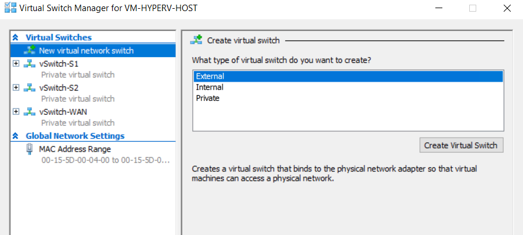

A temporary NAT-enabled switch and a temporary external switch were also used during the
build for two unrelated, short-lived purposes — giving `RTR-SITE1` outbound internet
access to install a package (see Issues 3–4), and later as one of several attempts to work
around the Windows 11 OOBE network screen on `PC-S1-USERS` (see Issue 9). Neither is
part of the final network design; both were removed once no longer needed.

## 3. Routers

### RTR-SITE1

VLAN trunk configuration, after correcting which adapter carries the trunk (see Issue 1):

```powershell
Get-VMNetworkAdapterVlan -VMName RTR-SITE1
```

| VMNetworkAdapterName | Mode | VlanList |
|---|---|---|
| Network Adapter | Trunk | 0,10,20 |
| Network Adapter | Untagged | — |

One adapter correctly trunked (VLANs 10 and 20, toward the site's vSwitch); the other
correctly left untagged (the WAN point-to-point link).

Interfaces confirmed present and up:

```bash
ip a
```

IP forwarding enabled:

```bash
echo "net.ipv4.ip_forward=1" | sudo tee /etc/sysctl.conf
sudo sysctl -p
sysctl net.ipv4.ip_forward
```

**Result:** `net.ipv4.ip_forward = 1`.

Netplan configuration (`/etc/netplan/01-netcfg.yaml`):

```yaml
network:
  version: 2
  ethernets:
    eth0: {}
    eth1:
      addresses: [10.10.0.1/30]
      routes:
        - to: 10.10.21.0/24
          via: 10.10.0.2
        - to: 10.10.22.0/24
          via: 10.10.0.2
  vlans:
    eth0.10:
      id: 10
      link: eth0
      addresses: [10.10.11.1/24]
    eth0.20:
      id: 20
      link: eth0
      addresses: [10.10.12.1/24]
```

Verified: `eth1` = `10.10.0.1/30`; `eth0.10` = `10.10.11.1/24`; `eth0.20` = `10.10.12.1/24`.
Route table shows `10.10.21.0/24` and `10.10.22.0/24` routed via `10.10.0.2 dev eth1`
(static).

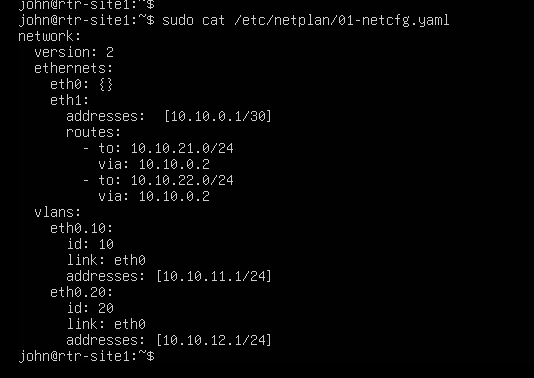
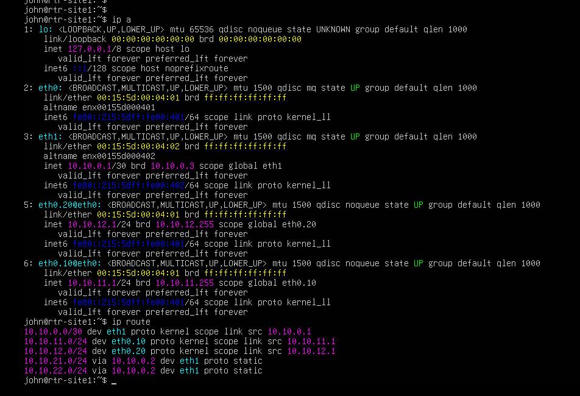

### RTR-SITE2

Netplan configuration (`/etc/netplan/01-netcfg.yaml`), mirrored addressing:

```yaml
network:
  version: 2
  ethernets:
    eth0: {}
    eth1:
      addresses: [10.10.0.2/30]
      routes:
        - to: 10.10.11.0/24
          via: 10.10.0.1
        - to: 10.10.12.0/24
          via: 10.10.0.1
  vlans:
    eth0.10:
      id: 10
      link: eth0
      addresses: [10.10.21.1/24]
    eth0.20:
      id: 20
      link: eth0
      addresses: [10.10.22.1/24]
```

Verified: `eth1` = `10.10.0.2/30`; `eth0.10` = `10.10.21.1/24`; `eth0.20` =
`10.10.22.1/24`. Route table shows `10.10.11.0/24` and `10.10.12.0/24` routed via
`10.10.0.1 dev eth1` (static).

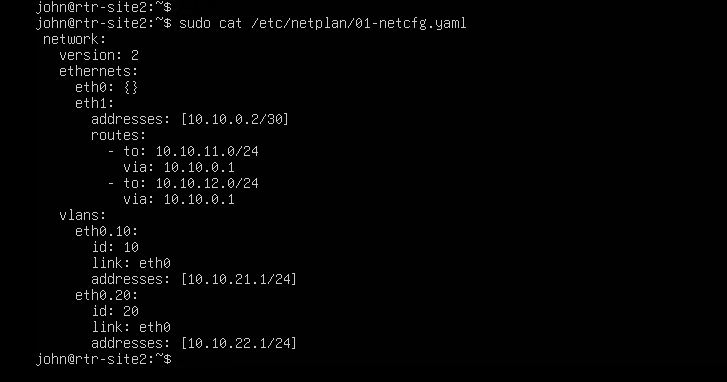
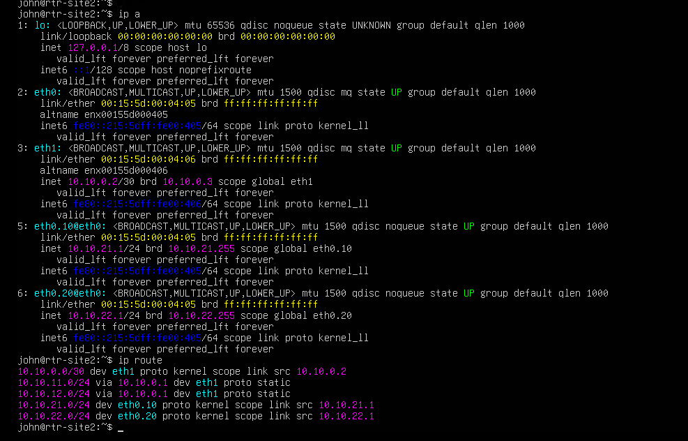

### Core routing validation (pre-end-device)

Run from `RTR-SITE1`, before any end devices existed, to isolate router/WAN correctness
from end-device variables:

```bash
ping -c 4 10.10.0.2    # WAN neighbor (RTR-SITE2)
ping -c 4 10.10.21.1   # Site 2, VLAN10 gateway
ping -c 4 10.10.22.1   # Site 2, VLAN20 gateway
```

**Result:** all three passed, 0% packet loss (avg RTT 0.38–0.42 ms). Core inter-router
routing and the WAN link were confirmed working before end devices were built.

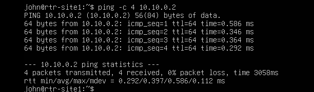

Checkpoints taken: `RTR-SITE1 - post-VLAN-routing-working`, `RTR-SITE2 -
post-VLAN-routing-working` (later merged into the final consolidated checkpoint, Section 6).

## 4. End Devices

### PC-S1-USERS (Windows 11 client, Site 1 / VLAN 10)

Rebuilt clean after TPM/OOBE issues (see Issues 8–10).

```powershell
New-VM -Name PC-S1-USERS -Generation 2 -MemoryStartupBytes 4GB `
  -NewVHDPath "C:\ProgramData\Microsoft\Windows\Virtual Hard Disks\PC-S1-USERS.vhdx" `
  -NewVHDSizeBytes 64GB
Set-VMProcessor -VMName PC-S1-USERS -Count 2
Get-VMNetworkAdapter -VMName PC-S1-USERS | Remove-VMNetworkAdapter
Set-VMFirmware -VMName PC-S1-USERS -EnableSecureBoot On -SecureBootTemplate MicrosoftWindows
Set-VMKeyProtector -VMName PC-S1-USERS -NewLocalKeyProtector
Enable-VMTPM -VMName PC-S1-USERS
Add-VMDvdDrive -VMName PC-S1-USERS -Path "C:\ISOs\Win11_25H2_English_x64_v2.iso"
```

OS install: language → Install Now → no product key → edition selection → accept license
→ Custom install → 64GB disk. OOBE network screen bypassed via `Shift+Fn+F10` →
`oobe\bypassnro` → reboot → local account created (see Issue 9).

Network attach and VLAN tagging, done after OS install:

```powershell
Add-VMNetworkAdapter -VMName PC-S1-USERS -SwitchName "vSwitch-S1"
Set-VMNetworkAdapterVlan -VMName PC-S1-USERS -Access -VlanId 10
Get-VMNetworkAdapterVlan -VMName PC-S1-USERS
```

**Result:** Mode `Access`, VlanList `10`.

Static IP set via Windows Settings GUI: `10.10.11.10` / `255.255.255.0` / gateway
`10.10.11.1`. Confirmed via `ipconfig /all`.

Windows Firewall was disabled during Phase 1 testing (`Set-NetFirewallProfile -Profile
Domain,Public,Private -Enabled False`) after a targeted ICMP rule attempt failed on a
display-name mismatch. It was re-enabled later in the project with scoped rules.

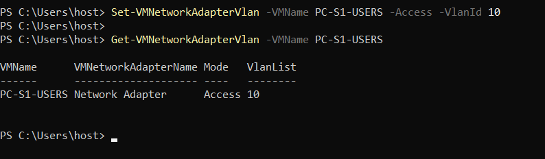
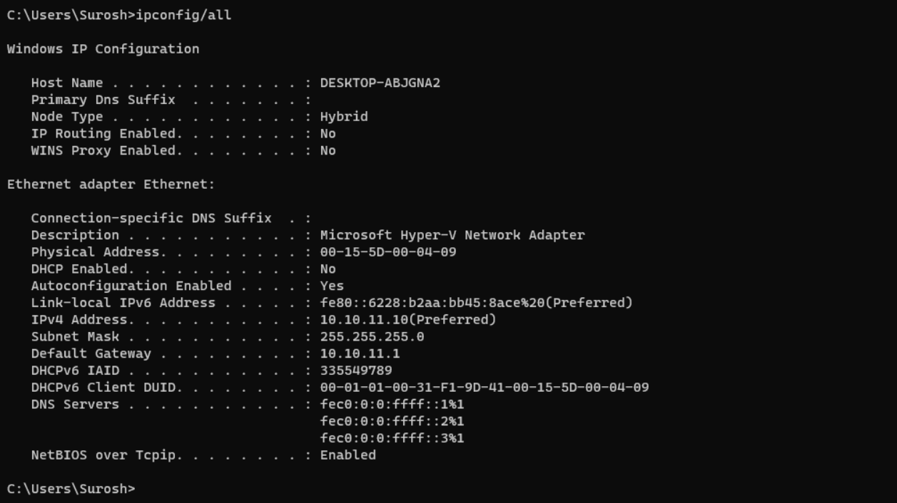

```powershell
Checkpoint-VM -Name PC-S1-USERS -SnapshotName "PC-S1-USERS - static-IP-confirmed"
```

### SRV-S1-SERVERS (Windows Server 2022 Standard, Desktop Experience, Site 1 / VLAN 20)

Built all-in-one with the NIC attached from the start — Server has no OOBE network screen.

```powershell
New-VM -Name SRV-S1-SERVERS -Generation 2 -MemoryStartupBytes 4GB `
  -NewVHDPath "C:\ProgramData\Microsoft\Windows\Virtual Hard Disks\SRV-S1-SERVERS.vhdx" `
  -NewVHDSizeBytes 64GB -SwitchName "vSwitch-S1"
Set-VMProcessor -VMName SRV-S1-SERVERS -Count 2
Set-VMNetworkAdapterVlan -VMName SRV-S1-SERVERS -Access -VlanId 20
Set-VMFirmware -VMName SRV-S1-SERVERS -EnableSecureBoot On -SecureBootTemplate MicrosoftWindows
Set-VMKeyProtector -VMName SRV-S1-SERVERS -NewLocalKeyProtector
Enable-VMTPM -VMName SRV-S1-SERVERS
Add-VMDvdDrive -VMName SRV-S1-SERVERS -Path "C:\ISOs\SERVER_EVAL_x64FRE_en-us.iso"
```

Edition: Windows Server 2022 Standard Evaluation (Desktop Experience) — chosen over
Server Core for easier Phase 2 AD/DNS/DHCP configuration, and over Datacenter since
Standard is sufficient for this lab.

Post-install: renamed from default `WIN-JSN217VPG71` to `SRV-S1-SERVERS`. Static IP set
via Server Manager: `10.10.12.10` / `255.255.255.0` / gateway `10.10.12.1`. Confirmed via
`ipconfig /all` and `hostname`. Windows Firewall was disabled during Phase 1 testing and
was re-enabled later in the project with scoped rules.

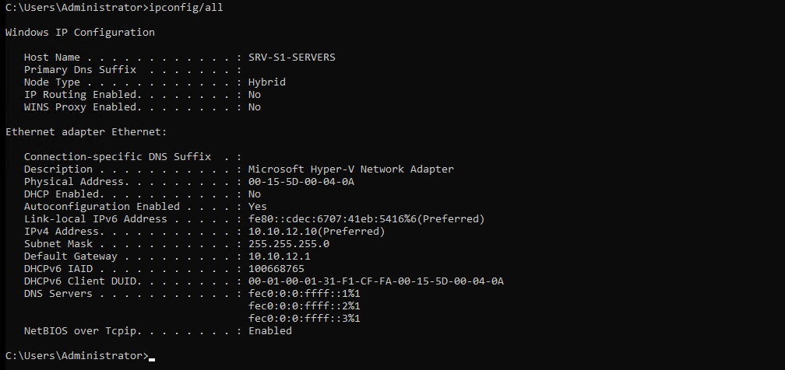

```powershell
Checkpoint-VM -Name SRV-S1-SERVERS -SnapshotName "SRV-S1-SERVERS - static-IP-confirmed"
```

### PC-S2-USERS (Windows 11 client, Site 2 / VLAN 10)

Built all-in-one with the NIC attached from the start, applying the lesson from
PC-S1-USERS.

```powershell
New-VM -Name PC-S2-USERS -Generation 2 -MemoryStartupBytes 4GB `
  -NewVHDPath "C:\ProgramData\Microsoft\Windows\Virtual Hard Disks\PC-S2-USERS.vhdx" `
  -NewVHDSizeBytes 64GB -SwitchName "vSwitch-S2"
Set-VMProcessor -VMName PC-S2-USERS -Count 2
Set-VMNetworkAdapterVlan -VMName PC-S2-USERS -Access -VlanId 10
Set-VMFirmware -VMName PC-S2-USERS -EnableSecureBoot On -SecureBootTemplate MicrosoftWindows
Set-VMKeyProtector -VMName PC-S2-USERS -NewLocalKeyProtector
Enable-VMTPM -VMName PC-S2-USERS
Add-VMDvdDrive -VMName PC-S2-USERS -Path "C:\ISOs\Win11_25H2_English_x64_v2.iso"
```

Hit the same OOBE network screen as PC-S1-USERS, but went straight to the known fix:
`Shift+Fn+F10` → `oobe\bypassnro` → reboot → local account created. No time lost on other
workarounds.

Static IP: `10.10.21.10` / `255.255.255.0` / gateway `10.10.21.1`. Confirmed via
`ipconfig /all`.


```powershell
Checkpoint-VM -Name PC-S2-USERS -SnapshotName "PC-S2-USERS - static-IP-confirmed"
```

### SRV-S2-SERVERS (Ubuntu Server, Site 2 / VLAN 20)

```powershell
New-VM -Name SRV-S2-SERVERS -Generation 2 -MemoryStartupBytes 1GB `
  -NewVHDPath "C:\ProgramData\Microsoft\Windows\Virtual Hard Disks\SRV-S2-SERVERS.vhdx" `
  -NewVHDSizeBytes 32GB -SwitchName "vSwitch-S2"
Set-VMProcessor -VMName SRV-S2-SERVERS -Count 1
Set-VMNetworkAdapterVlan -VMName SRV-S2-SERVERS -Access -VlanId 20
Set-VMFirmware -VMName SRV-S2-SERVERS -EnableSecureBoot On -SecureBootTemplate MicrosoftUEFICertificateAuthority
Add-VMDvdDrive -VMName SRV-S2-SERVERS -Path "C:\ISOs\ubuntu-26.04-live-server-amd64.iso"
```

Secure Boot template set to `MicrosoftUEFICertificateAuthority` (not `MicrosoftWindows`)
— required for a Linux guest to boot on Gen 2. No vTPM needed.

OS install: standard Ubuntu Server base (not minimized), storage set to use entire disk,
hostname `srv-s2-servers`, user `labadmin`, OpenSSH server installed during setup.

Static IP via netplan (`/etc/netplan/00-installer-config.yaml`):

```yaml
network:
  version: 2
  ethernets:
    eth0:
      dhcp4: no
      addresses:
        - 10.10.22.10/24
      routes:
        - to: default
          via: 10.10.22.1
```

```bash
sudo netplan apply
```

Confirmed via `ip a` and `ip route` (`default via 10.10.22.1 dev eth0 proto static`). No
firewall rule needed — Linux responds to ping by default.


```powershell
Checkpoint-VM -Name SRV-S2-SERVERS -SnapshotName "SRV-S2-SERVERS - static-IP-confirmed"
```

### Final IP addressing (as-built)

| Device | IP | Subnet | Gateway | VLAN | Switch |
|---|---|---|---|---|---|
| PC-S1-USERS | 10.10.11.10 | /24 | 10.10.11.1 | 10 | vSwitch-S1 |
| SRV-S1-SERVERS | 10.10.12.10 | /24 | 10.10.12.1 | 20 | vSwitch-S1 |
| PC-S2-USERS | 10.10.21.10 | /24 | 10.10.21.1 | 10 | vSwitch-S2 |
| SRV-S2-SERVERS | 10.10.22.10 | /24 | 10.10.22.1 | 20 | vSwitch-S2 |

Matches the IP addressing plan in `01-decisions.md`, no deviation.

## 5. Validation

Tests were run in order. Some validation was completed with only the VMs required for that
test powered on because of the 16 GB host limit (see Issue 12).

#### Test 1 — Local gateway reachability

**Objective:** Confirm PC-S1-USERS can reach its own VLAN gateway before testing
anything cross-segment.

**Method:**
```cmd
ping -n 4 10.10.11.1
```

**Result:** Passed, 0% loss.

**Evidence:** 

#### Test 2 — Inter-VLAN routing within Site 1

**Objective:** Confirm RTR-SITE1 routes traffic between VLAN 10 and VLAN 20.

**Method:**
```cmd
ping -n 4 10.10.12.10
```

**Result:** Failed initially, 100% loss — root-caused to IP forwarding disabled on
RTR-SITE1 (see Issue 11). Fixed and retested: passed, 0% loss. RTR-SITE2 proactively
checked and found already correctly enabled.

**Evidence:** 

#### Test 3 — Cross-site routing over the WAN link, VLAN 10

**Objective:** Confirm end-to-end routing from Site 1 to Site 2 across the WAN link.

**Method:**
```cmd
ping -n 4 10.10.21.10
```

**Result:** Passed, 0% loss.

**Evidence:** 

#### Test 4 — Cross-site routing over the WAN link, VLAN 20

**Objective:** Confirm end-to-end routing to Site 2's Servers VLAN.

**Method:**
```cmd
ping -n 4 10.10.22.10
```

**Result:** Passed, 0% loss.

**Evidence:** 

#### Test 5 — Path verification

**Objective:** Confirm traffic actually takes the expected router path rather than passing
only because both ends happen to be reachable.

**Method:**
```cmd
tracert 10.10.22.10
```

**Result:** 3 hops, matched expected path: `10.10.11.1 → 10.10.0.2 → 10.10.22.10`.

**Evidence:** 

#### Test 6 — VLAN sub-interface validation

**Objective:** Confirm that disabling a VLAN sub-interface actually blocks routed traffic to
that segment, proving the routing observed in Tests 2–4 depends on the sub-interface being
up rather than some other path.

**Method:**
```bash
sudo ip link set eth0.20 down
```
```bash
ping -c 4 10.10.12.10
```
```bash
sudo ip link set eth0.20 up
```

**Result:** With the sub-interface down, ping correctly failed ("Destination net
unreachable" from 10.10.11.1). Brought back up and retested: passed, 0% loss.

**Evidence:** 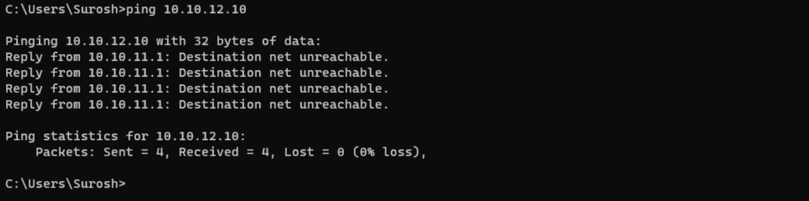 

## 6. Final State

Once all validation tests passed, per-device interim checkpoints were merged forward into a
single final checkpoint per VM:

```powershell
Checkpoint-VM -Name PC-S1-USERS -SnapshotName "ALL-VMs - phase1-validated-complete"
Checkpoint-VM -Name PC-S2-USERS -SnapshotName "ALL-VMs - phase1-validated-complete"
Checkpoint-VM -Name SRV-S1-SERVERS -SnapshotName "ALL-VMs - phase1-validated-complete"
Checkpoint-VM -Name SRV-S2-SERVERS -SnapshotName "ALL-VMs - phase1-validated-complete"
Checkpoint-VM -Name RTR-SITE1 -SnapshotName "ALL-VMs - phase1-validated-complete"
Checkpoint-VM -Name RTR-SITE2 -SnapshotName "ALL-VMs - phase1-validated-complete"

Remove-VMSnapshot -VMName PC-S1-USERS -Name "PC-S1-USERS - static-IP-confirmed"
Remove-VMSnapshot -VMName PC-S2-USERS -Name "PC-S2-USERS - static-IP-confirmed"
Remove-VMSnapshot -VMName SRV-S1-SERVERS -Name "SRV-S1-SERVERS - static-IP-confirmed"
Remove-VMSnapshot -VMName SRV-S2-SERVERS -Name "SRV-S2-SERVERS - static-IP-confirmed"
Remove-VMSnapshot -VMName RTR-SITE1 -Name "RTR-SITE1 - post-VLAN-routing-working"
Remove-VMSnapshot -VMName RTR-SITE2 -Name "RTR-SITE2 - post-VLAN-routing-working"
```

| VM | Checkpoint |
|---|---|
| PC-S1-USERS | `ALL-VMs - phase1-validated-complete` |
| PC-S2-USERS | `ALL-VMs - phase1-validated-complete` |
| RTR-SITE1 | `ALL-VMs - phase1-validated-complete` |
| RTR-SITE2 | `ALL-VMs - phase1-validated-complete` |
| SRV-S1-SERVERS | `ALL-VMs - phase1-validated-complete` |
| SRV-S2-SERVERS | `ALL-VMs - phase1-validated-complete` |

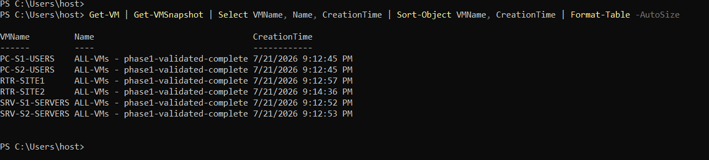

Phase 1 build and validation complete.

## 7. Troubleshooting & Issues

### Issue 1 — VLAN trunk mode accidentally applied to both network adapters

**Where:** RTR-SITE1

**Symptom:** Each router has two virtual NICs — one that must carry both VLANs (trunk,
toward the site's vSwitch) and one that must stay untagged (the WAN point-to-point link).
Both adapters shared the same generic name ("Network Adapter"), so a command targeting
the VM by name only set both to trunk mode instead of just the intended one.

**Root cause:** No unique identifier was used to target the adapter; the generic shared name
made the command ambiguous.

**Fix:** Each adapter identified by its unique MAC address and associated virtual switch
name; only the correct one set to trunk, the other explicitly reset to access/untagged mode.
On RTR-SITE2, the MAC and switch name were filtered before running the command —
correct on the first attempt.

**Lesson:** When several adapters share the same display name, identify the intended adapter
by MAC address or switch attachment before changing VLAN mode, then verify the result.

### Issue 2 — Standard Linux network config file didn't exist on a minimal install

**Where:** RTR-SITE1

**Symptom:** Enabling IP forwarding normally means editing `/etc/sysctl.conf`, which
exists by default on most Linux systems. On this minimal Ubuntu Server install, the file
wasn't present, and the edit command failed with "no such file or directory."

**Root cause:** Minimal/lightweight installs can omit files present on a full install by
default.

**Fix:** Created the file fresh with the one required setting line, then applied it.

**Lesson:** Minimal installs may not contain the same default files as a full installation.
Check the actual filesystem before assuming a standard configuration file is present.

### Issue 3 — No internet access on the router blocked installing needed software

**Where:** RTR-SITE1

**Symptom:** The router needed a VLAN-related package during setup, but its lab-facing
interfaces were intentionally isolated from the internet, so the install could not reach the
package repositories.

**Diagnosis path:**
1. Created a temporary NAT-enabled switch and connected the router to it for outbound access.
2. The temporary path still could not resolve package servers because the resolver file had
   been created as `resolve.conf` instead of `resolv.conf`.
3. Corrected the filename and confirmed DNS resolution before retrying the install.

**Root cause:** The isolated router had no normal internet path, and the temporary workaround
also had a DNS configuration typo.

**Fix:** Corrected the resolver configuration, completed the package install, then removed the
temporary NAT connection so the router returned to the intended isolated design.

**Lesson:** For an isolated lab device, temporary outbound access should be added only when
needed and removed afterward. If the path exists but name resolution still fails, verify the
resolver configuration before changing the network design.


### Issue 4 — No default internet-connected virtual switch existed on this host

**Where:** RTR-SITE1 (build host)

**Symptom:** While building the temporary internet workaround above, the first attempt
failed immediately because a generic default NAT-enabled switch — often present by
default in other Hyper-V setups — didn't exist on this host.

**Root cause:** Cloud-hosted Windows Server Hyper-V hosts don't ship with the same
defaults as a typical Windows 10/11 desktop install.

**Fix:** Checked what switches actually existed, then built the needed piece from scratch —
created a new internal switch and configured NAT manually.

**Lesson:** Hyper-V defaults differ between desktop and cloud-hosted Windows environments.
Check the switches that actually exist on the host before planning around a default one.

### Issue 5 — YAML config file rejected due to inconsistent indentation

**Where:** RTR-SITE2

**Symptom:** While retyping the netplan YAML config for RTR-SITE2, one section's
indentation didn't match its sibling section. YAML is whitespace-sensitive, and the system
rejected the file with "inconsistent indentation."

**Root cause:** Manually retyped indentation drifted from the known-working reference.

**Fix:** Deleted the broken file and retyped it, matching indentation levels against the
known-working RTR-SITE1 file side by side.

**Lesson:** With YAML, compare indentation against a known-working file before applying the
configuration. Small spacing errors can invalidate the whole file.

### Issue 6 — Typo: network address used instead of the actual gateway address

**Where:** RTR-SITE2

**Symptom:** A config line meant to specify the gateway device's address (ending in `.1`)
was mistyped as `.0` — the network address, not a usable device address.

**Root cause:** Single-digit typo with a materially different meaning in networking terms.

**Fix:** Caught during line-by-line review before applying the config, and corrected.

**Lesson:** Small addressing typos can be functionally significant, not just cosmetic —
recheck config values against the actual design spec, not just "does it look about right."

### Issue 7 — Auto-generated installer config conflicted with a manually written config

**Where:** RTR-SITE2

**Symptom:** Applying the finished netplan config was rejected with an error about not
being able to uniquely identify a network interface. The OS installer had automatically
generated its own separate config file for the same NIC, creating a conflict with the
manually written one.

**Root cause:** The installer's auto-generated default file was never removed after a custom
config was written over it.

**Fix:** Identified the auto-generated leftover file, confirmed it was redundant, and removed
it, leaving one authoritative config source for the interface.

**Lesson:** When replacing installer-generated network configuration, check for other files
that still reference the same interface so only one active configuration remains.


### Issue 8 — Windows 11 Setup blocked by TPM requirement

**Where:** PC-S1-USERS

**Symptom:** Windows 11 Setup stopped with "This PC doesn't currently meet Windows 11
system requirements — The PC must support TPM 2.0," despite Secure Boot already being
enabled.

**Root cause:** Secure Boot alone isn't sufficient for Windows 11 — a virtual TPM is a
separate Hyper-V feature requiring a key protector before it can be enabled.

**Fix:**
```powershell
Set-VMKeyProtector -VMName PC-S1-USERS -NewLocalKeyProtector
Enable-VMTPM -VMName PC-S1-USERS
```
Verified via `Get-VMSecurity -VMName PC-S1-USERS` showing `TpmEnabled : True`.

**Lesson:** Windows 11's hardware requirements need both Secure Boot and vTPM configured
explicitly on a Gen 2 Hyper-V VM — neither alone is sufficient.

### Issue 9 — Windows 11 OOBE network screen blocks setup on an isolated vSwitch

**Where:** PC-S1-USERS

**Symptom:** After fixing the TPM issue, Windows 11 OOBE reached "Let's connect you to a
network" and would not proceed — the VM sits on a private/isolated vSwitch with no DHCP
or internet by design.

**Diagnosis path:**
1. Removing the VM's network adapter entirely before OOBE — didn't work; this Windows
   11 build shows the network screen unconditionally, with or without a NIC present.
2. Temporarily attaching a NAT/External vSwitch bound to the host's real NIC to fake
   internet access — unreliable on this Azure-hosted setup, due to Azure's fabric-level MAC
   filtering and the extra hop through RDP → VMConnect.
3. Attempting the standard `Shift+F10` shortcut to open a command prompt during OOBE —
   this repeatedly triggered the host's Win+P "Project" dialog instead, most likely a
   physical keyboard/driver-level hotkey hijack unrelated to VMConnect itself.

**Root cause:** No internet path exists on the isolated vSwitch by design, and Windows 11's
OOBE has no built-in offline path without an explicit bypass command.

**Fix:** `Shift + Fn + F10` sent the real F10 keystroke through to the VM, opening a genuine
Command Prompt inside Setup:
```
oobe\bypassnro
```
VM reboots automatically; OOBE restarts with a genuine "I don't have internet" option,
allowing local account creation without network connectivity.

The same bypass was used directly on PC-S2-USERS when it reached the OOBE network
screen. SRV-S1-SERVERS did not require it because Windows Server setup does not use the same
consumer OOBE flow.

**Lesson:** Not every keyboard shortcut passes through a remote VM console cleanly — a
host-level hotkey can silently intercept it. When a "standard" fix doesn't behave as
documented, verify what's actually receiving the keystroke before assuming the fix itself is
wrong.

### Issue 10 — Orphaned VHDX file after deleting a VM via Hyper-V Manager GUI

**Where:** PC-S1-USERS (host)

**Symptom:** After deleting PC-S1-USERS via the Hyper-V Manager GUI to rebuild it
cleanly, host disk free space did not return to its prior level (~210 GB before, ~195 GB
after).

**Root cause:** Deleting a VM through Hyper-V Manager's GUI removes the VM's
configuration object but doesn't always delete its associated `.vhdx` file.

**Fix:**
```powershell
Get-ChildItem -Path "C:\" -Recurse -Include "PC-S1-USERS*.vhdx" -ErrorAction SilentlyContinue
```
Located a 16 GB orphaned `PC-S1-USERS.vhdx` in
`C:\ProgramData\Microsoft\Windows\Virtual Hard Disks\`, no longer referenced by any VM.
```powershell
Remove-Item "C:\ProgramData\Microsoft\Windows\Virtual Hard Disks\PC-S1-USERS.vhdx"
```
Space recovery confirmed via `Get-PSDrive C | Select Used, Free`.

**Lesson:** When deleting and rebuilding a VM, verify the underlying `.vhdx` was actually
removed, not just the VM object — GUI deletion behavior can leave the disk file behind
depending on how the VM was originally created.

### Issue 11 — Inter-VLAN ping fails despite router reaching both VLANs directly

**Where:** RTR-SITE1

**Symptom:** During validation Test 2, `ping 10.10.12.10` from PC-S1-USERS (VLAN 10) to
SRV-S1-SERVERS (VLAN 20) failed with 100% packet loss, even though PC-S1-USERS could
reach RTR-SITE1's own VLAN 20 sub-interface, RTR-SITE1 could reach SRV-S1-SERVERS
directly, and Windows Firewall was confirmed disabled on SRV-S1-SERVERS.

**Diagnosis:** The symmetric failure pattern — router reaches both VLANs individually, but
traffic routed between them fails in both directions — pointed away from firewall/ARP
issues and toward the router not actually forwarding packets between interfaces.
```bash
sysctl net.ipv4.ip_forward
```
Returned `net.ipv4.ip_forward = 0` — IP forwarding was disabled on RTR-SITE1.

**Root cause:** IP forwarding had been reset to disabled on RTR-SITE1 sometime after the
earlier router configuration (Issue 2). The exact cause of the reset was not confirmed — the
`sysctl.conf` file's format had changed between the original router setup (freshly-created single-line file)
and this point (a commented-out placeholder line), suggesting the router's OS or config was
reset or reinstalled at some point between, but this is recorded as an open observation, not
an established fact.

**Fix:**
```bash
sudo sed -i 's/#net.ipv4.ip_forward=1/net.ipv4.ip_forward=1/' /etc/sysctl.conf
sudo sysctl -p
```
The first attempt failed silently because `sysctl -p` was run without `sudo` — the config file
was updated correctly but the live kernel setting wasn't, producing a "permission denied on
key... ignoring" warning. Re-running with `sudo` applied it correctly, confirmed via
`sysctl net.ipv4.ip_forward` returning `= 1`. RTR-SITE2 was proactively checked and found
already correctly enabled.

**Lesson:** When two directly-connected segments are each individually reachable from a
router but traffic won't pass between them, check `ip_forward` before investigating
firewalls, ARP, or VLAN tagging.

### Issue 12 — Host memory ceiling reached when starting additional VMs

**Where:** Hyper-V host

**Symptom:** Starting a fourth or fifth guest sometimes failed with `Not enough memory in the
system to start the virtual machine... Could not initialize memory.`

**Root cause:** The 16 GB host had limited headroom once the Windows Server host OS, open
applications, and several guests were running at their configured startup memory.

**Fix (used as needed during Phase 1):**

```powershell
Stop-VM -Name PC-S1-USERS -Force
Set-VMMemory -VMName PC-S1-USERS -StartupBytes 2GB
Start-VM -Name PC-S1-USERS
```

Startup memory was reduced on non-critical guests when needed, and VMs that were not part of
the current test were powered off.

**Lesson:** Phase 1 validation had to account for the host's memory limit rather than assuming
all guests could always start at their original allocations. Later phases moved to Dynamic
Memory, and the final project state was validated with all seven VMs running together.


## 8. Phase 1 Build Result

Phase 1 finished with the original topology and addressing plan intact. The issues above were
configuration, sequencing, or host-environment problems rather than design changes.

All validation tests passed after correction, and the six Phase 1 VMs were checkpointed at the
validated state.

- [Back to Phase 1 design decisions](01-decisions.md)
- [Phase 1 summary](03-phase-summary.md)
- [Return to project README](../README.md)
