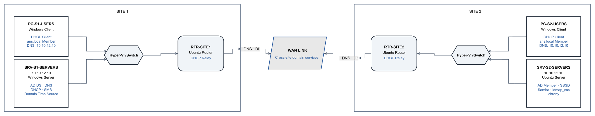

# Phase 2 — Servers: Design & Decisions

## 1. Phase Goal

Phase 2 adds core server services to the routed two-site network built in Phase 1. The focus is centralized identity, DNS, DHCP, time synchronization, domain membership, and cross-platform file sharing.

At the end of this phase, the lab has:

- Active Directory Domain Services and AD-integrated DNS on `SRV-S1-SERVERS`
- centralized DHCP for both Users VLANs, with relay agents on both Ubuntu routers
- both Windows clients using DHCP and joined to `ans.local`
- `SRV-S2-SERVERS` joined to the domain as a Linux member server
- time synchronization in place between the Windows domain controller and Linux server
- Windows SMB and Linux Samba shares using AD security groups for access control
- sample users and groups for validating read-write and read-only access

Monitoring is added in Phase 3. Router filtering, SSH hardening, and the remaining security controls are added in Phase 4.

### How this supports later phases

- **Phase 3 — Monitoring:** adds Zabbix checks for AD, DNS, DHCP, time synchronization, Samba, host availability, and WAN performance
- **Phase 4 — Security:** hardens router forwarding and SSH access around the services and systems established in the earlier phases

### Main technical areas

Active Directory Domain Services, AD-integrated DNS, Windows DHCP, DHCP relay, Windows domain join, Linux AD integration with realmd/SSSD, Kerberos, chrony, SMB/Samba, AD security groups, and cross-platform permissions.

---

## 2. Design Options

### Directory service model

| Option | Advantages | Trade-offs |
|---|---|---|
| **Single AD domain — chosen** | Centralizes identity and DNS for both sites and uses the existing routed WAN path | Site 2 depends on the WAN link for central directory and DNS access |
| Separate directory services per site | Reduces dependency on the WAN for local authentication | Adds unnecessary complexity for a small two-site lab |
| No directory service | Simplest server setup | Removes domain authentication and centralized identity from the phase |

A single `ans.local` domain was selected so both Windows clients and the Linux server could use the same identity source without adding a second Domain Controller.

### DHCP delivery

| Option | Advantages | Trade-offs |
|---|---|---|
| **Central DHCP with router relay — chosen** | Keeps both scopes on one server and allows DHCP to cross VLAN and site boundaries | Relay configuration must be correct on both routers |
| DHCP server at each site | Keeps address assignment local to each site | Requires additional DHCP service instances and separate administration |
| Static addressing for clients | Simple and predictable | Does not provide centralized client address management |

`SRV-S1-SERVERS` hosts both Users-VLAN scopes. Each Ubuntu router relays DHCP traffic to `10.10.12.10`, including Site 2 requests that cross the WAN link.

### Linux domain integration

| Option | Advantages | Trade-offs |
|---|---|---|
| **realmd + SSSD — chosen for Linux identity** | Handles domain discovery, Kerberos integration, NSS/PAM identity lookup, and domain logins | Adds several Linux identity components that must be configured together |
| Manual Kerberos and LDAP configuration | Provides direct control over each component | More configuration and more opportunities for mismatch |
| Samba/Winbind as the primary Linux identity path | Integrates closely with Samba | Not needed as the main NSS/PAM identity method for this build |

`SRV-S2-SERVERS` uses realmd and SSSD for Linux domain membership and AD identity resolution. Samba later uses `security = ads` with the SSSD idmap backend; that Samba configuration also requires `winbindd` and a supplementary `net ads join`, as documented in the build log.

### File-sharing protocol

| Option | Advantages | Trade-offs |
|---|---|---|
| **SMB on Windows and Samba on Linux — chosen** | Gives Windows clients one access protocol for both servers and allows the same AD groups to be tested on each share | Samba requires additional domain-integration and permission configuration |
| SMB on Windows and NFS on Linux | Uses a native Linux file-sharing protocol | Gives clients two different access methods and permission models |
| Windows SMB only | Simplest file-sharing setup | Does not test AD-backed file access on the Linux server |

Both servers therefore expose a file share over SMB-compatible protocols while using the same two AD security groups for access testing.

---

## 3. Final Design Decisions

| Decision | Final Choice | Reason |
|---|---|---|
| Directory service | Single AD domain `ans.local` | One identity source is sufficient for the two-site lab and supports both Windows and Linux domain membership |
| Domain Controller | `SRV-S1-SERVERS` | Reuses the existing Site 1 Windows Server without adding another VM |
| DNS | AD-integrated DNS on `SRV-S1-SERVERS` | Keeps domain name resolution with AD and supports the domain-join workflow |
| DHCP | Two centralized scopes on `SRV-S1-SERVERS` | Provides one DHCP service for both Users VLANs |
| DHCP delivery | Relay on `RTR-SITE1` and `RTR-SITE2` | Allows DHCP requests to cross VLAN boundaries and the Site 2 WAN path |
| Client addressing | DHCP for both Windows clients | Moves user endpoints from Phase 1 static addresses into managed scopes |
| Infrastructure addressing | Static for routers and servers | Keeps gateways and server services at predictable addresses |
| Linux identity integration | realmd + SSSD on `SRV-S2-SERVERS` | Provides AD-backed Linux user and group resolution and domain login |
| Samba domain integration | `security = ads` with SSSD idmap backend | Allows Samba to resolve and enforce the AD groups used by the Linux share |
| Time synchronization | `SRV-S1-SERVERS` as domain time source; chrony on `SRV-S2-SERVERS` | Keeps clocks aligned before Kerberos-based authentication is used |
| DNS clients | Both Windows clients and `SRV-S2-SERVERS` use `10.10.12.10` | These systems require the AD DNS server for domain name resolution and joins |
| File sharing | Windows SMB share plus Linux Samba share | Provides the same client protocol on both servers |
| Share authorization | `SG-FileShare-ReadWrite` and `SG-FileShare-ReadOnly` | Allows the same access model to be validated on Windows and Linux |
| Print services | Out of scope | Not required for the server-service goals of this phase |
| Monitoring | Deferred to Phase 3 | Keeps service monitoring separate from the Phase 2 server build |
| Security hardening | Deferred to Phase 4 | Router filtering and SSH hardening are handled after the server and monitoring layers are complete |

### Server sizing note

Before the Phase 2 build, `SRV-S2-SERVERS` was increased from 1 GB RAM / 1 vCPU to 2 GB RAM / 2 vCPU while powered off. The added resources supported the Linux domain-integration and Samba services without changing the overall topology.

---

## 4. Domain, AD Structure & Addressing

### Domain and service naming

| Item | Value |
|---|---|
| AD domain | `ans.local` |
| NetBIOS name | `ANS` |
| DNS forward zone | `ans.local` |
| DNS reverse zones | `11.10.10.in-addr.arpa`, `12.10.10.in-addr.arpa`, `21.10.10.in-addr.arpa`, `22.10.10.in-addr.arpa` |
| DHCP scopes | `DHCP-S1-USERS`, `DHCP-S2-USERS` |
| Windows share | `\\SRV-S1-SERVERS\TechShare` |
| Linux Samba share | `//SRV-S2-SERVERS/techshare` |

### Phase 2 AD objects

```text
ans.local
├─ OU=Site1
│  ├─ OU=Users
│  │  ├─ PC-S1-USERS
│  │  └─ s1.user
│  └─ OU=Servers
├─ OU=Site2
│  ├─ OU=Users
│  │  ├─ PC-S2-USERS
│  │  └─ s2.user
│  └─ OU=Servers
│     └─ SRV-S2-SERVERS
└─ OU=Groups
   ├─ SG-FileShare-ReadWrite
   └─ SG-FileShare-ReadOnly
```

The Site 1 and Site 2 OUs are used for logical organization only. They are not AD Sites and Services objects. With a single Domain Controller, no AD replication topology is required in this phase.

`SG-FileShare-ReadWrite` contains `s1.user`, while `SG-FileShare-ReadOnly` contains `s2.user`. Those accounts are used to verify write, read, and denied-write behavior on both file shares.

### Addressing changes from Phase 1

| Segment | Subnet | Infrastructure addressing | Phase 2 client addressing |
|---|---|---|---|
| VLAN 10 — Users, Site 1 | 10.10.11.0/24 | Gateway `10.10.11.1` | DHCP pool `10.10.11.100–200`; `PC-S1-USERS` received `10.10.11.100` |
| VLAN 20 — Servers, Site 1 | 10.10.12.0/24 | Gateway `10.10.12.1`; `SRV-S1-SERVERS` `10.10.12.10` | No DHCP scope |
| WAN link | 10.10.0.0/30 | `RTR-SITE1` `10.10.0.1`; `RTR-SITE2` `10.10.0.2` | n/a |
| VLAN 10 — Users, Site 2 | 10.10.21.0/24 | Gateway `10.10.21.1` | DHCP pool `10.10.21.100–200`; `PC-S2-USERS` received `10.10.21.100` |
| VLAN 20 — Servers, Site 2 | 10.10.22.0/24 | Gateway `10.10.22.1`; `SRV-S2-SERVERS` `10.10.22.10` | No DHCP scope |

The routers and servers keep their static Phase 1 addresses. Only the two Windows user endpoints move from static `.10` addresses into the DHCP pools.

### Phase 2 role changes

| VM | Phase 1 role | Phase 2 additions |
|---|---|---|
| `RTR-SITE1` | Ubuntu router | DHCP relay for Site 1 Users VLAN |
| `RTR-SITE2` | Ubuntu router | DHCP relay for Site 2 Users VLAN across the WAN path |
| `SRV-S1-SERVERS` | Windows Server | AD DS, AD-integrated DNS, DHCP, SMB file share, domain time source |
| `SRV-S2-SERVERS` | Ubuntu Server | chrony, AD membership through realmd/SSSD, Samba file share, AD group resolution |
| `PC-S1-USERS` | Windows client | DHCP client, AD DNS client, domain member |
| `PC-S2-USERS` | Windows client | DHCP client through relay, AD DNS client, domain member |

No guest VMs are renamed between phases; the same six Phase 1 systems continue into the server build.

---

## 5. Phase 2 Topology



*Phase 2 topology showing the existing routed two-site network with centralized AD DS, DNS, DHCP, domain membership, time synchronization, and cross-platform file services added.*

---

## 6. Phase 2 Outcome

Phase 2 finished with `ans.local` operating across both sites. Both Windows clients received DHCP leases and joined the domain, `SRV-S2-SERVERS` resolved AD users and groups through SSSD, and the Linux server participated in Kerberos-backed domain access. DNS resolution, DHCP relay, time synchronization, domain health, and group-based file-share permissions were all validated during the build.

The commands, screenshots, validation results, and troubleshooting are documented in [02-build-log.md](02-build-log.md).

A shorter completed-phase view is available in [03-phase-summary.md](03-phase-summary.md).

[← Main README](../README.md) · [Build log](02-build-log.md) · [Phase summary](03-phase-summary.md)
