# Phase 2 — Servers: Design & Decisions

## 1. Objectives

Phase 2 layers directory services, name resolution, dynamic addressing, and cross-platform file sharing onto the routed VLAN foundation built in Phase 1. The goal is a coherent, centrally managed environment rather than a collection of isolated static devices.

What exists when this phase is complete:

- Active Directory Domain Services running on `SRV-S1-SERVERS`, with AD-integrated DNS serving both sites
- Every device re-pointed from Phase 1’s “no DNS configured” state to `SRV-S1-SERVERS` (10.10.12.10)
- Time synchronization in place before domain join (`SRV-S1-SERVERS` as the domain time source; `SRV-S2-SERVERS` synced via chrony) so Kerberos authentication does not fail silently on clock drift
- DHCP relay configured on both routers, delivering dynamic addressing to both Users VLANs from a single central pair of scopes
- `SRV-S2-SERVERS` joined to the domain as a Linux member server (Kerberos/LDAP via SSSD), with Samba `idmap_sss` so AD security groups resolve correctly to Linux permissions
- Both Windows clients domain-joined and receiving DHCP addresses
- A small set of sample AD user accounts and security groups so group-based file-share access can be tested with real principals
- Cross-platform file sharing (native SMB share on Windows, Samba share on Linux)
- Documentation covering design rationale, DNS zone layout, DHCP scope/relay design, domain-join method, file-share ACL design, and the tests that prove the whole stack works

No monitoring or firewall/ACL work is done in this phase — those belong to Phase 3 and Phase 4.

**How this supports later phases:**

- Phase 3 (Monitoring) gains live services to watch (DNS queries, DHCP leases, AD authentication events, file-share access) instead of only raw link connectivity
- Phase 4 (Security & Automation) can use AD as the enforcement point for Group Policy; DHCP/DNS become the foundation for any future NAC-style work; SSH hardening and VLAN-boundary ACLs are layered onto an already-complete server set

**Skills demonstrated:** AD DS deployment and basic design, AD-integrated DNS, DHCP scope design plus relay configuration across subnet and WAN boundaries, Linux domain join via realmd/SSSD (cross-platform identity), SMB/Samba file-share design with AD group enforcement, and continued cross-platform (Windows + Linux) administration.

**Constraints:**

- Same Azure/host budget discipline as Phase 1 — VMs not actively under test are shut down
- AD DS adds measurable memory overhead on `SRV-S1-SERVERS`; allocation is increased if host headroom allows rather than starving the domain controller
- Scope is deliberately capped so the phase does not creep into monitoring or security work

## 2. Options Considered

### Directory Services Scope

| Option | Pros | Cons |
|---|---|---|
| **Single AD domain (chosen)** | Matches how a real organization normally runs; puts the WAN link to work; joining a Linux server via SSSD is a less commonly demonstrated skill | Site 2 authentication depends on the WAN link remaining up |
| Two independent sites (AD only at Site 1, Linux-native services at Site 2) | No WAN dependency for local services | Reads as two disconnected environments and wastes the multi-site story Phase 1 already built |
| No AD — DNS/DHCP only | Fastest to build | Skips the exact role `SRV-S1-SERVERS` was provisioned for in Phase 1 |

### DHCP Delivery Method

| Option | Pros | Cons |
|---|---|---|
| **Relay via routers (chosen)** | Proves DHCP works across subnet boundaries and over the WAN — the realistic enterprise case; the routers already exist and only need one relay configuration each | Relay must be pointed correctly or leases silently never arrive |
| Local DHCP server per Users VLAN | Simpler, no relay needed | Requires additional VMs per site; unrealistic — DHCP servers do not normally sit inside the VLAN they serve |
| Keep everything static | Zero risk | Skips DHCP entirely — one of the three services Phase 1 explicitly deferred |

### Linux Domain-Join Method (`SRV-S2-SERVERS`)

| Option | Pros | Cons |
|---|---|---|
| **realmd + SSSD (chosen)** | Modern standard tooling; automates Kerberos/LDAP/NSS configuration; widely documented | One more service stack to learn |
| Manual Kerberos + LDAP configuration | Deeper “under the hood” understanding | Much slower and more fragile, with no meaningful interview value over realmd |
| Winbind | Works and is Samba-native | Considered a legacy path; realmd is the current recommended approach |

### File Sharing Protocol

| Option | Pros | Cons |
|---|---|---|
| **SMB both sides — native share on Windows, Samba on Linux (chosen)** | One protocol and one client experience on both operating systems — cleanest cross-platform proof | Samba configuration is more involved than NFS |
| NFS on Linux, SMB on Windows | Native to each OS | Two protocols and two access methods; weaker “coherent system” story; Windows-to-NFS access is awkward |
| SMB on Windows only, no Linux share | Simplest | Drops the cross-platform file-sharing demonstration entirely |

## 3. Final Design Decisions

| Decision | Choice | Why |
|---|---|---|
| Directory service model | Single AD domain `ans.local`, `SRV-S1-SERVERS` as the sole Domain Controller | Matches a realistic single-organization deployment; makes full use of the WAN link and both server VMs |
| DNS | AD-integrated DNS on `SRV-S1-SERVERS` | Keeps DNS and directory data consistent automatically; replaces any standalone BIND9 plan |
| DHCP delivery | Relay agent on both routers pointing to `SRV-S1-SERVERS`; scopes cover the Users VLANs only | Realistic enterprise pattern; proves DHCP across subnet and WAN boundaries |
| Static vs. dynamic addressing | Servers, routers, and the WAN link stay static; only the Users-VLAN PCs convert to DHCP | Infrastructure devices need predictable addresses; only end-user devices benefit from dynamic assignment |
| Linux domain integration | realmd + SSSD on `SRV-S2-SERVERS` | Standard, well-documented method for joining Linux to AD; demonstrates real cross-platform identity |
| Time sync | `SRV-S1-SERVERS` is the domain time source; `SRV-S2-SERVERS` is synced via chrony before domain join | Kerberos rejects authentication if clocks drift too far; this is a prerequisite, not an optional extra |
| DNS client configuration | Every device is explicitly re-pointed to `SRV-S1-SERVERS` (10.10.12.10) | Phase 1 devices had no DNS configured; the change must be deliberate, not assumed as a side-effect of domain join |
| Samba group resolution | `idmap_sss` configured on `SRV-S2-SERVERS` | realmd/SSSD authenticates the server to AD, but Samba still needs ID mapping so AD group SIDs become Linux GIDs; without it, security-group ACLs on the Samba share do not enforce |
| Test accounts | Sample AD user accounts created across both site OUs | Group-based ACLs need real principals to test against |
| File sharing | Native SMB share on `SRV-S1-SERVERS`; Samba share on `SRV-S2-SERVERS` | Same protocol on both sides — cleanest cross-platform access story |
| Print services | Out of scope | Low relevance and disproportionate setup cost for the value it would add |
| Syslog / SSH hardening | Deferred | Belongs to Phase 3 (Monitoring) and Phase 4 (Security & Automation) respectively |

## 4. Naming, Domain Structure & Addressing

**Domain & service naming**

| Item | Value |
|---|---|
| AD domain name | `ans.local` |
| DNS zones | Forward: `ans.local`<br>Reverse: `11.10.10.in-addr.arpa`, `12.10.10.in-addr.arpa`, `21.10.10.in-addr.arpa`, `22.10.10.in-addr.arpa` |
| DHCP scope names | `DHCP-S1-USERS`, `DHCP-S2-USERS` |
| File shares | `\\SRV-S1-SERVERS\TechShare` (Windows SMB), `//SRV-S2-SERVERS/techshare` (Samba) |

**OU structure**

```
ans.local
 ├─ OU=Site1
 │   ├─ OU=Users     (PC-S1-USERS, Site 1 user accounts)
 │   └─ OU=Servers   (SRV-S1-SERVERS)
 └─ OU=Site2
     ├─ OU=Users     (PC-S2-USERS, Site 2 user accounts)
     └─ OU=Servers   (SRV-S2-SERVERS)
```

Security groups `SG-FileShare-ReadWrite` and `SG-FileShare-ReadOnly` live under a top-level `OU=Groups` and govern access to both shares so the ACL logic is identical on Windows and Linux.

Sample accounts: one test user per site OU (`s1.user`, `s2.user`) assigned to the two security groups in different combinations — enough to prove read-write works, read-only works, and access is correctly denied where expected.

**Note on OUs vs. AD Sites:** The `OU=Site1` / `OU=Site2` containers are ordinary organizational units used for logical grouping. They are **not** AD Sites and Services subnet/site objects (which control replication topology and client site affinity). With a single domain controller there is nothing to replicate, so configuring actual AD Sites is out of scope for this phase. The distinction is stated explicitly so it is understood as a deliberate scope decision rather than an omission.

**IP addressing — DHCP layered on the Phase 1 static plan**

| Segment | Subnet | Static (unchanged from Phase 1) | New DHCP pool |
|---|---|---|---|
| VLAN10-USERS, Site 1 | 10.10.11.0/24 | Gateway .1 | .100–.200 → PC-S1-USERS |
| VLAN20-SERVERS, Site 1 | 10.10.12.0/24 | Gateway .1, SRV-S1-SERVERS .10 | none — Servers VLAN stays static-only |
| WAN-LINK | 10.10.0.0/30 | unchanged | n/a |
| VLAN10-USERS, Site 2 | 10.10.21.0/24 | Gateway .1 | .100–.200 → PC-S2-USERS (relayed across WAN) |
| VLAN20-SERVERS, Site 2 | 10.10.22.0/24 | Gateway .1, SRV-S2-SERVERS .10 | none |

**Device / role additions**

| VM | Phase 1 role | Phase 2 additions |
|---|---|---|
| RTR-SITE1 | Router | DHCP relay agent for VLAN10-USERS Site 1 |
| RTR-SITE2 | Router | DHCP relay agent, forwarding across the WAN link to SRV-S1-SERVERS |
| SRV-S1-SERVERS | Windows Server, static | AD DS (Domain Controller), AD-integrated DNS, DHCP Server (both scopes), File Server (SMB share), domain time source |
| SRV-S2-SERVERS | Ubuntu Server, static | chrony synced to SRV-S1-SERVERS, domain member via realmd/SSSD, Samba file share with idmap_sss, DNS re-pointed to SRV-S1-SERVERS |
| PC-S1-USERS | Windows client, static | Converts to DHCP, domain-joined to ans.local, DNS re-pointed to SRV-S1-SERVERS |
| PC-S2-USERS | Windows client, static | Converts to DHCP (via relay across WAN), domain-joined to ans.local, DNS re-pointed to SRV-S1-SERVERS |

No VMs are renamed. Every device keeps its Phase 1 identity and gains roles, so the checkpoint and documentation history remains continuous.

**Plan-vs-actual note:** Before Phase 2 work began, `SRV-S2-SERVERS` memory and vCPU were increased from the Phase 1 values (1 GB / 1 vCPU) to 2 GB / 2 vCPU while the VM was powered off. This was done to give the Linux domain member and Samba stack adequate headroom; the change is noted here for accuracy and does not alter the overall design.

## 5. Topology Diagram

```mermaid
%%{init: {'flowchart': {'nodeSpacing': 60, 'rankSpacing': 55}}}%%
flowchart LR

    subgraph SITE1["SITE 1"]
        direction TB

        PC1["<b>PC-S1-USERS</b><br/>10.10.11.100 (DHCP)<br/>Windows Client<br/><font color='#285A9E'>VLAN 10 · domain-joined</font>"]

        SRV1["<b>SRV-S1-SERVERS</b><br/>10.10.12.10 (static)<br/>Windows Server<br/><font color='#285A9E'>AD DS · DNS · DHCP · SMB<br/>domain time source</font>"]

        VS1{{"<b>Hyper-V vSwitch</b><br/>802.1Q TRUNK"}}

        R1["<b>RTR-SITE1</b><br/>Ubuntu Router<br/>VLAN 10: 10.10.11.1<br/>VLAN 20: 10.10.12.1<br/><font color='#285A9E'>DHCP relay<br/>WAN: 10.10.0.1/30</font>"]

        PC1 -->|"VLAN 10"| VS1
        SRV1 -->|"VLAN 20"| VS1
        VS1 -->|"802.1Q Trunk"| R1
    end

    WAN[/"<b>WAN LINK</b><br/>10.10.0.0/30<br/>Static Routing"/]

    R1 -->|"10.10.0.1/30"| WAN
    WAN -->|"10.10.0.2/30"| R2

    subgraph SITE2["SITE 2"]
        direction TB

        R2["<b>RTR-SITE2</b><br/>Ubuntu Router<br/>VLAN 10: 10.10.21.1<br/>VLAN 20: 10.10.22.1<br/><font color='#285A9E'>DHCP relay<br/>WAN: 10.10.0.2/30</font>"]

        VS2{{"<b>Hyper-V vSwitch</b><br/>802.1Q TRUNK"}}

        PC2["<b>PC-S2-USERS</b><br/>10.10.21.100 (DHCP)<br/>Windows Client<br/><font color='#285A9E'>VLAN 10 · domain-joined</font>"]

        SRV2["<b>SRV-S2-SERVERS</b><br/>10.10.22.10 (static)<br/>Ubuntu Server<br/><font color='#285A9E'>domain member (SSSD)<br/>Samba share · chrony</font>"]

        R2 -->|"802.1Q Trunk"| VS2
        VS2 -->|"VLAN 10"| PC2
        VS2 -->|"VLAN 20"| SRV2
    end

    classDef endpoint fill:#FFFFFF,stroke:#243B5A,stroke-width:2px,color:#111827;
    classDef server fill:#FFFFFF,stroke:#243B5A,stroke-width:2px,color:#111827;
    classDef switch fill:#EEF3F8,stroke:#243B5A,stroke-width:2px,color:#111827;
    classDef router fill:#F5F8FC,stroke:#183B63,stroke-width:3px,color:#111827;
    classDef wan fill:#EDF4FF,stroke:#285A9E,stroke-width:2px,color:#111827;

    class PC1,PC2 endpoint;
    class SRV1,SRV2 server;
    class VS1,VS2 switch;
    class R1,R2 router;
    class WAN wan;

    style SITE1 fill:#FFFFFF,stroke:#243B5A,stroke-width:2px
    style SITE2 fill:#FFFFFF,stroke:#243B5A,stroke-width:2px

    linkStyle default stroke:#334155,stroke-width:2px
```



DHCP requests from either Users VLAN travel to the local router’s relay agent and are forwarded to `SRV-S1-SERVERS`. For Site 2 this path crosses the WAN link. Domain authentication and DNS queries follow the same path.

## 6. Status

- Step 1 — Understand the goal — done
- Step 2 — Research options — done
- Step 3 — Make decisions — done
- Step 4 — Build (see `02-build-log.md`)
