# Phase 2 — Servers: Build Log

Environment and design rationale are covered in `01-decisions.md`. This document is the as-executed build: commands, verification output, and the issues encountered along the way.

## 1. Environment & Prerequisites (recap)

Same Azure/Hyper-V nested lab from Phase 1. All six guest VMs and the three private virtual switches remained in place. Design decisions (single AD domain, DHCP relay, realmd/SSSD, SMB on both platforms) are documented in `01-decisions.md`.

Pre-checks completed before any Phase 2 work:

- `SRV-S2-SERVERS` memory and vCPU increased to 2 GB / 2 vCPU while powered off
- Both routers powered on first to conserve host memory
- `ip_forward` verified on both routers
- Hostnames and NIC aliases spot-checked on Windows devices

## 2. Time Sync

### SRV-S1-SERVERS as authoritative time source

```powershell
Stop-Service w32time
w32tm /config /syncfromflags:NO /reliable:YES /update
Start-Service w32time
w32tm /config /update
New-NetFirewallRule -DisplayName "NTP-In (UDP 123)" -Direction Inbound -Protocol UDP -LocalPort 123 -Action Allow
w32tm /query /status
```

**Result:** Stratum 1, self-authoritative (LOCL), no errors.

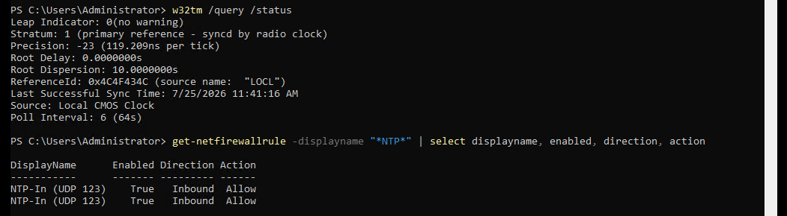

### chrony on SRV-S2-SERVERS

```bash
sudo apt install chrony -y
```

Final working `/etc/chrony/chrony.conf` (default `maxdistance` of 3 seconds was too strict for the initial multi-hour clock offset — see Issue 1):

```text
server 10.10.12.10 iburst prefer
makestep 1 -1
maxdistance 16
```

```bash
sudo systemctl restart chrony
sudo systemctl enable chrony
chronyc tracking
chronyc sources -v
```

**Result:** `^* 10.10.12.10`, Stratum 2, offset in the microsecond range, Leap status Normal.

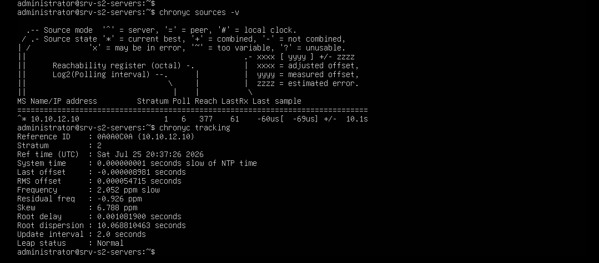

**Checkpoint:** `SRV-S1-SERVERS - ntp-authoritative-configured`, `SRV-S2-SERVERS - chrony-synced`

## 3. AD DS Promotion & Objects

### Install AD DS role and promote

```powershell
Install-WindowsFeature -Name AD-Domain-Services -IncludeManagementTools
Import-Module ADDSDeployment
Install-ADDSForest `
  -DomainName "ans.local" `
  -DomainNetbiosName "ANS" `
  -InstallDns:$true `
  -SafeModeAdministratorPassword (ConvertTo-SecureString "<dsrm-password-redacted>" -AsPlainText -Force) `
  -Force:$true
```

VM rebooted automatically.

### Post-promotion verification

```powershell
Get-ADDomain
Get-Service NTDS, DNS, Netlogon
w32tm /query /status /verbose
```

**Result:** Domain `ans.local` present; NTDS, DNS, and Netlogon all Running; time configuration survived promotion (still Stratum 1).

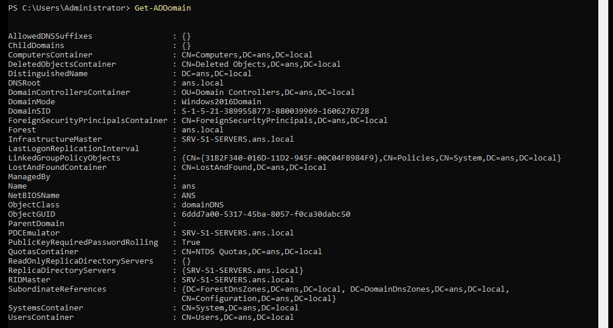
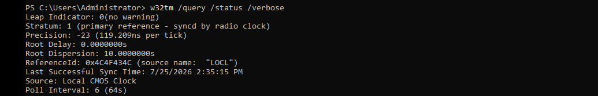

### OU structure, security groups, and sample accounts

```powershell
New-ADOrganizationalUnit -Name "Site1" -Path "DC=ans,DC=local"
New-ADOrganizationalUnit -Name "Users" -Path "OU=Site1,DC=ans,DC=local"
New-ADOrganizationalUnit -Name "Servers" -Path "OU=Site1,DC=ans,DC=local"
New-ADOrganizationalUnit -Name "Site2" -Path "DC=ans,DC=local"
New-ADOrganizationalUnit -Name "Users" -Path "OU=Site2,DC=ans,DC=local"
New-ADOrganizationalUnit -Name "Servers" -Path "OU=Site2,DC=ans,DC=local"
New-ADOrganizationalUnit -Name "Groups" -Path "DC=ans,DC=local"

New-ADGroup -Name "SG-FileShare-ReadWrite" -GroupScope Global -Path "OU=Groups,DC=ans,DC=local"
New-ADGroup -Name "SG-FileShare-ReadOnly" -GroupScope Global -Path "OU=Groups,DC=ans,DC=local"

New-ADUser -Name "s1.user" -SamAccountName "s1.user" -UserPrincipalName "s1.user@ans.local" `
  -Path "OU=Users,OU=Site1,DC=ans,DC=local" `
  -AccountPassword (ConvertTo-SecureString "<password-redacted>" -AsPlainText -Force) -Enabled $true

New-ADUser -Name "s2.user" -SamAccountName "s2.user" -UserPrincipalName "s2.user@ans.local" `
  -Path "OU=Users,OU=Site2,DC=ans,DC=local" `
  -AccountPassword (ConvertTo-SecureString "<password-redacted>" -AsPlainText -Force) -Enabled $true

Add-ADGroupMember -Identity "SG-FileShare-ReadWrite" -Members "s1.user"
Add-ADGroupMember -Identity "SG-FileShare-ReadOnly" -Members "s2.user"
```

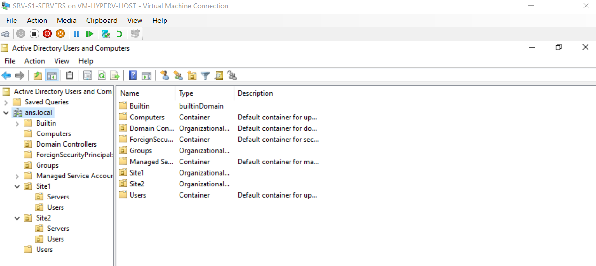
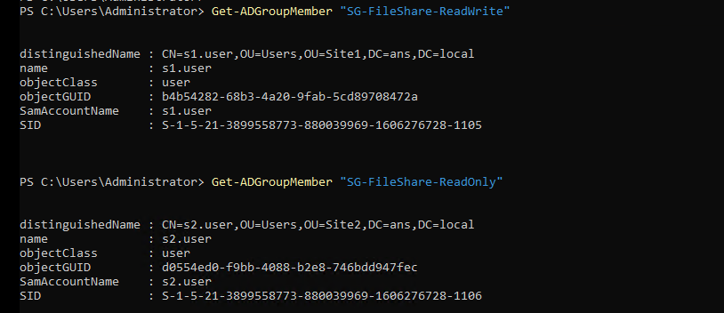

**Checkpoint:** `SRV-S1-SERVERS - post-ADDS-promotion-working`

## 4. DNS Configuration

### Reverse lookup zones

```powershell
Add-DnsServerPrimaryZone -NetworkID "10.10.11.0/24" -ReplicationScope "Forest"
Add-DnsServerPrimaryZone -NetworkID "10.10.12.0/24" -ReplicationScope "Forest"
Add-DnsServerPrimaryZone -NetworkID "10.10.21.0/24" -ReplicationScope "Forest"
Add-DnsServerPrimaryZone -NetworkID "10.10.22.0/24" -ReplicationScope "Forest"
```

### Re-point clients and SRV-S2-SERVERS to the new DNS server

Windows clients:

```powershell
Set-DnsClientServerAddress -InterfaceAlias "Ethernet" -ServerAddresses "10.10.12.10"
```

SRV-S2-SERVERS (`/etc/netplan/00-installer-config.yaml`):

```yaml
network:
  version: 2
  ethernets:
    eth0:
      dhcp4: no
      addresses:
        - 10.10.22.10/24
      routes:
        - to: default
          via: 10.10.22.1
      nameservers:
        addresses: [10.10.12.10]
        search: [ans.local]
```

```bash
sudo netplan apply
```

First attempt failed on YAML indentation (see Issue 4). After correction, `resolvectl status eth0` confirmed the correct DNS server and search domain.

### DNS resolution verification

From SRV-S2-SERVERS and both PCs: `nslookup ans.local`, `nslookup srv-s1-servers.ans.local`, and reverse lookups all succeeded.

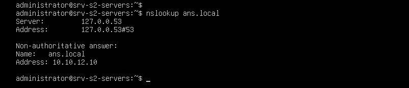
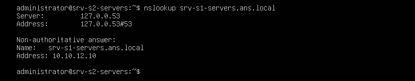
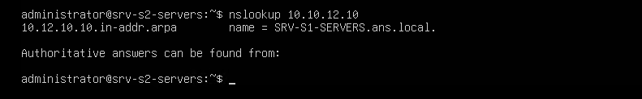
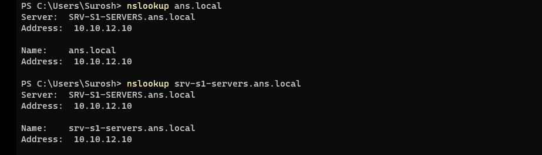
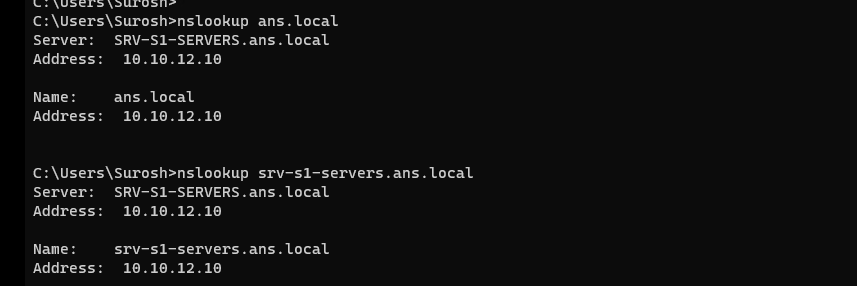

**Checkpoint:** `ALL-DEVICES - dns-repointed-verified`

## 5. DHCP Deployment & Relay

### Install and authorize DHCP on SRV-S1-SERVERS

```powershell
Install-WindowsFeature DHCP -IncludeManagementTools
Add-DhcpServerInDC -DnsName "srv-s1-servers.ans.local" -IPAddress 10.10.12.10
```

### Create scopes

```powershell
Add-DhcpServerv4Scope -Name "DHCP-S1-USERS" -StartRange 10.10.11.100 -EndRange 10.10.11.200 -SubnetMask 255.255.255.0
Set-DhcpServerv4OptionValue -ScopeId 10.10.11.0 -Router 10.10.11.1 -DnsServer 10.10.12.10 -DnsDomain "ans.local"

Add-DhcpServerv4Scope -Name "DHCP-S2-USERS" -StartRange 10.10.21.100 -EndRange 10.10.21.200 -SubnetMask 255.255.255.0
Set-DhcpServerv4OptionValue -ScopeId 10.10.21.0 -Router 10.10.21.1 -DnsServer 10.10.12.10 -DnsDomain "ans.local"
```

### Dynamic DNS settings and firewall

```powershell
Set-DhcpServerv4DnsSetting -ScopeId 10.10.11.0 -DynamicUpdates "Always" -DeleteDnsRROnLeaseExpiry $true
Set-DhcpServerv4DnsSetting -ScopeId 10.10.21.0 -DynamicUpdates "Always" -DeleteDnsRROnLeaseExpiry $true
```

All four DHCP Server firewall rules confirmed Enabled.

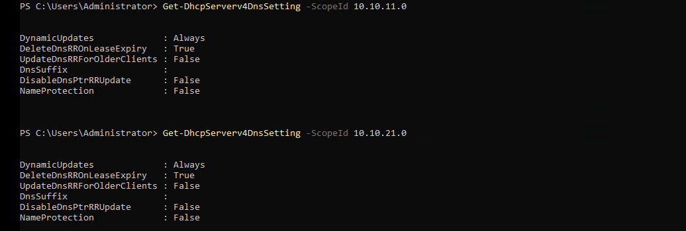
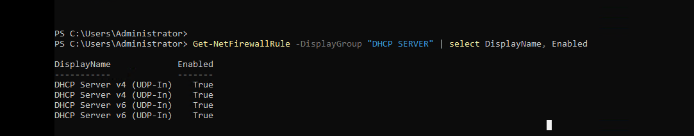

### DHCP relay on both routers

Both routers required a temporary internet path to install `isc-dhcp-relay` (see Issue 6). Final working configuration on **both** routers:

```text
# /etc/default/isc-dhcp-relay
SERVERS="10.10.12.10"
INTERFACES=""
OPTIONS="-id eth0.10 -iu eth0.20 -iu eth1"
```

```bash
sudo systemctl restart isc-dhcp-relay
sudo systemctl enable isc-dhcp-relay
```

The initial configuration used plain `-i` flags and caused legitimate replies to be dropped as “bogus giaddr” (see Issue 7). The corrected `-id` / `-iu` classification resolved it.

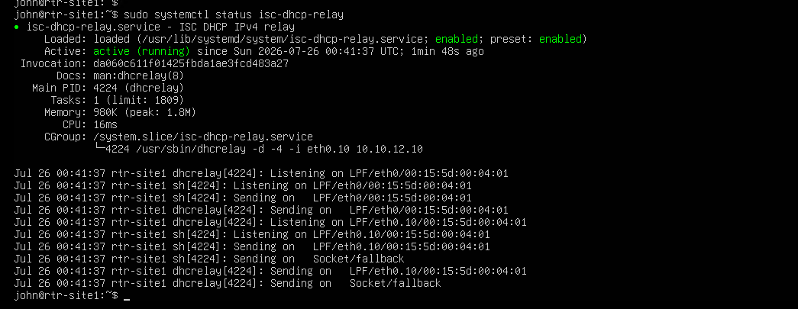
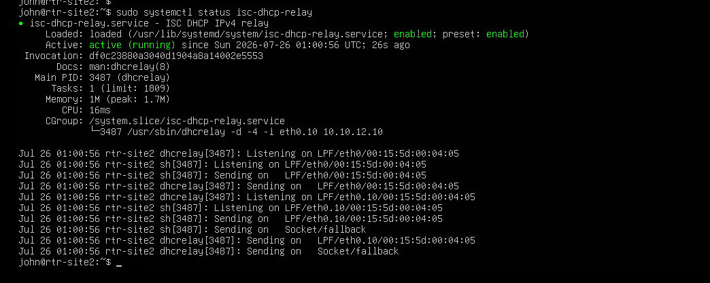
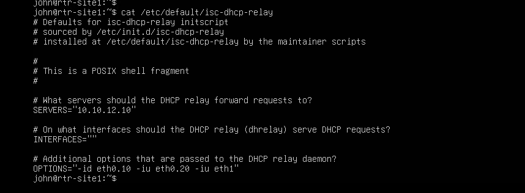
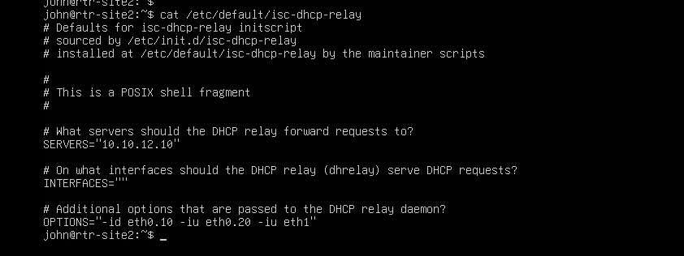

### Convert both PCs to DHCP

```powershell
Set-NetIPInterface -InterfaceAlias "Ethernet" -Dhcp Enabled
Remove-NetIPAddress -InterfaceAlias "Ethernet" -Confirm:$false
Set-DnsClientServerAddress -InterfaceAlias "Ethernet" -ResetServerAddresses
ipconfig /renew
```

**Results:**

| Device | IP | Gateway | DNS | Hostname in lease |
|---|---|---|---|---|
| PC-S1-USERS | 10.10.11.100/24 | 10.10.11.1 | 10.10.12.10 | PC-S1-USERS.ans.local |
| PC-S2-USERS | 10.10.21.100/24 | 10.10.21.1 | 10.10.12.10 | PC-S2-USERS.ans.local |

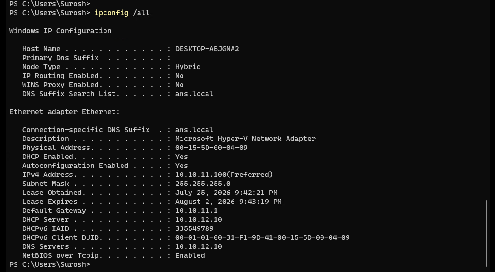
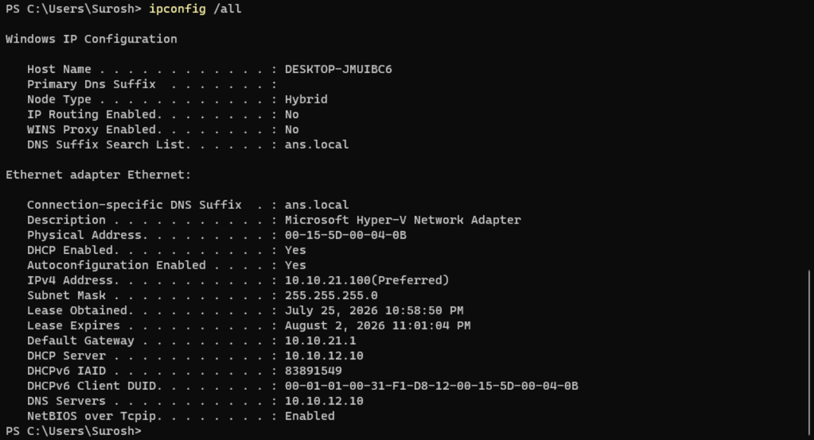

### Dynamic DNS registration

Initial leases showed `DnsRegistration: Complete` but no A records appeared in the zone. Root cause was a missing DHCP-to-DNS credential (see Issue 8). After:

```powershell
Set-DhcpServerDnsCredential -Credential (Get-Credential)
```

(and a hostname correction on PC-S1-USERS — see Issue 10), both A records registered correctly.

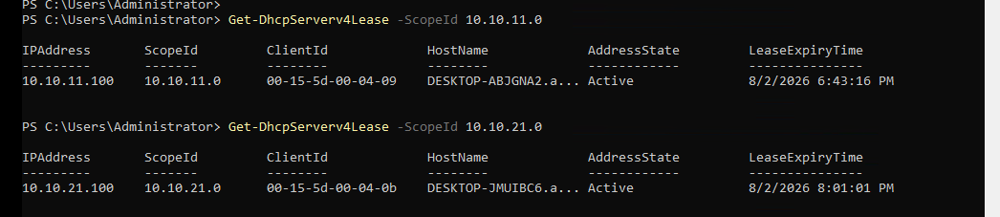
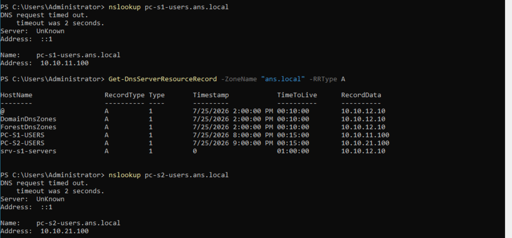

**Checkpoints:** `RTR-SITE1 - post-dhcp-relay-working`, `RTR-SITE2 - post-dhcp-relay-working`, `SRV-S1-SERVERS - post-dhcp-phaseD-complete`, `PC-S1-USERS - dhcp-lease-confirmed`, `PC-S2-USERS - dhcp-lease-confirmed`

## 6. Windows Domain Join

### PC-S1-USERS

```powershell
Add-Computer -DomainName "ans.local" -Credential (Get-Credential) -Restart
```

First attempt failed on credential format (forward slash instead of backslash — see Issue 11). Retry with `ans\administrator` succeeded.

```powershell
whoami
Move-ADObject -Identity "CN=PC-S1-USERS,CN=Computers,DC=ans,DC=local" -TargetPath "OU=Users,OU=Site1,DC=ans,DC=local"
```

**Result:** `ans\s1.user` after login; computer object moved to the correct OU.

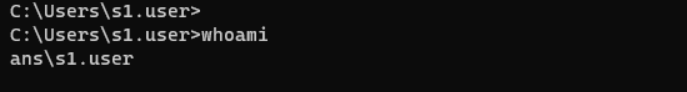
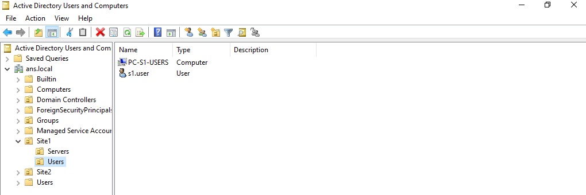

### PC-S2-USERS

Same procedure. No credential-format repeat. Logged in as `s2.user`, computer object moved to `OU=Users,OU=Site2,DC=ans,DC=local`.

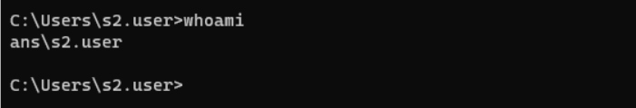
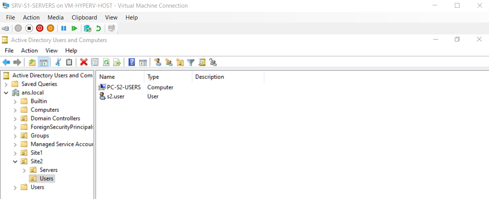

**Checkpoints:** `PC-S1-USERS - domain-joined-verified`, `PC-S2-USERS - domain-joined-verified`

## 7. Linux Domain Integration (SRV-S2-SERVERS)

### Package install (permanent narrow-route NAT path)

Because SRV-S2-SERVERS sits on an isolated private vSwitch, a permanent destination-specific route path was established once (see Issue 13) rather than repeatedly swapping the default route:

```bash
sudo ip addr add 192.168.100.10/24 dev eth1
sudo ip link set eth1 up
sudo ip route add 8.8.8.8/32 via 192.168.100.1 dev eth1
sudo ip route add 91.189.91.0/24 via 192.168.100.1 dev eth1
sudo ip route add 91.189.92.0/24 via 192.168.100.1 dev eth1
sudo ip route add 185.125.190.0/24 via 192.168.100.1 dev eth1
```

```bash
sudo apt install realmd sssd sssd-tools libnss-sss libpam-sss adcli samba-common-bin oddjob oddjob-mkhomedir packagekit -y
```

### Discover and join

```bash
sudo realm discover ans.local
sudo realm join ans.local -U Administrator
```

### Verification and post-join fixes

```bash
sudo realm list
getent passwd s1.user
id s2.user
```

Initial `getent` / `id` failures were caused by a leftover public DNS resolver from the package-install workaround (Issue 14) and by `use_fully_qualified_names = True` (Issue 15). After fixing both:

```bash
getent passwd s1.user
id s2.user
```

Both resolved correctly, including group membership.

Home-directory creation on login was enabled via `pam-auth-update`.

SSH login as `s2.user` initially failed because SSSD dynamic DNS registration never created an A record for the server itself (Issue 16). Manual workaround:

```powershell
Add-DnsServerResourceRecordA -ZoneName "ans.local" -Name "srv-s2-servers" -IPv4Address "10.10.22.10"
```

After that, SSH succeeded and the home directory was created automatically.

```powershell
Move-ADObject -Identity "CN=SRV-S2-SERVERS,CN=Computers,DC=ans,DC=local" -TargetPath "OU=Servers,OU=Site2,DC=ans,DC=local"
```

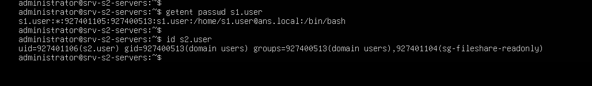

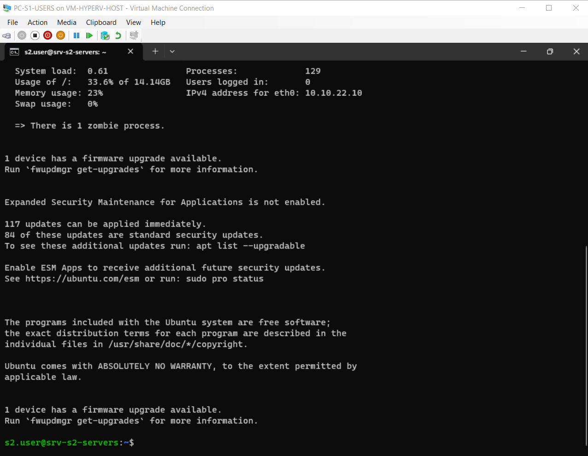
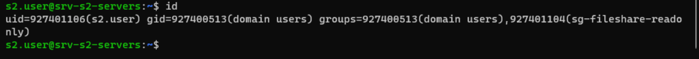
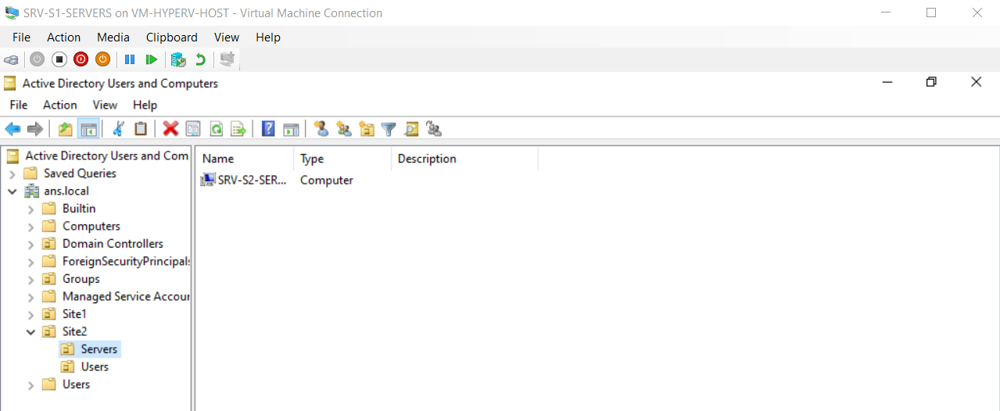

**Checkpoint:** `SRV-S2-SERVERS - realm-joined-verified`

## 8. File Sharing

### SMB share on SRV-S1-SERVERS

```powershell
New-Item -Path "C:\TechShare" -ItemType Directory
New-SmbShare -Name "TechShare" -Path "C:\TechShare" -FullAccess "ANS\SG-FileShare-ReadWrite","ANS\SG-FileShare-ReadOnly"
icacls "C:\TechShare" /grant "ANS\SG-FileShare-ReadWrite:(OI)(CI)M"
icacls "C:\TechShare" /grant "ANS\SG-FileShare-ReadOnly:(OI)(CI)RX"
```

An inherited `BUILTIN\Users` ACE later granted unexpected write rights to the ReadOnly group (see Issue 19). Inheritance was broken and the ACL rebuilt explicitly.

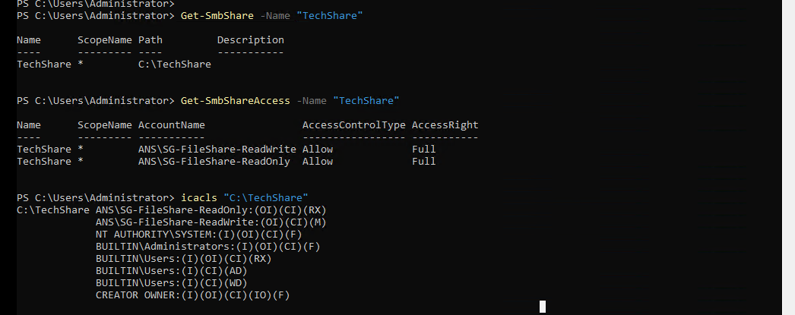
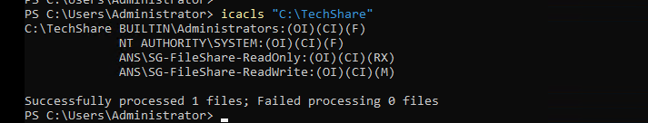

### Samba share on SRV-S2-SERVERS

```bash
sudo apt install samba krb5-user -y
```

`/etc/samba/smb.conf` (relevant sections):

```ini
[global]
workgroup = ANS
security = ads
realm = ANS.LOCAL
idmap config * : backend = sss
idmap config * : range = 200000-2147483647

[techshare]
path = /srv/techshare
valid users = @"SG-FileShare-ReadWrite" @"SG-FileShare-ReadOnly"
write list = @"SG-FileShare-ReadWrite"
read only = yes
```

```bash
sudo mkdir -p /srv/techshare
sudo chgrp "SG-FileShare-ReadWrite" /srv/techshare
sudo chmod 2775 /srv/techshare
sudo systemctl restart smbd nmbd
```

`security = ads` requires `winbindd` even when using the `sss` idmap backend (see Issue 18). A supplementary `net ads join` was required for Samba’s domain membership state:

```bash
sudo net ads join -U administrator
sudo systemctl restart winbind smbd nmbd
```

AD group resolution confirmed with `getent group`.

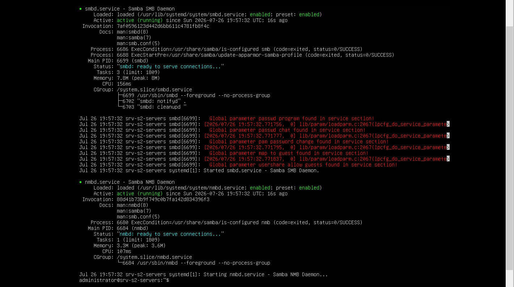
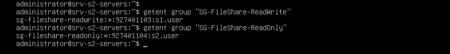

### Access test matrix

| Test | Account | Share | Expected | Result |
|---|---|---|---|---|
| 1 | s1.user (ReadWrite) | `\\SRV-S1-SERVERS\TechShare` | Write succeeds | Passed |
| 2 | s1.user (ReadWrite) | `\\SRV-S2-SERVERS\techshare` | Write succeeds | Passed (after winbind fix) |
| 3 | s2.user (ReadOnly) | Both shares | Write denied | Passed (after NTFS inheritance fix) |
| 4 | s2.user (ReadOnly) | Both shares | Read succeeds | Passed |

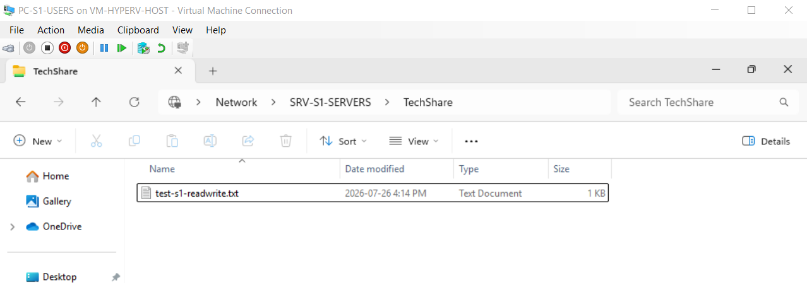
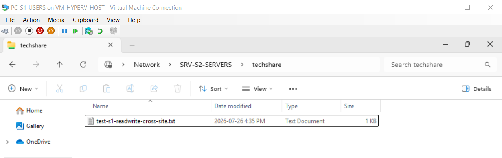
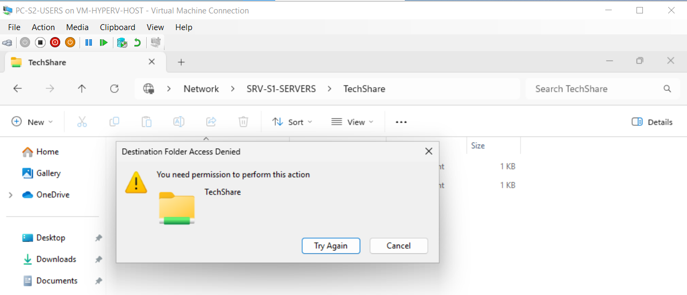
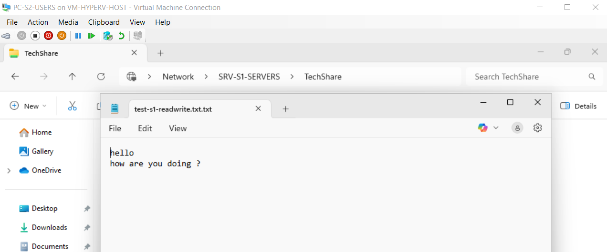
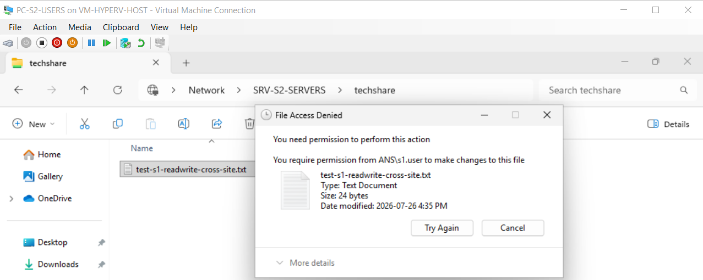
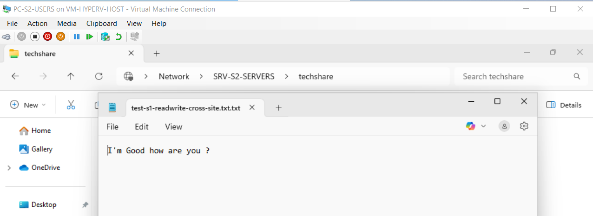

**Checkpoints:** `SRV-S1-SERVERS - file-share-verified`, `SRV-S2-SERVERS - samba-share-verified`

## 9. Validation

#### Test 1 — DNS full-mesh resolution

**Objective:** Confirm every device can resolve every other device by name, including the DHCP-registered PC records and the manually-added SRV-S2-SERVERS record.

**Method:**
```bash
nslookup pc-s1-users.ans.local
nslookup pc-s2-users.ans.local
nslookup srv-s1-servers.ans.local
nslookup srv-s2-servers.ans.local
```

**Result:** All lookups succeeded from SRV-S2-SERVERS, PC-S1-USERS, and PC-S2-USERS.

**Evidence:** 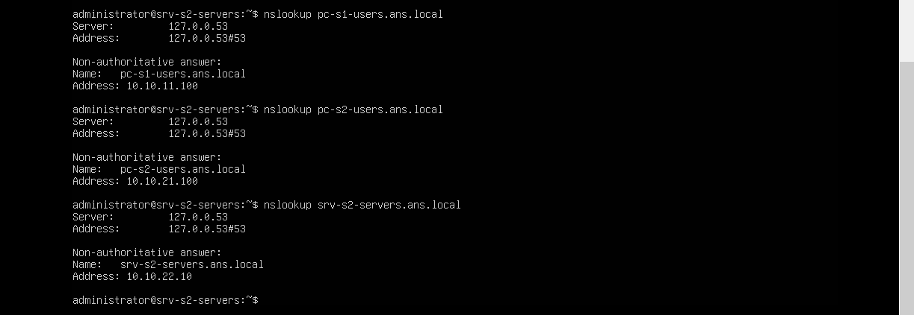 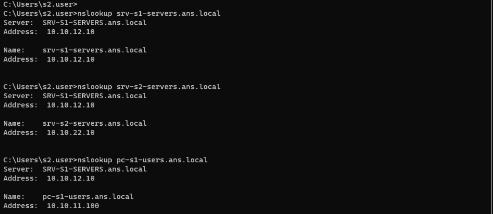 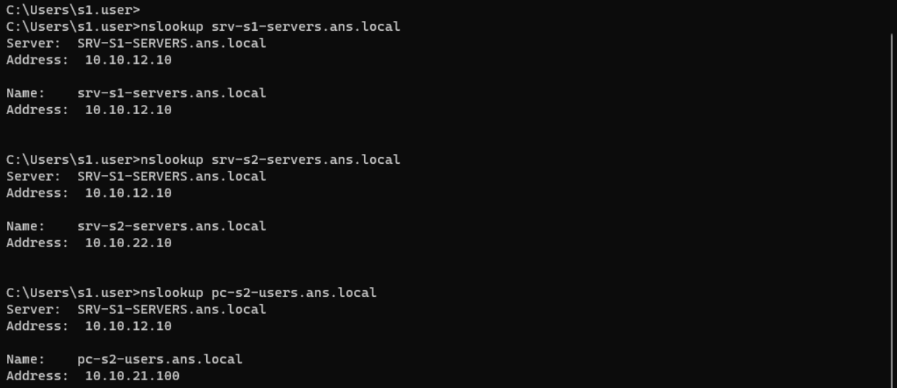

#### Test 2 — DHCP lease confirmation

**Objective:** Confirm both PCs hold active leases with the expected addresses and hostnames.

**Method:**
```powershell
Get-DhcpServerv4Lease -ScopeId 10.10.11.0
Get-DhcpServerv4Lease -ScopeId 10.10.21.0
```

**Result:** Both leases Active, correct IPs/MACs/hostnames.

**Evidence:** 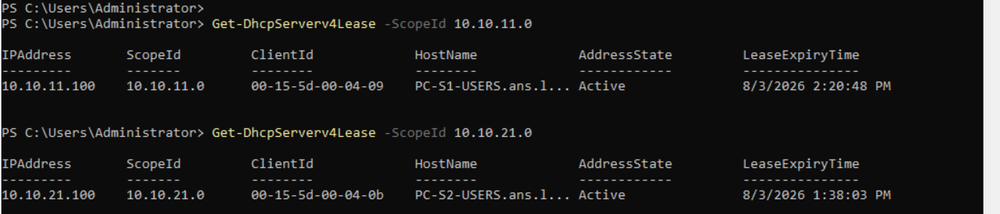

#### Test 3 — Time synchronization

**Objective:** Confirm the domain time hierarchy is healthy.

**Method:**
```powershell
w32tm /query /status
```
```bash
chronyc tracking
```

**Result:** SRV-S1-SERVERS Stratum 1 self-authoritative; SRV-S2-SERVERS Stratum 2, offset ~120 µs, Leap status Normal.

**Evidence:** 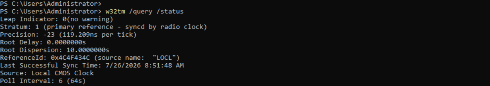 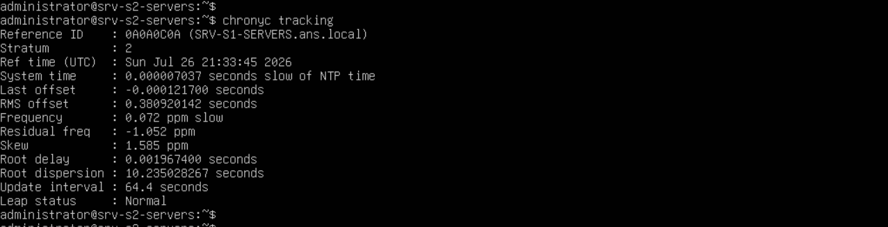

#### Test 4 — Kerberos ticket evidence

**Objective:** Confirm Kerberos authentication is functioning for cross-platform access.

**Method:**
```powershell
klist
```

**Result:** PC-S1-USERS (logged in as s1.user) held a TGT plus service tickets for LDAP (SRV-S1-SERVERS) and CIFS (SRV-S2-SERVERS), all AES-256.

**Evidence:** 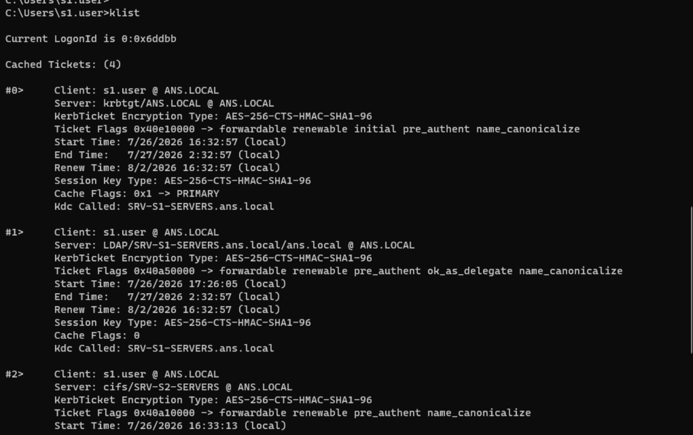

#### Test 5 — AD health diagnostic

**Objective:** Confirm the domain controller itself is healthy.

**Method:**
```powershell
dcdiag /v
```

**Result:** All tests passed except DFSREvent (expected with a single-DC forest; SysVolCheck passed independently, confirming SYSVOL health).

**Evidence:** 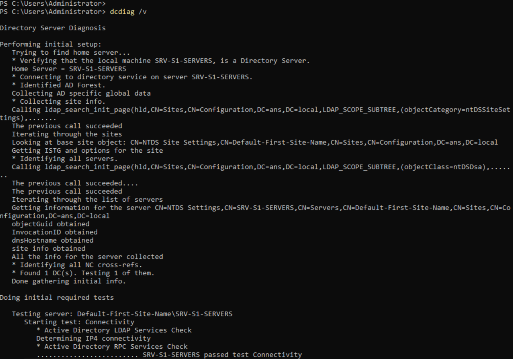 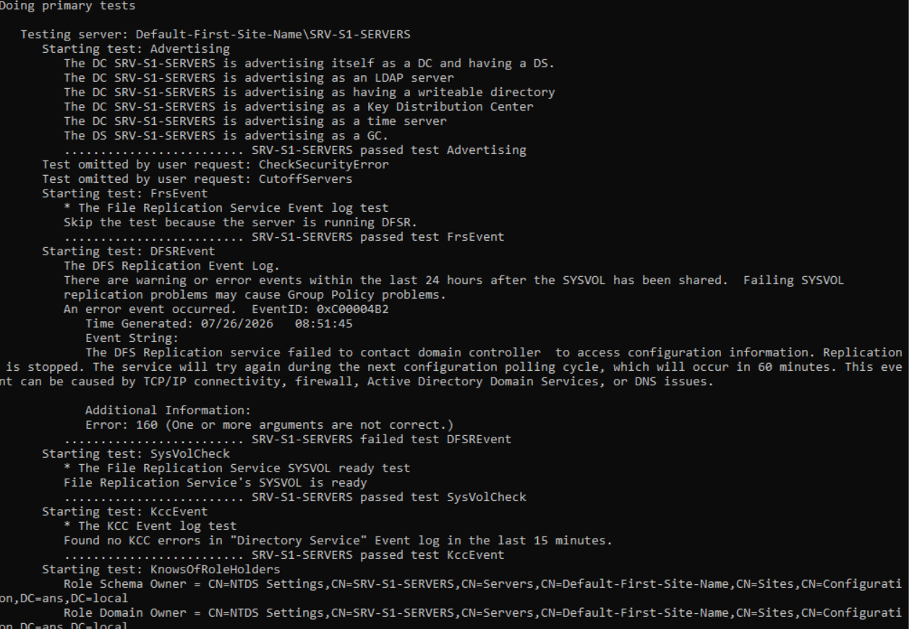 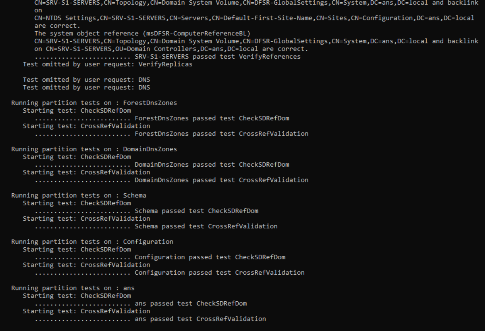

#### Test 6 — File-share enforcement

**Objective:** Confirm group-based access is correctly enforced on both the Windows SMB share and the Linux Samba share.

**Method:** Full four-combination matrix already executed in Section 8 (s1.user ReadWrite write on both shares; s2.user ReadOnly write-denied and read-success on both shares).

**Result:** All four combinations passed after the NTFS inheritance and winbind fixes documented in Issues 18 and 19.

**Evidence:** See the six evidence screenshots in Section 8 (phase2-34 through phase2-40).

## 10. Final State

Final checkpoint taken on all six VMs:

```powershell
Checkpoint-VM -Name PC-S1-USERS -SnapshotName "Phase2-Complete-Clean"
Checkpoint-VM -Name PC-S2-USERS -SnapshotName "Phase2-Complete-Clean"
Checkpoint-VM -Name RTR-SITE1 -SnapshotName "Phase2-Complete-Clean"
Checkpoint-VM -Name RTR-SITE2 -SnapshotName "Phase2-Complete-Clean"
Checkpoint-VM -Name SRV-S1-SERVERS -SnapshotName "Phase2-Complete-Clean"
Checkpoint-VM -Name SRV-S2-SERVERS -SnapshotName "Phase2-Complete-Clean"
```

Interim troubleshooting checkpoints were removed, leaving exactly two checkpoints per VM:

- `ALL-VMs - phase1-validated-complete` (Phase 1 anchor)
- `Phase2-Complete-Clean` (this phase)

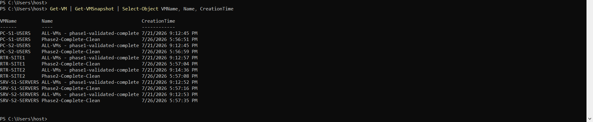

Phase 2 build and validation complete.

## 11. Troubleshooting & Issues

### Issue 1 — Chrony would not synchronize (default maxdistance too strict)

**Where:** SRV-S2-SERVERS

**Symptom:** `chronyc tracking` showed Leap status “Not synchronised” and an enormous offset (~7.3 hours). Reachability improved but the source was never selected.

**Root cause:** Chrony’s default `maxdistance` is 3 seconds. Nested VMs started with multi-hour clock drift, so the source was rejected regardless of reachability.

**Fix:**
```bash
# temporary
maxdistance 30000
sudo chronyc burst 4/4
sudo chronyc makestep
# permanent
maxdistance 16
```

**Lesson:** In isolated nested labs, chrony’s default `maxdistance` is often too strict for the first sync. A modest permanent increase (e.g. 16) avoids repeating the force-sync dance after every reboot.

### Issue 2 — Clipboard non-functional between host and nested VMs

**Where:** All nested VMs (ongoing)

**Symptom:** Clipboard completely non-functional even after enabling Guest Service Interface.

**Root cause:** Nested Hyper-V accessed over RDP frequently breaks clipboard integration.

**Fix:** Typed all commands manually. No reliable clipboard path was found for this environment.

**Lesson:** Plan on manual typing or an alternative transfer method (mounted ISO, serial console) rather than relying on clipboard sync in nested Hyper-V-over-RDP labs.

### Issue 3 — Install-ADDSForest interactive prompt / quoting confusion

**Where:** SRV-S1-SERVERS

**Symptom:** Running without the full parameter set dropped into interactive prompts; a domain name was entered with literal quotes.

**Root cause:** Partial parameter set triggered the interactive fallback, which is more error-prone for values that need `ConvertTo-SecureString`.

**Fix:** Cancelled and re-ran with every parameter supplied up front.

**Lesson:** Always supply the complete parameter set to `Install-ADDSForest` rather than relying on the interactive path.

### Issue 4 — netplan “unknown key 'nameservers'” (YAML indentation)

**Where:** SRV-S2-SERVERS

**Symptom:** `sudo netplan generate` returned `unknown key 'nameservers'`.

**Root cause:** The `nameservers` block was placed at the wrong indentation level (flush with `ethernets:` instead of nested under `eth0:`).

**Fix:** Corrected indentation and set file permissions to 600.

**Lesson:** YAML is whitespace-sensitive. Verify alignment against a known-working example before applying.

### Issue 5 — Host memory ceiling (recurring)

**Where:** Hyper-V host (multiple points; originally logged as separate Issues 5, 9 and 21)

**Symptom:** Starting additional VMs failed with “Not enough memory in the system to start the virtual machine” (0x8007000E). VMs left in a Saved state blocked further memory changes. The same constraint appeared at three different points in the build and is consolidated here.

**Root cause:** 16 GiB host with AD DS overhead and multiple guests exceeds available headroom when everything runs simultaneously. A Saved-state restore requires the full memory footprint up front.

**Fix:** Sequenced tests in pairs/subsets, temporarily reduced non-critical VM memory, and cleared stuck Saved states with `Remove-VMSavedState` before cold-booting.

**Lesson:** Treat subset testing as the default pattern on this host. Always check for Saved-state VMs before troubleshooting other symptoms.

### Issue 6 — No internet access on private vSwitch for package installs (routers)

**Where:** RTR-SITE1, RTR-SITE2

**Symptom:** `apt install isc-dhcp-relay` failed with temporary failure resolving archive.ubuntu.com.

**Root cause:** Routers sit entirely on private vSwitches by design and have no internet path.

**Fix:** Temporary Internal NAT switch + static IP on a secondary adapter, install, then fully remove the workaround. An External-switch approach failed due to Azure fabric MAC filtering.

**Lesson:** For nested Hyper-V-on-Azure labs, prefer a local Internal NAT switch with static addressing for temporary internet access.

### Issue 7 — isc-dhcp-relay dropping legitimate replies as “bogus giaddr”

**Where:** RTR-SITE1, RTR-SITE2

**Symptom:** `ipconfig /renew` on PC-S2-USERS timed out. Relay logs showed `Dropping reply received on eth1 / BOOTREPLY giaddr: 10.10.21.1 / Packet to bogus giaddr`.

**Root cause:** Default service unit applies a plain `-i` flag to every interface, treating each as strictly client-facing. Legitimate replies that transit the WAN interface of the other router fail the giaddr-ownership check and are discarded.

**Fix:**
```text
# /etc/default/isc-dhcp-relay
OPTIONS="-id eth0.10 -iu eth0.20 -iu eth1"
```

`-id` marks the client-facing interface; `-iu` marks upstream/transit interfaces that should not enforce the ownership check.

**Lesson:** In any multi-hop DHCP relay topology, classify every interface a reply could transit through as upstream (`-iu`), including WAN/uplink interfaces. This behaviour is not clearly documented in the man page.

### Issue 8 — DHCP dynamic DNS registration silently failing

**Where:** SRV-S1-SERVERS

**Symptom:** Lease objects showed `DnsRegistration: Complete` but no A records appeared in the DNS zone. `nslookup` returned “Non-existent domain”.

**Root cause:** DHCP Server must authenticate to an AD-integrated zone with an explicitly configured credential. Without `Set-DhcpServerDnsCredential`, the service still marks the lease as Complete (it attempted the update) but the authenticated write fails silently.

**Fix:**
```powershell
Set-DhcpServerDnsCredential -Credential (Get-Credential)
```

**Lesson:** DHCP’s own `DnsRegistration: Complete` status is not authoritative proof a DNS record was written. Always cross-check with `Get-DnsServerResourceRecord`.

### Issue 9 — ip_forward reset to 0 after router reboot (recurring)

**Where:** RTR-SITE1, RTR-SITE2

**Symptom:** After power cycles, `sysctl net.ipv4.ip_forward` returned 0 despite `/etc/sysctl.conf` containing the setting. Same behaviour first observed in Phase 1.

**Root cause:** Ubuntu processes multiple sysctl locations in a defined order. The legacy single-file edit from Phase 1 was fragile and did not reliably survive reboot.

**Fix (permanent):**
```bash
echo "net.ipv4.ip_forward=1" | sudo tee /etc/sysctl.d/99-ip-forward.conf
sudo sysctl --system
```

**Lesson:** Treat `ip_forward` verification as a standard post-reboot check on these router images. Write to the drop-in location rather than only the legacy file.

### Issue 10 — PC-S1-USERS never renamed from default Windows hostname

**Where:** PC-S1-USERS

**Symptom:** DHCP lease registered under `DESKTOP-ABJGNA2.ans.local` instead of `PC-S1-USERS.ans.local`.

**Root cause:** Hostname verification step was not completed on this device before DHCP/DNS work began.

**Fix:**
```powershell
Rename-Computer -NewName "PC-S1-USERS" -Restart
ipconfig /registerdns
```

**Lesson:** Confirm hostnames on every device before starting DNS/DHCP/AD work. A skipped step surfaces confusingly far downstream.

### Issue 11 — Domain join failed — incorrect credential format

**Where:** PC-S1-USERS

**Symptom:** `Add-Computer` returned “The specified domain either does not exist or could not be contacted.”

**Diagnosis path:** DNS was checked first and confirmed healthy. The error message is commonly a DNS symptom, but was not the cause here.

**Root cause:** Credential entered as `ans/administrator` (forward slash). Windows requires `DOMAIN\username`.

**Fix:** Re-entered as `ans\administrator` (or UPN form). Join succeeded immediately.

**Lesson:** This exact error text is not exclusively a DNS problem. Always verify credential format before spending time on network diagnostics.

### Issue 12 — PC-S1-USERS fell back to APIPA (no DHCP lease)

**Where:** PC-S1-USERS

**Symptom:** `ipconfig /all` showed a 169.254.x.x address; pings failed with “General failure”.

**Root cause:** RTR-SITE1 (the required DHCP relay) was powered off. With no relay agent reachable, the broadcast never arrived.

**Fix:** Powered on RTR-SITE1; `ipconfig /release` + `/renew` obtained a correct lease.

**Lesson:** A 169.254.x.x address with no gateway is always worth checking against “is the DHCP relay path actually powered on and reachable” before deeper troubleshooting.

### Issue 13 — Package installs on SRV-S2-SERVERS require internet on an isolated vSwitch

**Where:** SRV-S2-SERVERS (Phases F and G)

**Symptom:** `apt install` failed — no route to any package mirror.

**Root cause:** Device sits entirely on a private, non-internet-routed vSwitch by design.

**Fix:** Permanent narrow destination-specific routes (public DNS + Ubuntu mirror subnets only) via a secondary NIC, leaving the internal default route and DNS resolver untouched. Set up once and reused for all subsequent installs.

**Lesson:** When a temporary internet path is needed repeatedly, prefer narrow destination-specific routes over swapping the default route. It removes the entire “did I remember to revert this” risk class.

### Issue 14 — AD account resolution failed — leftover NAT-workaround DNS resolver

**Where:** SRV-S2-SERVERS

**Symptom:** After successful `realm join`, `getent passwd` and `id` returned empty. SSSD logs showed “could not reach any name server” against 127.0.0.53.

**Root cause:** During the earlier package-install workaround, `/etc/resolv.conf` had been pointed at 8.8.8.8 and was never reverted. SSSD’s own AD communication depends on the internal resolver.

**Fix:**
```bash
echo "nameserver 10.10.12.10" | sudo tee /etc/resolv.conf
sudo sss_cache -E
sudo systemctl restart sssd
```

**Lesson:** Any temporary internet-access workaround that changes DNS resolver settings needs an explicit, verified rollback step immediately after the install completes.

### Issue 15 — use_fully_qualified_names default broke bare-username lookups

**Where:** SRV-S2-SERVERS

**Symptom:** `getent passwd s1.user` returned nothing while `getent passwd s1.user@ans.local` worked.

**Root cause:** `realm join` sets `use_fully_qualified_names = True` by default.

**Fix:**
```bash
sudo sed -i 's|use_fully_qualified_names = True|use_fully_qualified_names = False|' /etc/sssd/sssd.conf
sudo systemctl restart sssd
```

**Lesson:** `realm join` defaults are not always aligned with later command conventions. Check `use_fully_qualified_names` immediately after any join and decide deliberately.

### Issue 16 — SSH to SRV-S2-SERVERS failed — missing DNS A record

**Where:** PC-S1-USERS → SRV-S2-SERVERS

**Symptom:** `ssh s2.user@srv-s2-servers.ans.local` → “Could not resolve hostname”.

**Root cause:** SSSD dynamic DNS registration (`dyndns_update`) failed silently on every attempt (GSS-TSIG / reverse-zone related). Manual A record was the accepted workaround.

**Fix:**
```powershell
Add-DnsServerResourceRecordA -ZoneName "ans.local" -Name "srv-s2-servers" -IPv4Address "10.10.22.10"
```

**Lesson:** SSSD dynamic DNS registration does not work reliably in this environment and was worked around, not fixed. Documented as a known limitation.

### Issue 17 — klist unavailable; Kerberos ticket cache not found

**Where:** SRV-S2-SERVERS (early in Phase F)

**Symptom:** `klist` not installed; no raw credential cache file present.

**Root cause:** `krb5-user` had not yet been installed at that point in the sequence.

**Fix:** Accepted equivalent evidence (`id` correctly resolved AD UID/GID/groups + successful SSH password auth for a domain account) as sufficient proof Kerberos/LDAP auth was working. `krb5-user` was installed later with Samba; the clean Kerberos check for Phase H was performed on PC-S1-USERS instead.

**Lesson:** Not every verification step needs the exact tool the plan names. Equivalent evidence can be acceptable when the named tool is not yet available, provided the substitution is documented honestly.

### Issue 18 — SMB access failed — security = ads requires winbindd

**Where:** SRV-S2-SERVERS

**Symptom:** `\\SRV-S2-SERVERS\techshare` inaccessible. Samba log: `check_winbind_security: winbindd not running - but required as domain member`.

**Root cause:** `security = ads` requires `winbindd` for Samba’s own domain-security checks, independent of the idmap backend (`sss` in this case). A machine joined only via `realm join`/adcli does not fully populate the trust state that winbindd expects.

**Fix:**
```bash
sudo net ads join -U administrator
sudo systemctl restart winbind smbd nmbd
```

**Lesson:** When `smb.conf` specifies `security = ads`, winbindd must be running regardless of the configured idmap backend. A realmd join may still need a supplementary `net ads join` for Samba.

### Issue 19 — NTFS inheritance silently granted write access to the ReadOnly group

**Where:** SRV-S1-SERVERS (`C:\TechShare`)

**Symptom:** `s2.user` (member only of SG-FileShare-ReadOnly) successfully created a file despite the intended ACL.

**Root cause:** Inherited ACEs from the parent `C:\` folder granted the local Users group Append Data / Write Data rights. Domain users are members of the local Users group by default, so the inherited grant overrode the explicit restriction. `icacls /remove:g` only removes explicit ACEs, not inherited ones.

**Fix:**
```powershell
icacls "C:\TechShare" /inheritance:r
icacls "C:\TechShare" /grant "SYSTEM:(OI)(CI)F"
icacls "C:\TechShare" /grant "BUILTIN\Administrators:(OI)(CI)F"
# explicit SG grants remained
```

**Lesson:** When a share needs specific group-based restrictions, always check for and explicitly break inherited parent-folder permissions. Inherited entries will not be caught by a simple `/remove:g`.

---

**Cross-cutting observations carried forward:**

- Verify hostnames on every device before any DNS/DHCP/AD work.
- Always confirm DNS records with `Get-DnsServerResourceRecord`, not only DHCP lease status fields.
- In multi-hop DHCP relay topologies, mark every transit interface as upstream (`-iu`).
- `ip_forward` does not reliably persist across reboots on these images — re-verify after every reboot.
- Temporary internet workarounds that touch DNS resolver settings need an immediate, verified rollback.
- `security = ads` always needs winbindd, even when using the sss idmap backend.
- Explicit share ACLs are not sufficient on their own — break inheritance.
- Default working pattern on this host: test in subsets rather than attempting to run all six VMs simultaneously.
