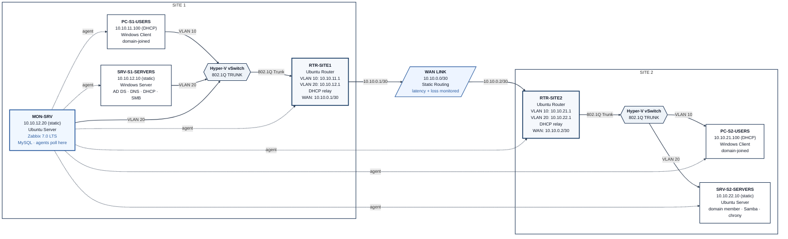

# Phase 3 — Monitoring: Design & Decisions

## 1. Objectives

Phase 3 adds a monitoring layer on top of the routed, domain-joined environment built in Phases 1 and 2. The goal is to watch the actual services and links that already exist — AD DS, DNS, DHCP, time sync, file shares, SSH, and the inter-site WAN link — rather than generic placeholders.

What exists when this phase is complete:

- A dedicated monitoring VM (`MON-SRV`) running Zabbix 7.0 LTS with MySQL, placed on the Site 1 Servers VLAN
- Zabbix agents on all six existing devices plus the monitoring host itself
- Service-level items and triggers for the core Phase 2 roles (NTDS, DNS, Netlogon, DHCP, W32Time, chrony, Samba)
- Custom items for DHCP lease counts on both Users scopes
- Simple checks for DNS zone health and SSH reachability to the routers and Linux server
- ICMP-based host-down detection and WAN link latency/packet-loss monitoring
- A host group (`ANS-Infrastructure`) and a basic operations dashboard
- ServiceNow configured with three assignment groups, ANS-specific categories/subcategories, and an integration user so that real alerts can be turned into tracked incidents
- Documentation of the design choices, the monitoring relationships, and the validation that the stack works

No Group Policy, firewall ACLs at VLAN boundaries, or automated remediation is done in this phase — those belong to Phase 4.

**How this supports later phases:**

- Phase 4 (Security & Automation) inherits a live monitoring baseline. Any hardening change that breaks a service should appear on the same dashboard; the three Python scripts planned for Phase 4 can query the same items and replace the manual alert-to-ticket step with automation.

**Skills demonstrated:** Zabbix server/agent deployment and configuration, custom UserParameters, trigger design and severity mapping, cross-platform agent management (Windows + Linux), basic ServiceNow administration and REST integration, and continued documentation of real troubleshooting paths.

**Constraints:**

- Same Azure/host budget and memory discipline as prior phases. Adding a seventh VM required enabling Dynamic Memory on every guest so the 16 GiB host could still run the subsets needed for testing.
- Scope deliberately stops at monitoring + manual ITIL demonstration. No auto-remediation or full NOC tooling.

## 2. Options Considered

### Monitoring platform

| Option | Pros | Cons |
|---|---|---|
| **Zabbix (chosen)** | Strong resume recognition; flexible trigger and escalation model that matches how many NOCs actually operate; good support for both Windows and Linux agents | Heavier footprint (MySQL required); more manual item/trigger work than some alternatives |
| Checkmk | Lighter install; strong auto-discovery | Less name recognition for the target roles; less control over exact trigger expressions |

### Where the monitoring platform lives

| Option | Pros | Cons |
|---|---|---|
| **New dedicated VM — MON-SRV (chosen)** | Isolation principle already used in the project: the thing that watches should not share fate with the things it watches; cleanest portfolio story | Extra RAM pressure on an already tight nested host |
| Reuse SRV-S1-SERVERS (AD DC) | No new VM | Monitoring dies with the exact failure it is supposed to catch; Zabbix is Linux-first |
| Reuse SRV-S2-SERVERS | No new VM; already Linux | Same isolation problem; adds load to the Samba/SSSD box; Site 2 or WAN failure blinds monitoring at the worst moment |

### Host memory strategy

The 16 GiB nested host already struggled to keep four of the six existing VMs running at once. Adding a seventh required a concrete fix rather than hoping for more headroom.

| Option | Pros | Cons |
|---|---|---|
| **Dynamic Memory on all seven VMs (chosen)** | Hyper-V only allocates what each guest is actively using and reclaims the rest; no extra Azure cost | Requires touching every existing VM; still needs selective power-on for full validation runs |
| Permanently larger Azure host size | Simple | Recurring cost for the entire remaining project |
| Keep static memory and accept fewer concurrent VMs | No config change | Makes end-to-end testing impractical |

### What gets monitored

Rebuilt from the actual Phase 2 services — no placeholders carried over from earlier drafts.

| Target | Check | Why |
|---|---|---|
| All 6 devices + 2 routers | ICMP reachability | Baseline host-down detection |
| SRV-S1-SERVERS: NTDS, DNS, Netlogon | Windows service status | Core AD health |
| SRV-S1-SERVERS: DHCP | Service status + scope lease counts | Phase 2 DHCP role |
| DNS (forward + reverse) | Simple check queries | Catches “service running but returning wrong data” |
| SRV-S1-SERVERS: W32Time | Service status | Kerberos depends on it |
| SRV-S2-SERVERS: chrony, smbd, nmbd | service.state UserParameter | Linux-side time and file share |
| Both routers + SRV-S2-SERVERS | SSH port open | Admin access availability |
| WAN link (RTR-SITE1 ↔ RTR-SITE2) | Latency and packet loss | Everything at Site 2 depends on this path |
| VLAN sub-interfaces | Interface status (planned stretch) | Ties back to Phase 1 segmentation proof |

### ServiceNow / ITIL scope

Kept to a practical demonstration rather than a full ITSM implementation: three assignment groups, a small set of categories/subcategories that match the services being monitored, one integration user with the minimum roles, and a handful of real alert-to-ticket walkthroughs against actual faults introduced in the lab.

## 3. Final Design Decisions

| Decision | Choice | Why |
|---|---|---|
| Monitoring platform | Zabbix 7.0 LTS | Resume recognition and a trigger model that supports the ITIL demonstration |
| Monitoring host | New Ubuntu Server VM `MON-SRV` | Isolation from the infrastructure it watches |
| MON-SRV placement | Site 1, VLAN 20 (Servers), vSwitch-S1, Access mode | Reuses existing trunked switch; same subnet as the domain controller |
| MON-SRV addressing | 10.10.12.20/24, gateway 10.10.12.1, DNS 10.10.12.10 | Follows the existing `{site}{vlan}` scheme; static like every other infrastructure device |
| MON-SRV sizing | 1 vCPU, Dynamic Memory 512 MB / 1 GB / 2 GB | Lean enough to coexist with the other guests under Dynamic Memory |
| RAM strategy for the whole lab | Dynamic Memory enabled on all seven VMs; selective power-on for tests | Solves the concurrent-VM ceiling without permanent Azure cost increase |
| Agent coverage | Zabbix agent on every device (Windows MSI + Linux package) | Uniform data collection path |
| Service checks | Custom items + triggers for AD DS roles, DHCP, time sync, Samba, plus simple checks for DNS and SSH | Matches the real services Phase 2 delivered |
| WAN monitoring | Simple-check ICMP items on a dedicated `network-links` host object | Keeps link metrics separate from host objects |
| Host grouping | Single group `ANS-Infrastructure` | One place to filter the whole environment |
| Alerting | Gmail media type (High + Disaster only) + trigger action | Proves the notification path without requiring a full on-call rotation |
| ServiceNow | Personal Developer Instance with three assignment groups, custom categories, and a dedicated integration user | Enough structure to demonstrate a real incident lifecycle against live Zabbix alerts |
| TempNAT / split-route pattern | Retained on the three Windows hosts that needed internet for agent install; scheduled for cleanup at project close | Allowed package downloads without permanently opening the lab to the internet; accepted as a temporary lab convenience |

**Plan-vs-actual notes:**

- Dynamic Memory was not in the original Phase 1/2 design; it was added across all existing VMs at the start of Phase 3 so the seventh guest could fit.
- The recurring `ip_forward` reset first seen in Phase 1 was finally root-caused in this phase to `/etc/ufw/sysctl.conf` (ufw re-applies its own sysctl settings on every reload). The permanent fix is now in place on both routers.
- The temporary internet pattern on the Windows hosts required an extra more-specific `10.10.0.0/16` route in addition to the original `/1` NAT routes; that companion route is now part of the accepted pattern.

## 4. Naming & Addressing

**New device**

| Device | IP | Subnet | Gateway | VLAN | Switch |
|---|---|---|---|---|---|
| MON-SRV | 10.10.12.20 | /24 | 10.10.12.1 | 20 | vSwitch-S1 |

**DNS**

- A record `mon-srv.ans.local` → 10.10.12.20 added on the AD-integrated DNS server.

**Zabbix objects**

| Object | Value |
|---|---|
| Host group | `ANS-Infrastructure` |
| Server name (web UI) | `ANS-Monitor` |
| Dashboard | `ANS Operations Center` |
| Network-links host | `network-links` (no agent interface; simple checks only) |
| Custom host (DNS/SSH) | `dns-checks` (no agent interface; simple checks only) |

**ServiceNow structure (lab)**

| Object | Value |
|---|---|
| Assignment groups | `ANS-Field-Technicians`, `ANS-Network-Engineering`, `ANS-Vendor-Support` |
| Categories | network, service, infrastructure, performance |
| Integration account | `monitoring-integration` (roles: itil, rest_service) |

All external identifiers (ServiceNow instance hostname, passwords, App Passwords) are redacted in published documentation.

No existing device names or Phase 1/2 IP addresses were changed.

## 5. Topology Diagram

The diagram shows the Phase 2 end state with the new monitoring host and the monitoring relationships added. Prior network layout stays plain; only the Phase 3 elements receive detail labels.

`MON-SRV` sits on the same Servers VLAN as the domain controller. Dotted lines show the Zabbix agent relationships to every host. Simple checks for DNS zone health, SSH reachability, and WAN latency/loss also originate from `MON-SRV` (via the `dns-checks` and `network-links` host objects). Prior-phase layout stays plain so the monitoring layer is the only new visual element.

## 6. Status

- Step 1 — Understand the goal — done
- Step 2 — Research options — done
- Step 3 — Make decisions — done
- Step 4 — Build (see `02-build-log.md`)
