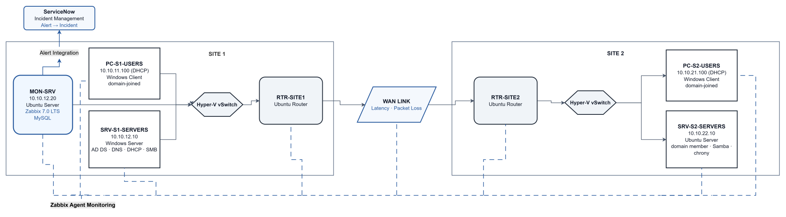

# Phase 3 — Monitoring: Design & Decisions

## 1. Objectives

Phase 3 adds centralized monitoring to the routed and domain-joined environment built in Phases 1 and 2. The monitoring scope follows the services already running in the lab: Active Directory, DNS, DHCP, time synchronization, file sharing, SSH, host availability, and the inter-site WAN link.

What exists when this phase is complete:

- A dedicated monitoring VM, `MON-SRV`, on the Site 1 Servers VLAN at `10.10.12.20`
- Zabbix 7.0 LTS with MySQL running on `MON-SRV`
- Zabbix agents on all seven lab VMs, including `MON-SRV`
- Service-state monitoring for NTDS, DNS, Netlogon, DHCP, W32Time, chrony, `smbd`, and `nmbd`
- Custom DHCP lease-count items for both Users VLAN scopes
- DNS and SSH simple checks from the monitoring server
- ICMP host-availability monitoring across the lab
- WAN latency and packet-loss monitoring between the two sites
- Host group `ANS-Infrastructure` and dashboard `ANS Operations Center`
- Email notification for High and Disaster severity triggers
- ServiceNow assignment groups, categories/subcategories, and a dedicated integration account
- Zabbix monitoring integrated with ServiceNow through REST for incident creation and tracking

Security hardening is outside this phase. Router filtering and SSH hardening are handled in Phase 4.

### Main technical areas

- Zabbix server and agent deployment
- Windows and Linux service monitoring
- Custom Zabbix items and triggers
- DHCP, DNS, SSH, ICMP, and WAN checks
- Alert severity and email notification
- ServiceNow REST integration and incident routing

### Constraints

- The lab runs on a 16 GiB Azure Hyper-V host. Dynamic Memory was enabled across the guest VMs so the seventh VM could be added without increasing the Azure host size.
- Validation was run with selective power-on when memory pressure required it.
- Temporary internet paths were needed for package and agent installation because the lab networks are otherwise isolated.

---

## 2. Options Considered

### Monitoring platform

| Option | Advantages | Trade-offs |
|---|---|---|
| **Zabbix 7.0 LTS (chosen)** | Supports Windows and Linux agents, custom items/triggers, service checks, ICMP monitoring, notifications, and API-based integrations | Requires a database and more manual configuration for custom checks |
| Checkmk | Strong discovery and a simpler initial setup | Less control was needed from discovery than from custom service and trigger configuration in this lab |

Zabbix was selected because the phase required both agent-based monitoring and custom checks for services already built in Phase 2.

### Monitoring host

| Option | Advantages | Trade-offs |
|---|---|---|
| **Dedicated `MON-SRV` VM (chosen)** | Keeps monitoring separate from the domain controller and file-serving workloads; provides a single monitoring source | Adds a seventh VM and additional host-memory usage |
| Reuse `SRV-S1-SERVERS` | No additional VM | Monitoring would share resources with AD DS, DNS, DHCP, and SMB |
| Reuse `SRV-S2-SERVERS` | Already Linux-based | Adds monitoring load to the Linux domain member and Samba server and places monitoring at Site 2 |

A dedicated VM keeps the monitoring stack independent from the main services being monitored.

### Host memory strategy

| Option | Advantages | Trade-offs |
|---|---|---|
| **Dynamic Memory on all seven VMs (chosen)** | Allows guest memory to adjust within configured limits and reduces pressure on the 16 GiB host | Still requires attention to concurrent VM usage |
| Increase the Azure host size | More available memory | Higher Azure cost |
| Keep static guest memory | No VM memory changes | Makes seven-VM operation more difficult on the existing host |

Dynamic Memory was enabled before `MON-SRV` was added.

### Monitoring coverage

Monitoring was based on the services present at the end of Phase 2 rather than generic placeholder checks.

| Target | Check | Purpose |
|---|---|---|
| All seven VMs | Zabbix agent + ICMP | Host and agent availability |
| `SRV-S1-SERVERS` | NTDS, DNS, Netlogon | Core AD-related service state |
| `SRV-S1-SERVERS` | DHCP Server | DHCP service availability |
| `SRV-S1-SERVERS` | DHCP lease counts for both scopes | Confirm active client leases are visible to Zabbix |
| `SRV-S1-SERVERS` | W32Time | Domain time-service state |
| DNS | Forward SOA and reverse PTR simple checks | Verify DNS responds with expected data |
| `SRV-S2-SERVERS` | chrony, `smbd`, `nmbd` | Linux time and Samba service state |
| Both routers + `SRV-S2-SERVERS` | SSH simple checks | Administrative SSH reachability |
| Site 1 ↔ Site 2 WAN | ICMP latency and packet loss | Inter-site link condition |

### ServiceNow scope

ServiceNow is used as the incident destination for monitoring alerts, not as a full ITSM deployment. The Phase 3 scope includes:

- three ANS assignment groups
- monitoring-related categories and subcategories
- a dedicated integration account
- REST-based incident creation for monitoring alerts
- incident assignment, documentation, resolution, and closure

No automated remediation is included.

---

## 3. Final Design Decisions

| Decision | Final Choice | Reason |
|---|---|---|
| Monitoring platform | Zabbix 7.0 LTS | Supports the Windows/Linux mix and the custom service/network checks required by the lab |
| Monitoring host | Dedicated Ubuntu Server VM `MON-SRV` | Keeps the monitoring stack separate from the workloads it monitors |
| Placement | Site 1, VLAN 20, `vSwitch-S1` access VLAN | Places the monitoring server with the existing server infrastructure |
| Addressing | `10.10.12.20/24`, gateway `10.10.12.1`, DNS `10.10.12.10` | Follows the existing addressing scheme and keeps the monitoring host static |
| VM sizing | 1 vCPU; Dynamic Memory 512 MB minimum / 1 GB startup / 2 GB maximum | Fits the monitoring workload within the available host memory |
| Lab memory strategy | Dynamic Memory on all seven VMs | Reduces memory pressure without changing the Azure host size |
| Agent coverage | Zabbix agent on all seven VMs | Provides one host-monitoring path across Windows and Linux |
| Windows service monitoring | Native Zabbix service-state items | Covers AD DS-related services, DHCP, and W32Time |
| Linux service monitoring | Custom `service.test[*]` UserParameter on `SRV-S2-SERVERS` | Provides service-state checks for chrony and Samba |
| DHCP monitoring | Two custom lease-count UserParameters on `SRV-S1-SERVERS` | Exposes lease counts for both Users VLAN scopes |
| DNS / SSH monitoring | Simple-check host object `dns-checks` | Keeps agentless DNS and SSH checks separate from normal host objects |
| WAN monitoring | Simple-check host object `network-links` | Keeps latency and packet-loss metrics separate from device health |
| Host grouping | `ANS-Infrastructure` | Provides one group for the seven monitored VMs |
| Dashboard | `ANS Operations Center` | Central view for host, service, and network status |
| Email alerting | Gmail media type for High and Disaster severity | Provides an external notification path for higher-severity events |
| ServiceNow integration | REST incident creation using `monitoring-integration` | Connects monitoring alerts to a tracked incident workflow |
| ServiceNow routing | Three assignment groups with monitoring-related categories/subcategories | Provides consistent incident routing and documentation |
| Security hardening | Deferred to Phase 4 | Keeps monitoring work separate from router and SSH hardening |

### Plan-vs-actual notes

- Dynamic Memory was added across the existing VMs at the start of Phase 3 so `MON-SRV` could be added without increasing the Azure host size.
- The recurring `ip_forward` reset first observed in Phase 1 was traced to `/etc/ufw/sysctl.conf` during Phase 3. The setting was corrected on both routers so UFW reloads no longer reset IPv4 forwarding.
- The Windows hosts required a more-specific `10.10.0.0/16` route alongside the temporary split-default internet routes so internal lab traffic stayed on the correct interface.
- `MON-SRV` initially received a competing default route on its internet-facing adapter. The final working configuration uses only scoped external routes so monitoring traffic remains on the lab network.

---

## 4. Monitoring Objects, Naming & Addressing

### New device

| Device | IP | Subnet | Gateway | VLAN | Switch |
|---|---|---|---|---|---|
| `MON-SRV` | `10.10.12.20` | `/24` | `10.10.12.1` | 20 | `vSwitch-S1` |

An A record for `mon-srv.ans.local` points to `10.10.12.20`.

### Zabbix objects

| Object | Value |
|---|---|
| Host group | `ANS-Infrastructure` |
| Web UI server name | `ANS-Monitor` |
| Dashboard | `ANS Operations Center` |
| Network-check host | `network-links` |
| DNS / SSH check host | `dns-checks` |

The seven monitored VM host objects are:

- `rtr-site1`
- `rtr-site2`
- `pc-s1-users`
- `srv-s1-servers`
- `pc-s2-users`
- `srv-s2-servers`
- `mon-srv`

### ServiceNow structure

| Object | Value |
|---|---|
| Assignment groups | `ANS-Field-Technicians`, `ANS-Network-Engineering`, `ANS-Vendor-Support` |
| Categories | network, service, infrastructure, performance |
| Integration account | `monitoring-integration` |
| Integration account roles | `itil`, `rest_service` |

Passwords, App Passwords, and the ServiceNow instance hostname are not included in the public documentation.

No existing Phase 1 or Phase 2 device names or IP addresses were changed.

---

## 5. Topology Diagram

The Phase 3 diagram keeps the existing two-site infrastructure and adds `MON-SRV` plus the monitoring relationships introduced in this phase. Host monitoring, service checks, and WAN monitoring originate from the monitoring server while the underlying Phase 1 and Phase 2 topology remains unchanged.

---

## 6. Completed Outcome

Phase 3 completed the monitoring layer for the seven-VM lab. Zabbix was collecting host and service data across both sites, custom triggers and WAN checks were active, higher-severity alerts had an email path, and ServiceNow was connected through REST for incident creation and tracking.

Detailed commands, validation, screenshots, and troubleshooting are recorded in [`02-build-log.md`](02-build-log.md). A shorter completed-phase view is in [`03-phase-summary.md`](03-phase-summary.md).

---

[← Main README](../README.md) · [02 — Build Log](02-build-log.md) · [03 — Phase Summary](03-phase-summary.md)
