# Phase 3 — Monitoring: Build Log

Environment and design rationale are covered in [`01-decisions.md`](01-decisions.md). This document is the as-executed build: commands, verification output, and the issues encountered along the way.

## 1. Environment & Prerequisites (recap)

Seven VMs on the same Azure Hyper-V host used in Phases 1–2. Naming, IPs, and VLANs follow the established conventions. One new device is added in this phase.

| VM | Role | IP | VLAN / Site |
|---|---|---|---|
| RTR-SITE1 | Router | 10.10.0.1 (WAN) | Site 1 |
| RTR-SITE2 | Router | 10.10.0.2 (WAN) | Site 2 |
| PC-S1-USERS | Windows 11 client | 10.10.11.100 (DHCP) | VLAN 10, Site 1 |
| SRV-S1-SERVERS | Windows Server (AD DC) | 10.10.12.10 | VLAN 20, Site 1 |
| PC-S2-USERS | Windows 11 client | 10.10.21.100 (DHCP) | VLAN 10, Site 2 |
| SRV-S2-SERVERS | Ubuntu (Samba) | 10.10.22.10 | VLAN 20, Site 2 |
| MON-SRV | Ubuntu Server (Zabbix) | 10.10.12.20 | VLAN 20, Site 1 — **new** |

Dynamic Memory was enabled on all six existing VMs before the seventh guest was created (see the plan-vs-actual notes in [`01-decisions.md`](01-decisions.md)). Local admin/SSH accounts used: `netadmin` (created this phase on the routers and SRV-S2-SERVERS).

## 2. Part A — Prerequisites & MON-SRV

### Dynamic Memory

Enabled and confirmed on all pre-existing VMs with appropriate min/startup/max values for each role. Selective power-on remained the working method for memory-constrained tests.

### MON-SRV creation

```powershell
New-VM -Name MON-SRV -Generation 2 -MemoryStartupBytes 1GB `
  -NewVHDPath "C:\ProgramData\Microsoft\Windows\Virtual Hard Disks\MON-SRV.vhdx" `
  -NewVHDSizeBytes 32GB -SwitchName "vSwitch-S1"
Set-VMProcessor -VMName MON-SRV -Count 1
Set-VMNetworkAdapterVlan -VMName MON-SRV -Access -VlanId 20
Set-VMFirmware -VMName MON-SRV -EnableSecureBoot On -SecureBootTemplate MicrosoftUEFICertificateAuthority
Add-VMDvdDrive -VMName MON-SRV -Path "C:\ISOs\ubuntu-26.04-live-server-amd64.iso"
```

Dynamic Memory set to 512 MB / 1 GB / 2 GB. OS install: standard Ubuntu Server, hostname `mon-srv`, OpenSSH enabled.

### Static IP and basic connectivity

Netplan on MON-SRV:

```yaml
network:
  version: 2
  ethernets:
    eth0:
      addresses: [10.10.12.20/24]
      routes:
        - to: default
          via: 10.10.12.1
      nameservers:
        addresses: [10.10.12.10]
        search: [ans.local]
```

```bash
sudo netplan apply
ip a
ping -c 4 10.10.12.1
ping -c 4 10.10.12.10
```

**Result:** Address, gateway, and DNS all reachable.

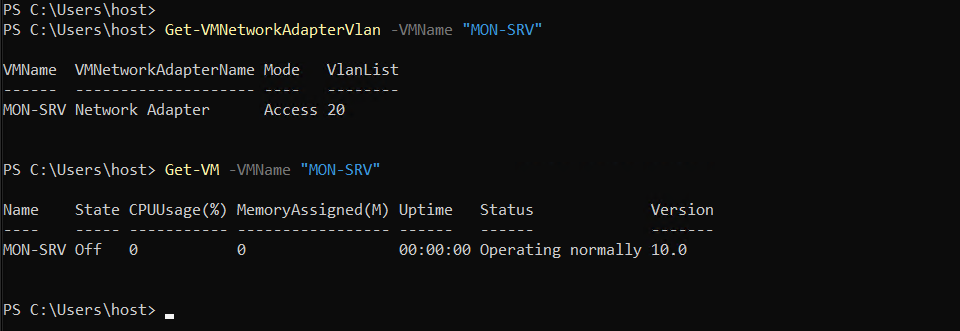
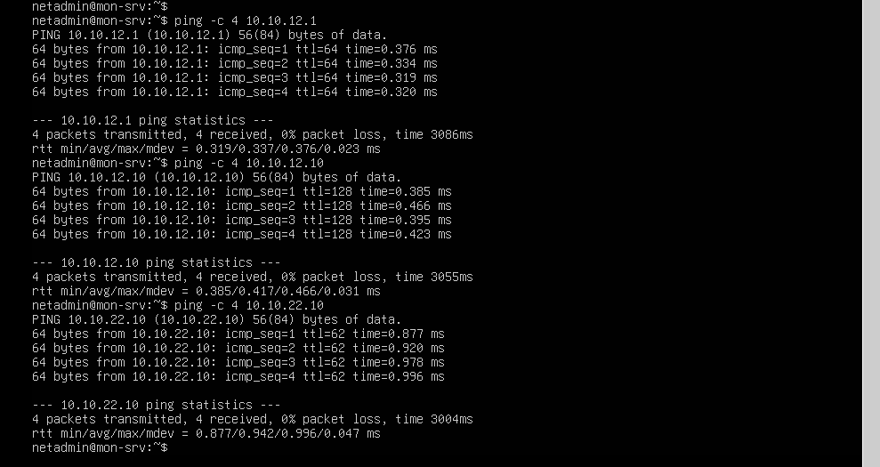

### netadmin account and SSH verification

`netadmin` created on RTR-SITE1, RTR-SITE2, and SRV-S2-SERVERS. SSH from MON-SRV confirmed to each:

```bash
ssh netadmin@10.10.0.1
ssh netadmin@10.10.0.2
ssh netadmin@10.10.22.10
```

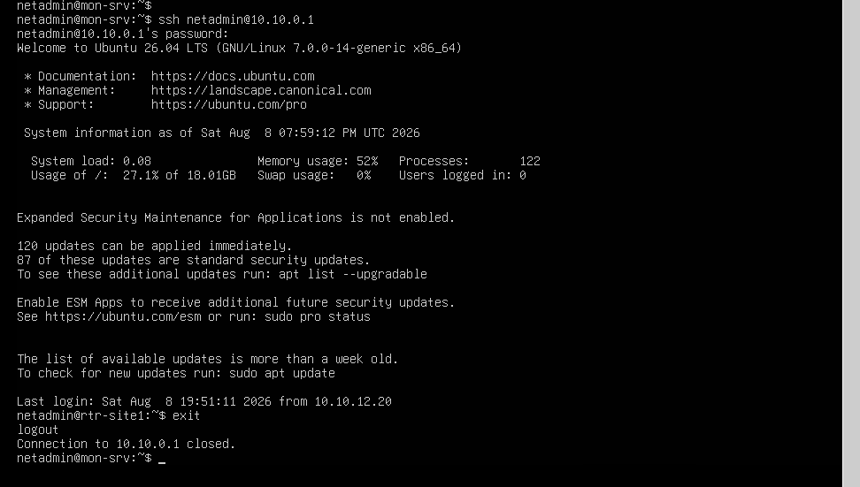
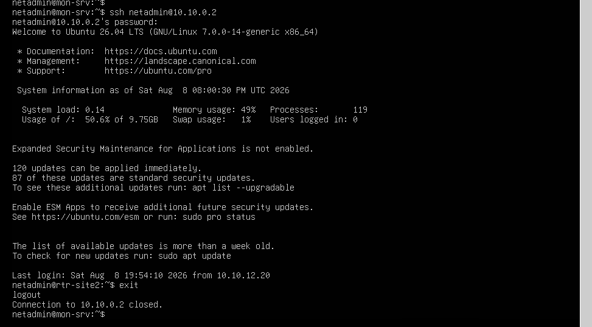
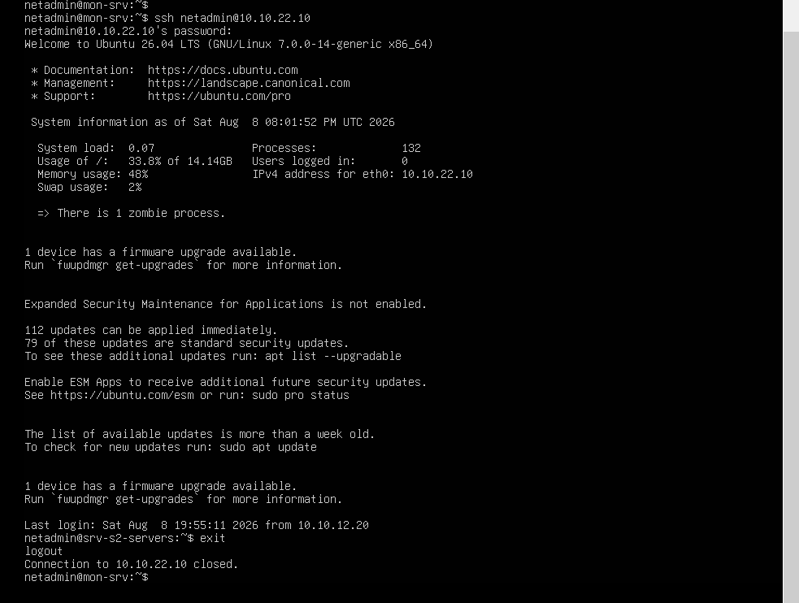

### DNS A record

On SRV-S1-SERVERS:

```powershell
Add-DnsServerResourceRecordA -Name "mon-srv" -ZoneName "ans.local" -IPv4Address "10.10.12.20"
```

### ip_forward check after reboot

Both routers confirmed `net.ipv4.ip_forward = 1` after a reboot cycle. (The permanent root cause of earlier resets was identified later — see Issue 4.)

### Part A checkpoint

All seven VMs checkpointed.

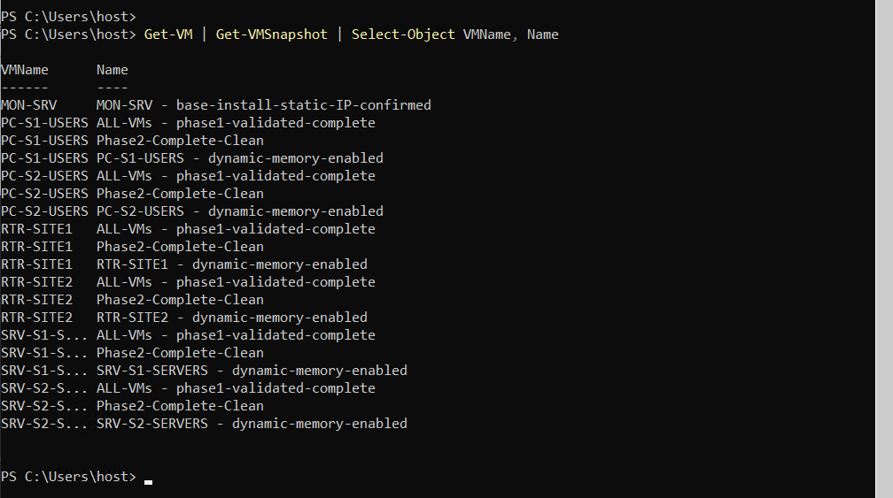

## 3. Part B — Zabbix + MySQL on MON-SRV

Temporary NAT adapter attached for package downloads, removed after install.

### Repository and packages

Zabbix 7.0 LTS components installed. `zabbix-server-mysql` was taken from Ubuntu’s native 26.04 repository to satisfy the `libmysqlclient24` dependency; remaining packages came from the official Zabbix repository.

```bash
# repo addition and package install (abbreviated)
sudo apt update
sudo apt install zabbix-server-mysql zabbix-frontend-php zabbix-apache-conf zabbix-sql-scripts zabbix-agent
```

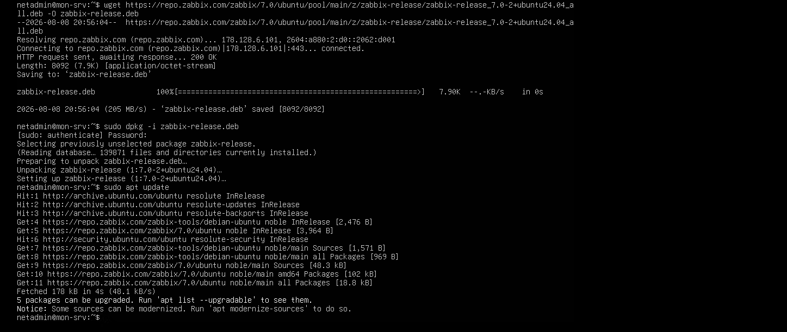

### Database

MySQL installed and running. Database and user created, schema imported from the Zabbix SQL scripts.

### Web configuration

`zabbix.conf.php` written via heredoc as root, ownership set to `www-data:www-data` with mode 640. Web setup wizard completed; server name set to `ANS-Monitor`. First login performed and password changed.

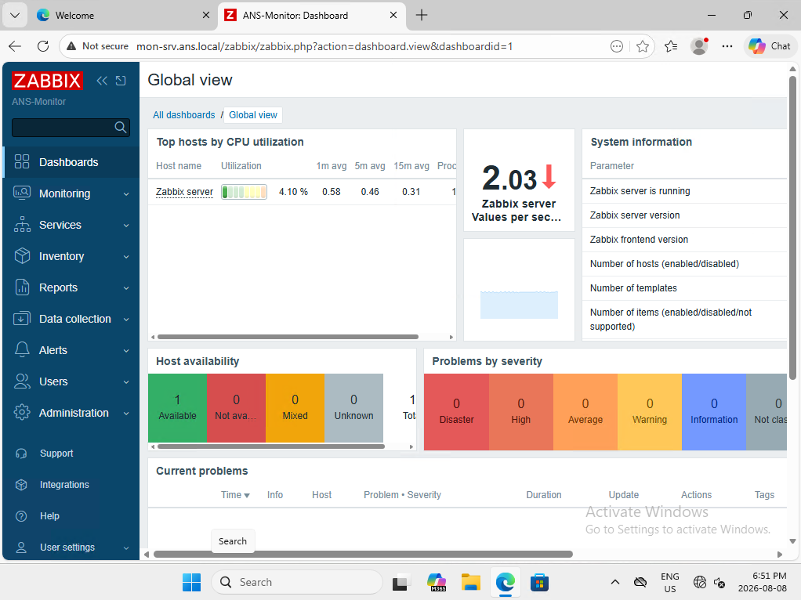

### Service status

```bash
sudo systemctl status zabbix-server
sudo systemctl status zabbix-agent
sudo systemctl status apache2
sudo systemctl status mysql
```

All four services active.

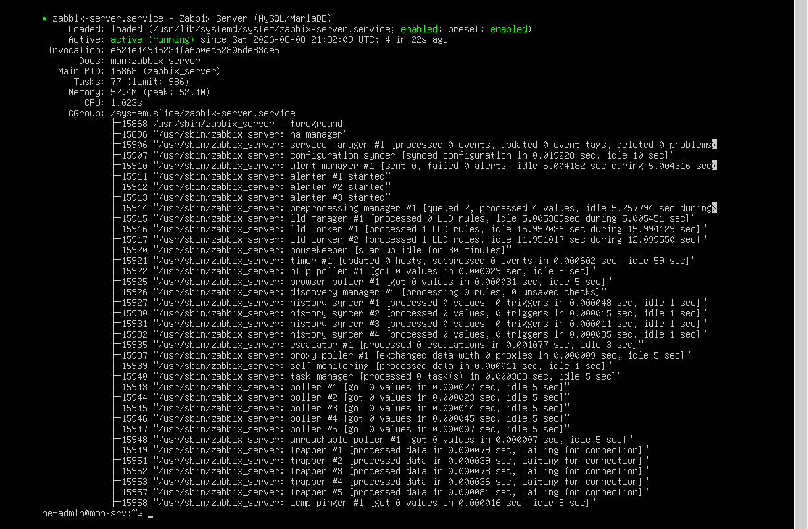
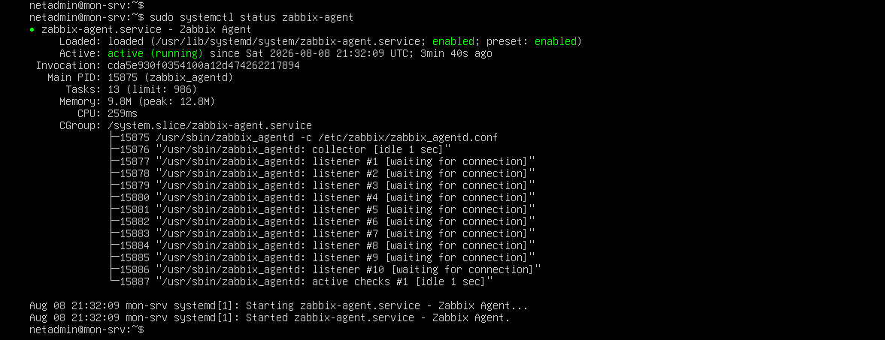
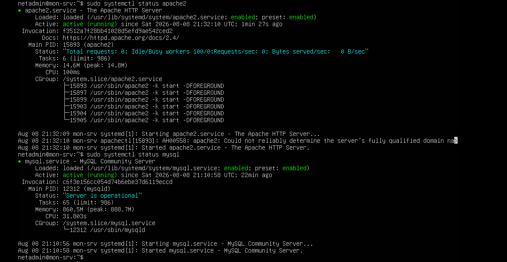

### ufw on MON-SRV

```bash
sudo ufw allow 10051/tcp
sudo ufw allow 10050/tcp
sudo ufw allow 80/tcp
sudo ufw allow 443/tcp
sudo ufw enable
sudo ufw status verbose
```

Port 22 was deliberately left closed at this stage (later corrected — see Issue 2).

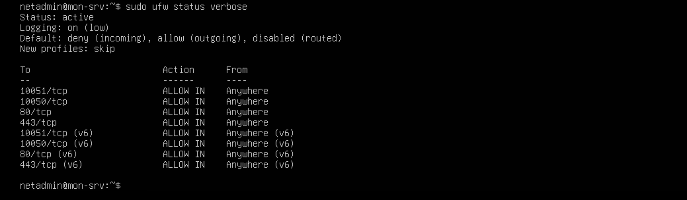
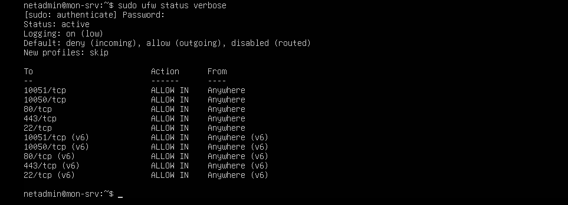

Checkpoint: `MON-SRV - zabbix-installed-web-accessible`.

## 4. Part C — Agents, Hosts & Service Checks

### Linux agents (RTR-SITE1, RTR-SITE2, SRV-S2-SERVERS)

Temporary NAT used on the two routers for package download; SRV-S2-SERVERS reused its existing narrow-route NAT path from Phase 2.

```bash
sudo apt update
sudo apt install zabbix-agent -y
```

Agent configuration (`/etc/zabbix/zabbix_agentd.conf`):

```ini
Server=10.10.12.20
ServerActive=10.10.12.20
Hostname=<device>
```

On SRV-S2-SERVERS only, a service-check UserParameter was added:

```ini
UserParameter=service.test[*],systemctl is-active $1
```

```bash
sudo systemctl restart zabbix-agent
sudo systemctl enable zabbix-agent
sudo systemctl status zabbix-agent
```

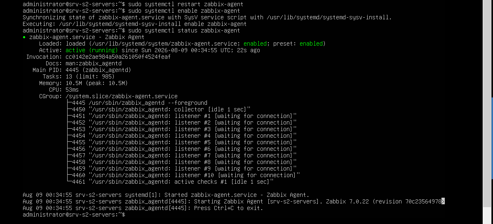

ufw rule for the agent port:

```bash
sudo ufw allow 10050/tcp
sudo ufw status verbose
```

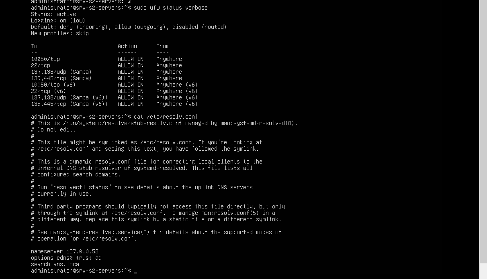
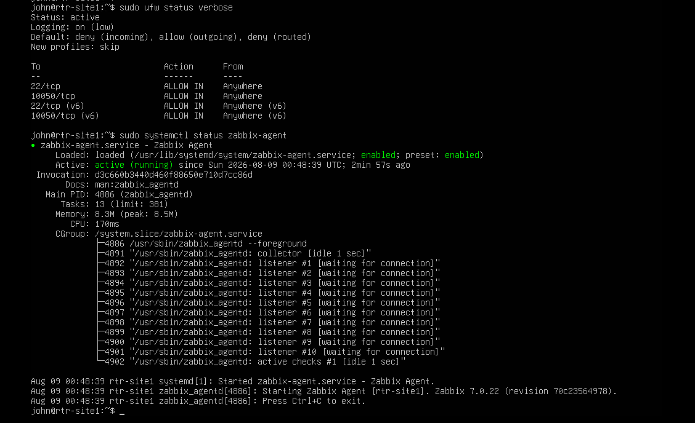
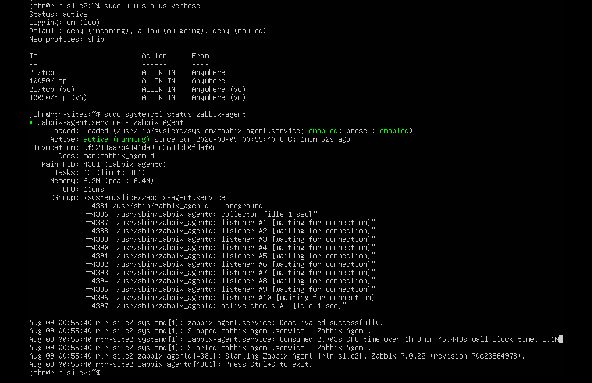

Temporary NAT adapters removed from the routers.

### SSH / TCP connectivity gap (post agent install)

Immediately after the above steps, ICMP succeeded on every path but TCP (SSH and agent port) failed from MON-SRV to RTR-SITE2 and SRV-S2-SERVERS. A full diagnostic sweep identified four stacked root causes (documented as Issues 1–4 in the Troubleshooting section). After the fixes, full bidirectional TCP connectivity was restored and retested with `nc`.

### Windows Firewall pre-enablement

Before installing the Windows agents, Windows Firewall was re-enabled on the three Windows hosts with the required rules for AD, DNS, DHCP, file sharing, and ICMP. Network Category on the domain controller remained Private (a known nested-Hyper-V NLA limitation); rules were applied against the active profile.

```powershell
Set-NetFirewallProfile -Profile Domain,Private,Public -Enabled True
Get-NetFirewallProfile | ft Name,Enabled -AutoSize
```

### Windows agents (SRV-S1-SERVERS, PC-S1-USERS, PC-S2-USERS)

Temporary NAT + permanent split-default-route pattern used for MSI download. The pattern later required an additional more-specific `10.10.0.0/16` route (see Issue 6).

Zabbix Agent 7.0 LTS MSI installed with:

- Hostname matching the eventual Zabbix host name (lowercase)
- Server / ServerActive = 10.10.12.20

```powershell
Get-Service "Zabbix Agent"
New-NetFirewallRule -DisplayName "Zabbix Agent (TCP 10050)" -Direction Inbound -Protocol TCP -LocalPort 10050 -Action Allow
Get-NetTCPConnection -LocalPort 10050 -State Listen
```

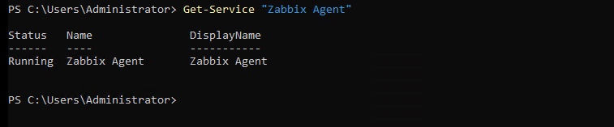
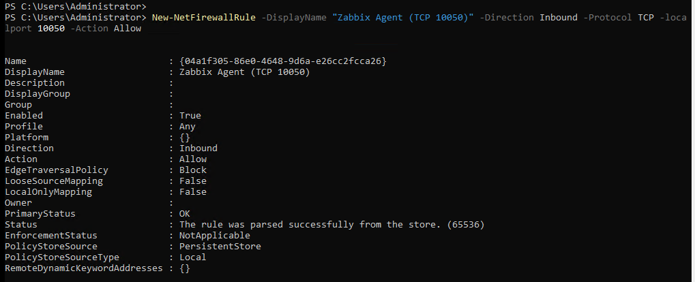
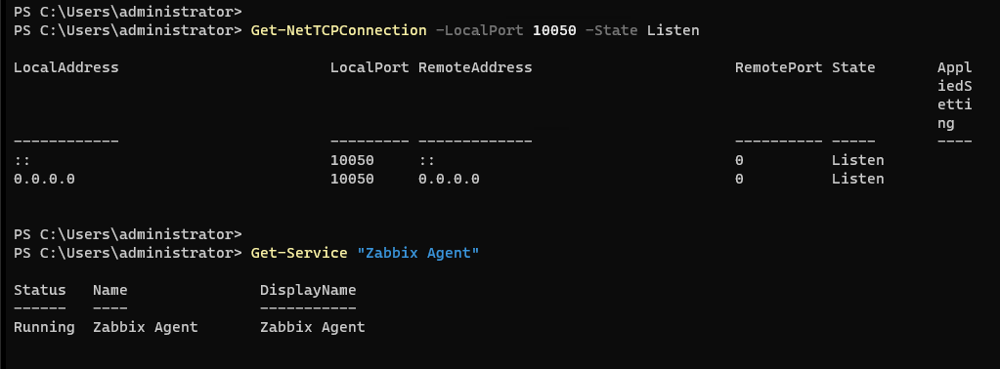
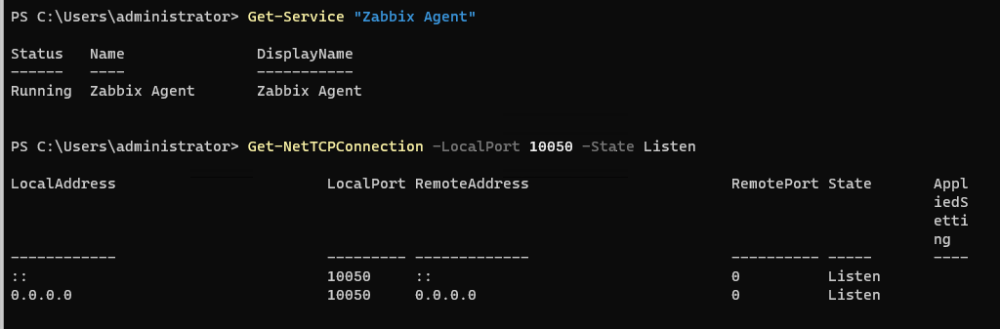

TempNAT adapters remained attached on the three Windows hosts, with the corrected persistent routes, for the remainder of Phase 3.

### DHCP lease-count UserParameters (SRV-S1-SERVERS)

Two layers of bugs were found and fixed before the items returned correct numeric values (see Issue 7).

Final form:

```ini
UserParameter=dhcp.leasecount.s1,powershell -NoProfile -Command "[int]@(Get-DhcpServerv4Lease -ScopeID 10.10.11.0).Count"
UserParameter=dhcp.leasecount.s2,powershell -NoProfile -Command "[int]@(Get-DhcpServerv4Lease -ScopeID 10.10.21.0).Count"
```

### Host group and host objects

Host group `ANS-Infrastructure` created.

All seven hosts added with the appropriate templates:

| Host name | Interface | Template |
|---|---|---|
| rtr-site1 | 10.10.0.1:10050 | Linux by Zabbix agent |
| rtr-site2 | 10.10.0.2:10050 | Linux by Zabbix agent |
| pc-s1-users | 10.10.11.100:10050 | Windows by Zabbix agent |
| srv-s1-servers | 10.10.12.10:10050 | Windows by Zabbix agent |
| pc-s2-users | 10.10.21.100:10050 | Windows by Zabbix agent |
| srv-s2-servers | 10.10.22.10:10050 | Linux by Zabbix agent |
| mon-srv | 127.0.0.1:10050 | Linux by Zabbix agent |

Interface IPs for the two DHCP clients were corrected from the plan’s assumed static values to the real leased addresses after the hosts initially showed red.

**Result:** all seven hosts green.

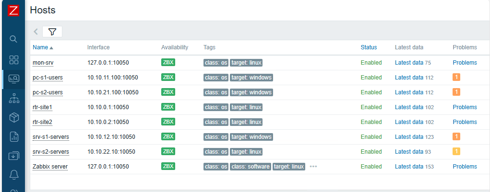

### Custom service-check items

On `srv-s1-servers`:

- AD DS – NTDS / DNS / Netlogon status (`service.info[...,state]`)
- DHCP Server status
- DHCP – Site1 / Site2 scope lease count (custom UserParameters)
- NTP (W32Time) status

On `srv-s2-servers`:

- chrony / smbd / nmbd status (`service.test[...]`)

Additional host objects (no agent interface):

- `dns-checks` — forward SOA and reverse PTR simple checks
- SSH reachability simple checks for the two routers and SRV-S2-SERVERS

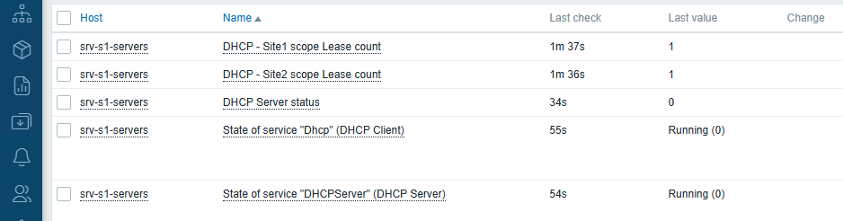
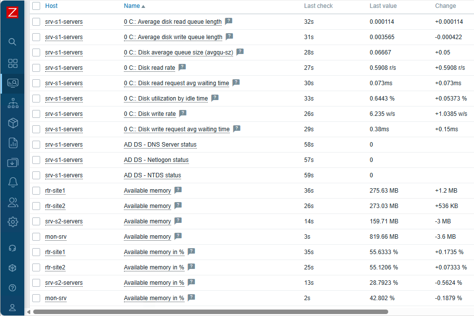

### Part C checkpoints

Checkpoints taken on all seven VMs after hosts and items were verified. Superseded intermediate checkpoints removed.

## 5. Part D — Triggers, WAN Monitoring, ServiceNow & Final Verification

### ICMP Ping template

Linked to all seven hosts. Confirmed the template auto-creates both items and the three standard ICMP triggers.

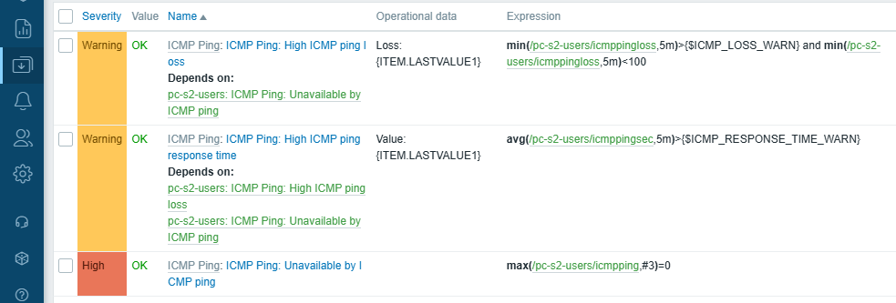

### Custom service triggers (8 total)

| Host | Trigger | Severity |
|---|---|---|
| srv-s1-servers | NTDS / DNS / Netlogon is DOWN | Disaster |
| srv-s1-servers | DHCP Server is DOWN | High |
| srv-s1-servers | W32Time is DOWN | High |
| srv-s2-servers | chrony / smbd / nmbd is DOWN | High / Average |

All eight triggers confirmed OK (silent) after creation.

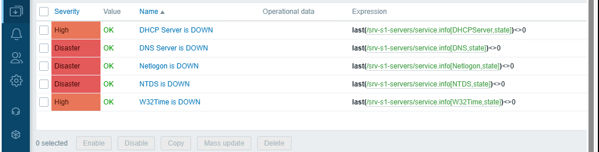

### Email media type and trigger action

Gmail media type configured (App Password). Action “Notify on High+ severity” created with condition Trigger severity ≥ High.

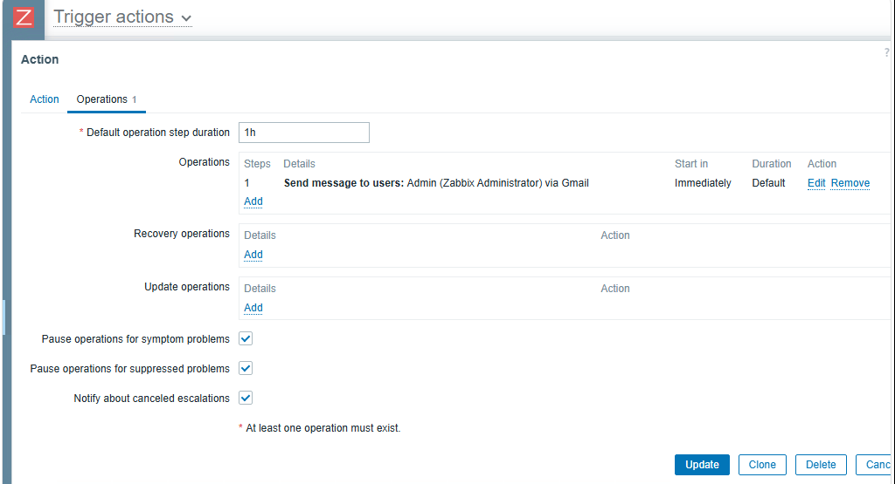

### Live-fire tests

- `systemctl stop smbd` on SRV-S2-SERVERS → Average-severity trigger fired and later resolved; no email (correct — Average filtered out).
- `Stop-Service DHCPServer` on SRV-S1-SERVERS → High-severity trigger fired. Email delivery initially failed because MON-SRV had no outbound internet path yet (dependency ordering). Delivery was later confirmed by real alerts generated during the permanent-NAT incident.

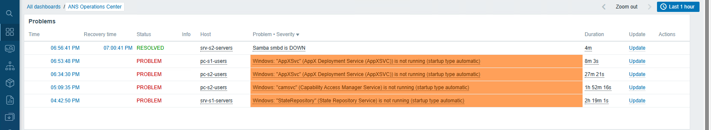
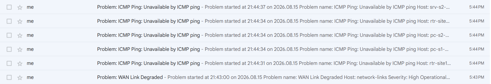

### WAN link items

Host object `network-links` created (no agent interface). Items for latency (`icmppingsec[10.10.0.2]`) and packet loss (`icmppingloss[10.10.0.2]`). Required `fping` with the setuid bit set.

```bash
sudo chmod u+s /usr/bin/fping
# FpingLocation already correct in zabbix_server.conf
sudo systemctl restart zabbix-server
```

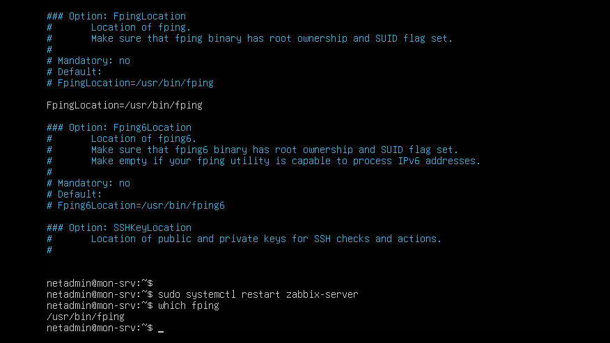

### ServiceNow

Personal Developer Instance provisioned (host browser used — nested VM browser was unreliable for the portal). Three assignment groups, custom categories/subcategories, and integration user `monitoring-integration` (roles `itil` + `rest_service`) created.

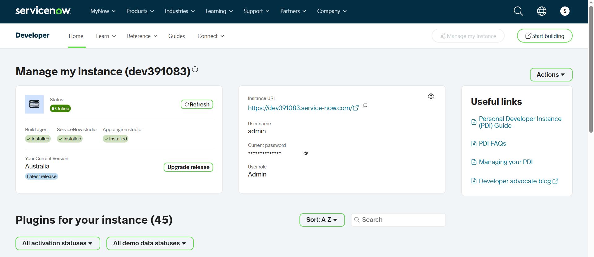
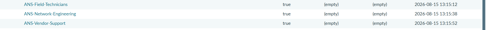
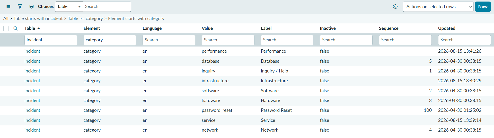
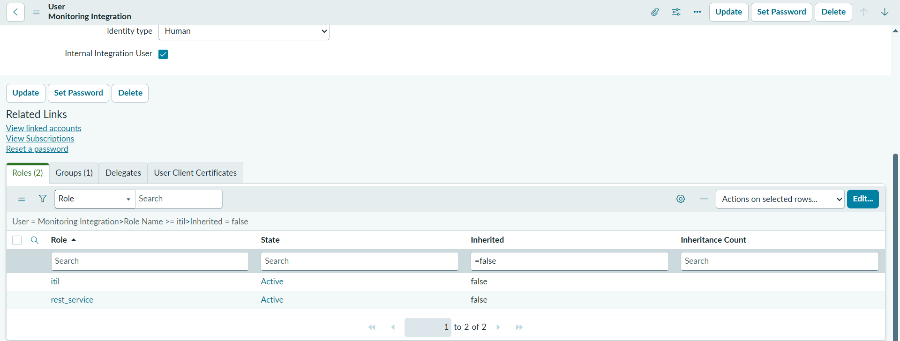

### Permanent NAT path on MON-SRV (and the major routing incident)

A permanent eth1 NAT path was added for outbound internet (email + ServiceNow API). An incorrect default-route metric caused all general-purpose traffic (including internal 10.10.11.0/24) to be pulled onto the NAT interface. Symptoms, diagnosis, and the corrected scoped `/32` routes are recorded as Issue 8.

After the fix:

```bash
curl -sI https://<servicenow-instance-url>
# 200 OK
```

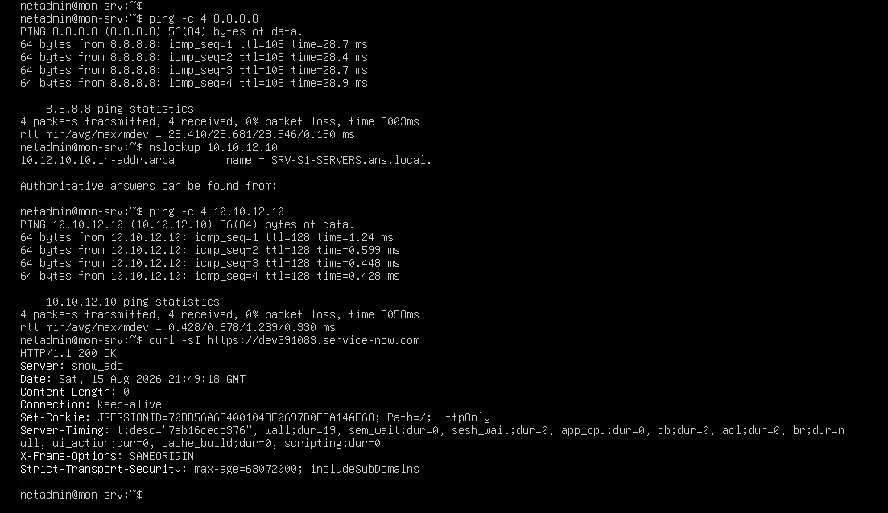

### ServiceNow REST integration test

Incident created through the ServiceNow REST API using the integration user. The incident was then tracked through resolution and closure in the UI.

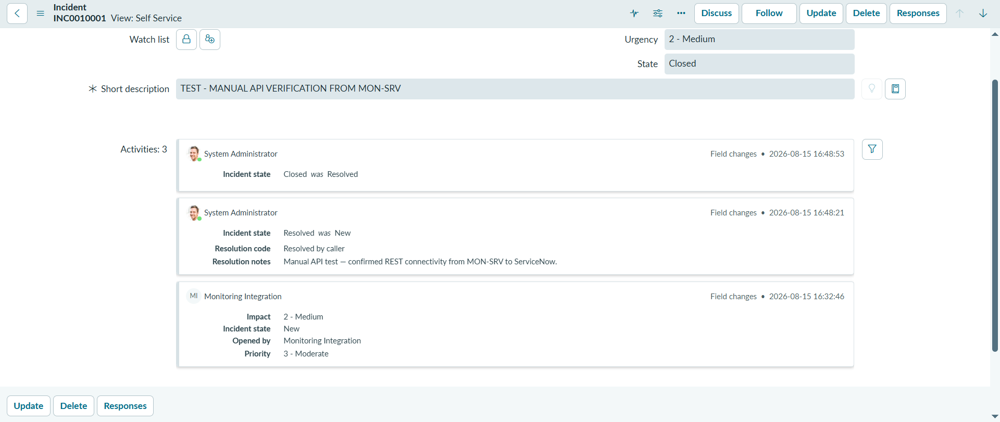

### Final dashboard baseline

Problems view empty, host availability 7/7 green, WAN latency/loss graphs clean.

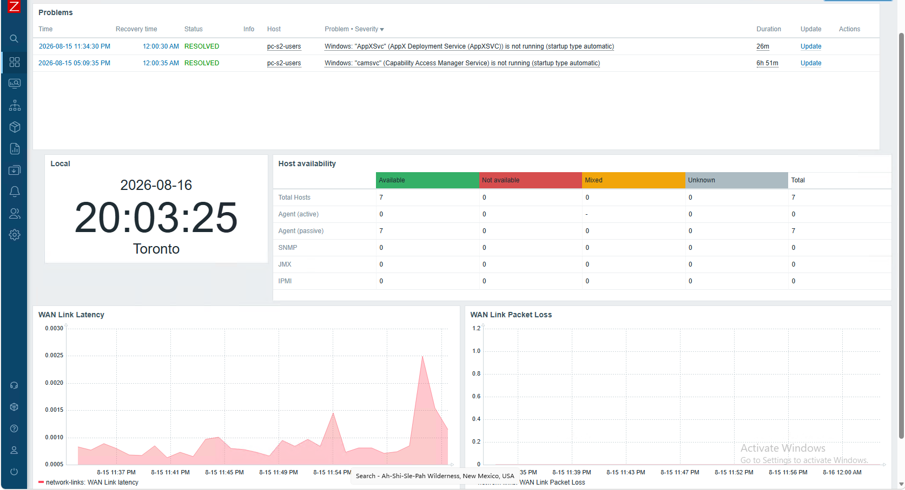

### Final checkpoints

All seven VMs checkpointed as `Phase3-Complete-Clean`. Superseded mid-phase checkpoints removed after merges completed.

## 6. Validation

#### Test 1 — All hosts reachable and green

**Objective:** Confirm every monitored host appears green in the Zabbix UI.

**Method:** Monitoring → Hosts, filtered by group ANS-Infrastructure.

**Result:** 7/7 hosts green (ZBX icon).

**Evidence:** 

#### Test 2 — Core service items returning healthy values

**Objective:** Confirm AD DS, DHCP, time sync, and Samba items report the expected healthy state.

**Method:** Monitoring → Latest data, filtered by custom item names.

**Result:** Service-state items report 0 / “active”; DHCP lease counts report 1/1; DNS SOA/PTR and SSH simple checks succeed.

**Evidence:** 

#### Test 3 — Custom triggers fire and resolve

**Objective:** Prove the severity mapping and resolution path.

**Method:** Stop `smbd` (Average) and `DHCPServer` (High); observe Problems view and later recovery.

**Result:** Both triggers fired within one poll interval and resolved after the services were restarted. Average severity produced no email (correct filter behaviour).

**Evidence:** 

#### Test 4 — Email notification path

**Objective:** Confirm High/Disaster alerts reach the configured Gmail media.

**Method:** Observed during the live DHCP test and again during the real routing incident that generated multiple High-severity alerts.

**Result:** Emails delivered once MON-SRV had a working outbound path.

**Evidence:** 

#### Test 5 — WAN link metrics live

**Objective:** Confirm latency and packet-loss items populate after fping is correctly configured.

**Method:** Latest data on host `network-links`.

**Result:** Sub-millisecond latency, 0 % loss under normal conditions.

**Evidence:** 

#### Test 6 — ServiceNow incident lifecycle

**Objective:** Confirm the ServiceNow REST integration can create and track a monitoring incident.

**Method:** REST POST through the integration user, followed by incident resolution and closure in the ServiceNow UI.

**Result:** Incident created with the expected category, subcategory, and assignment group, then tracked through closure.

**Evidence:** 

## 7. Troubleshooting & Issues

### Issue 1 — RTR-SITE1 ip_forward = 0 after agent work

**Where:** RTR-SITE1, immediately after Linux agent install / ufw changes

**Symptom:** TCP connectivity from MON-SRV to Site 2 failed while ICMP continued to work.

**Diagnosis path:**
1. Confirmed interfaces, ARP, and routes looked normal.
2. `sysctl net.ipv4.ip_forward` returned 0.

**Root cause:** IP forwarding had been reset (the same intermittent reset seen since Phase 1).

**Fix:**
```bash
echo "net.ipv4.ip_forward=1" | sudo tee /etc/sysctl.d/99-ip-forward.conf
sudo sysctl --system
```
(Temporary; permanent fix in Issue 4.)

**Lesson:** When forwarded traffic behaves unexpectedly, verify `ip_forward` early alongside the routing and firewall state.

### Issue 2 — MON-SRV ufw blocked inbound SSH

**Where:** MON-SRV

**Symptom:** Return-path SSH and some agent connectivity tests hung.

**Root cause:** ufw default-deny incoming; port 22 had been deliberately left closed during the initial Zabbix install.

**Fix:**
```bash
sudo ufw allow 22/tcp
sudo ufw status verbose
```

**Lesson:** Even “temporary” deny decisions need to be revisited once bidirectional testing starts.

### Issue 3 — DEFAULT_FORWARD_POLICY="DROP" on both routers

**Where:** RTR-SITE1 and RTR-SITE2

**Symptom:** New TCP sessions that required cross-WAN forwarding were dropped while ICMP still passed.

**Root cause:** `/etc/default/ufw` still contained the Ubuntu default `DEFAULT_FORWARD_POLICY="DROP"`. The ufw-user-forward chain was empty, so every forwarded packet hit the policy DROP.

**Fix:**
```bash
# edit /etc/default/ufw
DEFAULT_FORWARD_POLICY="ACCEPT"
sudo ufw reload
```

**Lesson:** ufw’s forwarding policy is separate from host-level allow rules. In Phase 3, forwarding was temporarily left permissive so monitoring traffic could traverse the routers; Phase 4 replaces this with explicit route allow-lists and a default-deny forwarding policy.

### Issue 4 — Real root cause of the recurring ip_forward resets

**Where:** Both routers (`/etc/ufw/sysctl.conf`)

**Symptom:** After the temporary sysctl.d fix (Issue 1), a subsequent `ufw reload` set `ip_forward` back to 0 again.

**Root cause:** ufw maintains its own sysctl file and re-applies it on every enable/reload. The line was still commented out:

```ini
#net/ipv4/ip_forward=1
```

This is the previously unidentified explanation for the resets first observed in Phase 1 and never fully rooted through Phase 2.

**Fix:**
```bash
sudo sed -i 's/#net\/ipv4\/ip_forward=1/net\/ipv4\/ip_forward=1/' /etc/ufw/sysctl.conf
sudo ufw reload
sysctl net.ipv4.ip_forward   # remains 1 after reboot
```
Applied to both routers.

**Lesson:** When a setting keeps reverting after a tool that manages sysctl is involved, inspect that tool’s own configuration files, not only `/etc/sysctl.d/`.

### Issue 5 — Dual default route / DNS pollution on Windows hosts during TempNAT

**Where:** SRV-S1-SERVERS, later PC-S1-USERS / PC-S2-USERS

**Symptom:** Internet traffic preferred the domain gateway; later `ans.local` resolved to a NAT address in addition to the real DC address.

**Root cause:** Two default routes at the same metric; Windows Dynamic DNS registration of the TempNAT adapter against the domain root name.

**Fix:** Permanent split-route pattern (`0.0.0.0/1` + `128.0.0.0/1` via NAT) plus:

```powershell
Set-DnsClient -InterfaceAlias "Ethernet 2" -RegisterThisConnectionsAddress $false
# remove the polluted A record from the DNS zone
```

**Lesson:** Any temporary adapter on a domain-joined Windows host must be prevented from registering itself in DNS.

### Issue 6 — Split-default-route pattern hijacked internal traffic

**Where:** All three Windows hosts that received the TempNAT pattern

**Symptom:** Traffic to 10.10.12.10 (and other internal subnets) was forced out the NAT interface.

**Root cause:** The two `/1` routes together cover the entire IPv4 space and are more specific than a normal default route. No exception existed for the lab’s 10.10.0.0/16 range.

**Fix:** Explicit more-specific route:

```powershell
route -p add 10.10.0.0 mask 255.255.0.0 <real-gateway> metric 1 if <domain-ifIndex>
```

**Lesson:** A split-default-route pattern is incomplete without an explicit exception for the internal networks that must stay on the real gateway.

### Issue 7 — DHCP lease-count UserParameter returned non-numeric or zero

**Where:** SRV-S1-SERVERS custom items

**Symptom:** Item first reported “Value of type 'string' is not suitable for value type 'Numeric (unsigned)'”, then after an `[int]` cast returned 0 despite an active lease existing.

**Root cause:** The command did not consistently return the numeric count Zabbix expected when the query produced a single lease object. Explicit casting and forcing array context corrected the result.

**Fix:**
```ini
UserParameter=dhcp.leasecount.s1,powershell -NoProfile -Command "[int]@(Get-DhcpServerv4Lease -ScopeID 10.10.11.0).Count"
```
(The `@()` forces array context.)

**Lesson:** When a PowerShell query may return zero or one object, forcing array context with `@()` gives a predictable count for Zabbix numeric items.

### Issue 8 — Permanent NAT default route broke internal connectivity (major incident)

**Where:** MON-SRV eth1 netplan

**Symptom:** Zabbix GUI briefly unreachable; multiple real High-severity alerts (WAN Link Degraded + ICMP Unavailable) arrived by email; `ping 10.10.11.100` failed while 10.10.12.x stayed reachable.

**Root cause:** The persisted netplan for eth1 contained a default route with metric 50, lower than eth0’s metric 100. All traffic without a more-specific route (including the Users VLAN and the WAN target) was pulled onto the NAT interface.

**Fix:**
```bash
sudo ip route del default via 192.168.100.1 dev eth1
# replace with scoped /32 routes only
sudo ip route add 8.8.8.8/32 via 192.168.100.1 dev eth1
sudo ip route add <servicenow-resolved-ip>/32 via 192.168.100.1 dev eth1
```
Netplan updated to match; `netplan apply` confirmed stable.

**Lesson:** A permanent “internet” adapter on a monitoring host must never install a competing default route. Scope the routes to the exact external destinations required.

**Overall summary:** Every issue was resolved through configuration or sequencing changes without changing the monitoring architecture. Phase 3 also identified the persistent `ip_forward` reset cause in `/etc/ufw/sysctl.conf`, closing a problem that had appeared in earlier phases.

---

[← Main README](../README.md) · [01 — Design & Decisions](01-decisions.md) · [03 — Phase Summary →](03-phase-summary.md)
