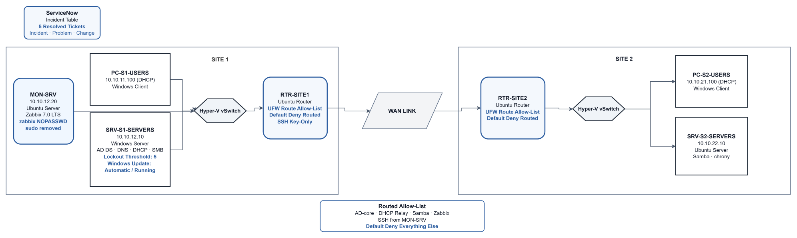

# Phase 4 — Security: Design & Decisions

## 1. Objectives

Phase 4 hardens the environment built in Phases 1–3 without changing the existing topology or addressing scheme. The focus is on restricting routed traffic, correcting security findings discovered during the audit, hardening administrative access, and confirming that the services built in earlier phases still work after the changes.

What exists when this phase is complete:

- Both Ubuntu routers enforce `default deny routed` with explicit `ufw route` allow rules for required lab traffic
- Required Active Directory, DHCP relay, Samba, Zabbix, and management SSH paths remain available through the router allow-lists
- `RTR-SITE1` uses SSH key authentication with password authentication disabled
- The Domain Controller Windows Update service is restored to Automatic/Running
- The domain account lockout threshold is set to 5
- An undocumented passwordless sudo grant for the `zabbix` service account is removed
- The unused MySQL X Protocol listener on `MON-SRV` is disabled
- Significant findings and configuration changes are documented and resolved in ServiceNow
- Phase 2 and Phase 3 service paths are re-tested after the security changes

### Main technical areas

- Routed UFW allow-lists and default-deny forwarding
- Active Directory and DHCP-aware ACL design
- SSH key-only authentication
- Windows domain-policy and service review
- Linux service-account privilege cleanup
- Open-port review and service reduction
- ServiceNow incident documentation
- Post-hardening validation

### Constraints

- The lab remains on the same resource-constrained Azure Hyper-V host, so selective VM power-on is still used when necessary.
- Security controls must preserve the AD, DNS, DHCP, file-sharing, SSH, and Zabbix paths established in earlier phases.
- No new devices, VLANs, or IP addresses are introduced in Phase 4.
- ServiceNow records are stored in the Incident table; type prefixes are used where a finding represents a problem or change rather than a normal incident.

---

## 2. Options Considered

### Router traffic control

| Option | Advantages | Trade-offs |
|---|---|---|
| **UFW route allow-list + default-deny forwarding (chosen)** | Uses the firewall already present on both Ubuntu routers; readable rules; straightforward verification with `ufw status numbered` | Requires every required routed flow to be identified and tested |
| Raw iptables / nftables | More granular control | More configuration complexity than needed for this lab |
| Leave routed traffic unrestricted | Lowest risk of initially breaking services | Provides no enforcement between routed VLANs and sites |

UFW route rules were selected because they could enforce traffic at the routing boundary while remaining consistent with the Linux tooling already used in the lab.

### Allow-list scope

| Option | Advantages | Trade-offs |
|---|---|---|
| **Permit only required service flows (chosen)** | Limits routed access to the services the environment actually uses | Missing protocols or reply paths can interrupt valid traffic |
| Broad Users-to-Servers allow rules | Simpler implementation | Allows more traffic than the services require |
| Host firewalls only | No router ACL changes | Does not control traffic at the inter-VLAN or inter-site routing boundary |

The allow-list is based on required application flows rather than broad subnet-to-subnet access.

### SSH authentication

| Option | Advantages | Trade-offs |
|---|---|---|
| **Key-only authentication on `RTR-SITE1` (chosen)** | Removes password authentication on one infrastructure host while allowing the configuration to be validated safely | Other Linux hosts retain their existing authentication configuration |
| Key-only authentication on every Linux host at once | Wider immediate coverage | Greater risk of losing administrative access during configuration |
| Keep password authentication everywhere | No migration work | Leaves password-based SSH enabled on all infrastructure hosts |

`RTR-SITE1` was used as the hardening target so the key-only configuration and cloud-init behavior could be verified without changing every Linux host at the same time.

### Audit-remediation scope

| Option | Advantages | Trade-offs |
|---|---|---|
| **Remediate confirmed security findings from the audit (chosen)** | Keeps the phase tied to observed conditions in the lab | Does not attempt a full security-baseline framework |
| Full CIS/STIG-style hardening across every host | Broader control coverage | Outside the scope and time available for this phase |

The audit focused on open ports, running services, administrative privileges, SSH configuration, Windows update state, and domain lockout policy. Findings were remediated when they were clearly unnecessary or insecure.

---

## 3. Final Design Decisions

| Decision | Final Choice | Reason |
|---|---|---|
| Routed traffic policy | `ufw default deny routed` on both routers | Makes routed traffic deny-by-default instead of fully open |
| ACL model | Explicit rules for required AD, DHCP relay, Samba, Zabbix, and management SSH flows | Preserves required services while restricting unrelated routed traffic |
| AD traffic | Required TCP AD ports plus UDP 88, 389, and 464 where needed | The initial TCP-only rules broke Site 2 domain operations |
| DHCP relay return traffic | UDP 67 from `SRV-S1-SERVERS` to the VLAN gateway addresses | DHCP relay replies are addressed to the relay `giaddr`, not the WAN interface |
| SSH hardening target | `RTR-SITE1` | Allows key-only authentication to be implemented and verified on one infrastructure host |
| SSH effective configuration | Main `sshd_config` plus cloud-init drop-in checked with `sshd -T` | The cloud-init drop-in overrode the first password-authentication change |
| Domain Controller service state | `wuauserv` Automatic/Running | Corrects the stopped Windows Update service found during the audit |
| Domain lockout policy | `LockoutThreshold = 5` | Replaces the previous zero-lockout configuration |
| Zabbix service-account privilege | Remove the undocumented `NOPASSWD` sudoers grant | No active Zabbix function required the root-equivalent `nmap` privilege |
| MySQL X Protocol | Disabled on `MON-SRV` | Port 33060 was open but unused by Zabbix or other lab services |
| ServiceNow documentation | Five records documenting significant findings and changes | Keeps troubleshooting, root cause, work notes, and resolution tied to the security work |
| Validation | Re-test critical Phase 2 and Phase 3 paths after ACL and hardening changes | Confirms the security controls do not break required services |

### Plan-vs-actual notes

- The first router allow-list included TCP rules for the required AD services but missed required UDP traffic. Site 2 domain operations failed until UDP 88, 389, and 464 were added.
- DHCP still failed after the AD UDP correction because the relay reply path was not permitted. The final ACL allows UDP 67 from `SRV-S1-SERVERS` to the Site 1 and Site 2 VLAN gateway addresses.
- Editing `/etc/ssh/sshd_config` alone did not disable password authentication on `RTR-SITE1`. `/etc/ssh/sshd_config.d/50-cloud-init.conf` still enabled it, so the effective configuration was verified with `sshd -T` and the drop-in was corrected.
- A stale TempNAT DNS record from Phase 3 was found while validating the ACL changes and removed.
- The audit found MySQL X Protocol listening on TCP 33060 on `MON-SRV`; it was not required and was disabled.

---

## 4. Security Controls & Documentation

### Router controls

Both routers retain the existing Phase 1 routing design but now enforce routed traffic through explicit UFW rules.

The final rules permit the traffic required for:

- Active Directory authentication and directory access
- DHCP relay and its return path
- SMB/Samba file sharing
- Zabbix monitoring
- SSH from `MON-SRV` to the infrastructure hosts

Traffic that does not match an allow rule is denied by the routed default policy.

Exact commands and rule verification are recorded in [`02-build-log.md`](02-build-log.md).

### Host and account hardening

| System | Change |
|---|---|
| `RTR-SITE1` | SSH key authentication enabled; password authentication disabled and verified |
| `SRV-S1-SERVERS` | Windows Update service restored to Automatic/Running |
| `ans.local` domain | Account lockout threshold set to 5 |
| `MON-SRV` | Undocumented Zabbix `NOPASSWD` sudoers grant removed |
| `MON-SRV` | Unused MySQL X Protocol listener disabled |

### ServiceNow records

ServiceNow was used to document significant findings and changes from the phase, including:

- the Site 2 DHCP/AD outage caused by the first ACL revision
- the Domain Controller Windows Update finding
- the undocumented Zabbix sudoers grant
- the `SRV-S2-SERVERS` kernel deadlock encountered during scanning
- the SSH key-authentication change on `RTR-SITE1`

The ticket numbers, work notes, screenshots, and resolution evidence remain in [`02-build-log.md`](02-build-log.md).

No new device names or IP addresses were introduced in this phase.

---

## 5. Topology Diagram

The Phase 4 diagram keeps the Phase 3 infrastructure and monitoring layout unchanged while adding the router security boundaries introduced in this phase. Both routers now enforce explicit routed allow-lists with a default-deny forwarding policy; the required monitoring and service paths remain available through those controls.

---

## 6. Completed Outcome

Phase 4 completed the security-hardening layer for the existing seven-VM environment. Routed traffic is restricted by explicit allow-lists, key-only SSH is active on `RTR-SITE1`, identified service and privilege findings were corrected, and the earlier AD, DHCP, file-sharing, and monitoring paths were re-tested under the hardened configuration.

Detailed commands, screenshots, validation results, ServiceNow records, and troubleshooting are in [`02-build-log.md`](02-build-log.md). A shorter completed-state view is in [`03-phase-summary.md`](03-phase-summary.md).

---

[← Main README](../README.md) · [02 — Build Log](02-build-log.md) · [03 — Phase Summary](03-phase-summary.md)
