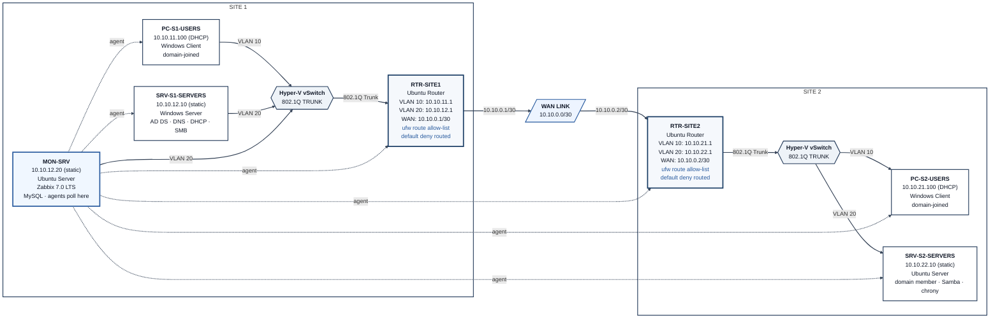

# Phase 4 — Security & Automation: Design & Decisions

## 1. Objectives

Phase 4 hardens the environment built in Phases 1–3 and demonstrates a basic security-operations workflow. The work has two parallel tracks:

1. **Security hardening** — restrict inter-VLAN and inter-site traffic to an explicit allow-list on both routers, remediate high-risk service-account grants, enforce key-only SSH on at least one infrastructure host, and close the most obvious gaps found by a full port audit.
2. **Operations / ITIL practice** — capture every real fault that appeared during the hardening work as a tracked ServiceNow incident (or problem/change analogue), with chronological work notes and an explicit root-cause / resolution split.

What exists when this phase is complete:

- Both routers enforce a default-deny routed policy plus an explicit allow-list covering AD-core (TCP + UDP), Samba, Zabbix, SSH from MON-SRV, and the DHCP-relay reply path
- Domain Controller Windows Update service restored to Automatic/Running and account lockout policy set to a non-zero threshold
- Undocumented passwordless sudo grant for the zabbix service account removed
- SSH key-only authentication live on RTR-SITE1 (password auth rejected)
- Five ServiceNow tickets written, worked, and resolved with full evidence
- Documentation of the design choices, the ACL gaps that were discovered the hard way, and the validation that the hardened posture still permits the services Phase 2 and 3 rely on

No full Zero-Trust redesign, no Group Policy objects, and no automated remediation scripts are in scope — those would be natural extensions, not part of this phase.

**How this closes the project:**

- The monitoring baseline from Phase 3 now sits behind real network controls, so a future change that breaks a service should still appear on the dashboard.
- The ServiceNow tickets give a concrete example of turning lab findings into an auditable operations record.

**Skills demonstrated:** network ACL design and troubleshooting (including relay-aware rules), service-account hygiene, SSH hardening with cloud-init awareness, Windows domain policy basics, structured incident documentation, and continued cross-platform administration.

**Constraints:**

- Same nested-host memory limits; selective power-on remains necessary.
- Router ACLs must not break the Phase 2 services (AD authentication, DHCP, file shares) or the Phase 3 monitoring paths.
- ServiceNow Personal Developer Instance has no Problem or Change modules activated — all tickets live in the Incident table with bracketed type prefixes for clarity.

## 2. Options Considered

### Router traffic-control method

| Option | Pros | Cons |
|---|---|---|
| **ufw route allow-list + default deny routed (chosen)** | Already present on the Ubuntu routers; simple syntax; easy to verify with `ufw status numbered` | Less granular than raw iptables; requires careful testing of every protocol the lab actually uses |
| Raw iptables / nftables | Full control | Steeper learning curve for the same end result; harder to keep consistent across two routers |
| Leave routing fully open | Zero risk of breaking services | Leaves the multi-VLAN design with no enforcement — weakens the Phase 1 segmentation story |

### Scope of the allow-list

| Option | Pros | Cons |
|---|---|---|
| **Explicit service ports only (chosen)** | Least privilege; forces the builder to understand which ports AD, DHCP, Samba and Zabbix actually need | Easy to miss UDP or reply-path addresses (exactly what happened) |
| Broad “any from Users VLANs to Servers VLAN” | Faster to implement | Defeats the purpose of an allow-list |
| Host-based firewalls only | No router changes | Does not demonstrate inter-VLAN control at the routing boundary |

### SSH authentication

| Option | Pros | Cons |
|---|---|---|
| **Key-only on RTR-SITE1 first (chosen)** | Proves the pattern without locking every host at once; leaves a password path on other hosts as a safety net during testing | Incomplete coverage until rolled out further |
| Key-only on all Linux hosts immediately | Stronger end state | Higher risk of lock-out during the learning curve |
| Leave password authentication | Zero lock-out risk | Leaves the most common remote-access vector open |

### Service-account and policy hardening

| Option | Pros | Cons |
|---|---|---|
| **Remediate only the findings that were clearly high-risk or clearly broken (chosen)** | Matches the actual audit results; avoids inventing work | Does not produce a full CIS-style baseline |
| Full CIS / STIG pass on every host | Comprehensive | Far beyond the time and scope of a single phase |

## 3. Final Design Decisions

| Decision | Choice | Why |
|---|---|---|
| Traffic control mechanism | `ufw` route rules + `default deny routed` on both routers | Already installed; consistent with the Linux tooling used in prior phases |
| Allow-list contents | AD-core (88, 389, 445, 464, 636, 3268, 3269 TCP + UDP), Samba (139/445), Zabbix (10050/10051 both directions), SSH from MON-SRV, DHCP reply path to the VLAN gateways | Exactly the services the lab depends on; anything else is denied by default |
| SSH hardening target | RTR-SITE1 only for this phase | Proves key-only auth and surfaces the cloud-init drop-in issue without risking simultaneous lock-out of every infrastructure host |
| DC hardening | Restore `wuauserv` to Automatic/Running; set LockoutThreshold = 5 | Closes the two clearest policy gaps found by the audit |
| zabbix sudoers entry | Disable (rename out of `/etc/sudoers.d/`) | Passwordless root-equivalent nmap for a service account with no active use case is unnecessary risk |
| ITIL documentation | Five Incident-table tickets with explicit [Problem] / [Change] prefixes | ServiceNow PDI lacks Problem and Change modules; the prefix keeps the intended classification visible |
| Validation approach | Re-test the Phase 2 and Phase 3 critical paths (DHCP, AD auth, file share, Zabbix agents, SSH) after every ACL change | Prevents “hardened but broken” outcomes |

**Plan-vs-actual notes:**

- The first ACL allow-list covered only TCP for AD-core services. Site 2 immediately lost DHCP and domain authentication because CLDAP (UDP 389) and Kerberos (UDP 88) were missing, and the DHCP-relay reply path (giaddr = VLAN gateway, not WAN address) was also missing. Both gaps were diagnosed and closed in the same session.
- Editing `/etc/ssh/sshd_config` alone did not disable password authentication; a cloud-init drop-in (`50-cloud-init.conf`) overrode it. Effective settings had to be verified with `sshd -T` and the drop-in itself edited.
- A stale TempNAT A record (192.168.100.20) left over from Phase 3 was still registered against both the domain root and the DC host name; it was cleaned up while verifying the ACL fixes.

## 4. Naming & Addressing

No new devices or IP addresses were introduced. All existing names and the Phase 1–3 addressing scheme remain unchanged.

**ACL rule naming convention (for documentation only):** rules are described by source subnet → destination host:port rather than by ufw rule numbers, because rule numbers shift when rules are inserted or deleted.

**ServiceNow ticket references used in this phase:**

| Ticket | Intended type | Short description (abridged) |
|---|---|---|
| INC0010003 | Incident | Site 2 clients lost DHCP / AD after ACL |
| INC0010004 | Problem | DC Windows Update service disabled (~4 years) |
| INC0010005 | Problem/Security | Undocumented zabbix sudoers NOPASSWD entry |
| INC0010006 | Incident | SRV-S2-SERVERS kernel deadlock during scan |
| INC0010007 | Change | SSH key-based authentication on infrastructure host |

(Exact ticket numbers are those generated by the lab’s ServiceNow instance; they are retained for traceability inside the build log.)

## 5. Topology Diagram

The diagram shows the Phase 3 end state with the new security boundaries annotated. Prior network and monitoring layout stays plain; only the ACL-controlled paths receive detail.

Both routers now enforce an explicit allow-list for inter-VLAN and inter-site traffic. Only the ports required by AD, DHCP relay, Samba, Zabbix and management SSH are permitted; everything else is denied by the default routed policy. Monitoring agent relationships from Phase 3 remain unchanged.

## 6. Status

- Step 1 — Understand the goal — done
- Step 2 — Research options — done
- Step 3 — Make decisions — done
- Step 4 — Build (see `02-build-log.md`)
