# Phase 4 — Security & Automation: Build Log

Environment and design rationale are covered in `01-decisions.md`. This document is the as-executed build: audit findings, ACL implementation, hardening steps, and the issues that appeared along the way.

## 1. Environment & Prerequisites (recap)

Seven VMs on the same Azure Hyper-V host used in Phases 1–3. No new devices or IP addresses were added.

| VM | Role | IP | VLAN / Site |
|---|---|---|---|
| RTR-SITE1 | Router | 10.10.0.1 (WAN) | Site 1 |
| RTR-SITE2 | Router | 10.10.0.2 (WAN) | Site 2 |
| PC-S1-USERS | Windows 11 client | 10.10.11.100 (DHCP) | VLAN 10, Site 1 |
| SRV-S1-SERVERS | Windows Server (AD DC) | 10.10.12.10 | VLAN 20, Site 1 |
| PC-S2-USERS | Windows 11 client | 10.10.21.100 (DHCP) | VLAN 10, Site 2 |
| SRV-S2-SERVERS | Ubuntu (Samba) | 10.10.22.10 | VLAN 20, Site 2 |
| MON-SRV | Ubuntu Server (Zabbix) | 10.10.12.20 | VLAN 20, Site 1 |

Baseline checkpoint `pre-phase4-audit-baseline` taken on all seven VMs before any changes. Phase 3 known limitations (ip_forward persistence, SSSD dynamic DNS, dcdiag DFSREvent) re-read and carried forward.

## 2. Part A — Pre-Work

All seven VMs confirmed running and reachable. Baseline DHCP leases recorded:

- PC-S1-USERS → 10.10.11.100
- PC-S2-USERS → 10.10.21.100

Tracking documents (this build log and an audit worksheet) prepared.

**Status:** Complete.

## 3. Part B — Audit (Discovery + Manual Checks)

### B1 — Nmap discovery pass

Full TCP scan with version detection against every host:

```bash
sudo nmap -p- -sV -sT -T4 <target> -oN <output>.txt
```

Targets: RTR-SITE1, RTR-SITE2, PC-S1-USERS, SRV-S1-SERVERS, PC-S2-USERS, SRV-S2-SERVERS, MON-SRV (localhost).

SRV-S2-SERVERS initially appeared down (see Issue 1). Hard-reset via Hyper-V console, recovered, and re-scanned successfully.

### B2 — Open ports (summary)

| Host | Notable open ports |
|---|---|
| RTR-SITE1 / RTR-SITE2 | 22 (ssh), 10050 (zabbix-agent) |
| PC-S1-USERS / PC-S2-USERS | 135, 139, 445, 5040 (CDPSvc – benign), 10050, dynamic RPC |
| SRV-S1-SERVERS | 53, 88, 135, 139, 389, 445, 464, 593, 636, 3268, 3269, 5985, 9389, 10050, many dynamic RPC |
| SRV-S2-SERVERS | 22, 139/445 (Samba), 10050 |
| MON-SRV | 22, 80, 3306, 10050, 10051, **33060 (MySQL X – later closed)** |

### B3 — Per-host manual checks

**Linux hosts** (SSH as netadmin):

```bash
sudo ss -tulpn
systemctl list-units --type=service --state=running
grep -E "PasswordAuthentication|PubkeyAuthentication" /etc/ssh/sshd_config
cat /etc/passwd | grep -E "/bin/bash|/bin/sh"
sudo cat /etc/sudoers.d/* 2>/dev/null
getent group sudo
apt list --upgradable 2>/dev/null
```

**Windows hosts** (console / RDP):

```powershell
Get-NetTCPConnection -State Listen | Select-Object LocalAddress,LocalPort,OwningProcess
Get-Service | Where-Object {$_.Status -eq "Running"}
Get-LocalGroupMember -Group "Administrators"   # Get-ADGroupMember on the DC
Get-HotFix | Sort-Object InstalledOn -Descending | Select-Object -First 10
```

Key observations:

- Routers and SRV-S2-SERVERS still had default SSH password authentication enabled.
- MON-SRV contained an undocumented `/etc/sudoers.d/zabbix` entry granting the zabbix service account passwordless sudo for `nmap -O *` (file dated 2018, pre-dates the lab).
- SRV-S1-SERVERS (DC) showed only three hotfixes from March 2022 and LockoutThreshold = 0.
- Port 5040 on both Windows clients identified as CDPSvc (benign, left running).
- Port 33060 on MON-SRV (MySQL X Protocol) unused and later disabled.

### B4 — Issues found and resolved during audit

Seven findings were recorded and closed in the same session (see Issues 1–7 in the Troubleshooting section). All hosts finished the audit with either a clean result or an explicitly documented intentional/benign exception.

**Status:** Complete.

## 4. Part C — Router ACL Implementation

Both routers received an identical allow-list under a new default-deny routed policy.

```bash
# AD-core (TCP) – Users VLANs → SRV-S1-SERVERS
sudo ufw route allow proto tcp from 10.10.11.0/24 to 10.10.12.10 port 88
sudo ufw route allow proto tcp from 10.10.21.0/24 to 10.10.12.10 port 88
# … (same pattern for 389, 445, 464, 636, 3268, 3269)

# Samba – Users VLANs → SRV-S2-SERVERS
sudo ufw route allow proto tcp from 10.10.11.0/24 to 10.10.22.10 port 445
sudo ufw route allow proto tcp from 10.10.21.0/24 to 10.10.22.10 port 445
sudo ufw route allow proto tcp from 10.10.11.0/24 to 10.10.22.10 port 139
sudo ufw route allow proto tcp from 10.10.21.0/24 to 10.10.22.10 port 139

# Zabbix (both directions)
# … 10050 and 10051 rules between all relevant subnets and MON-SRV

# SSH from MON-SRV to infrastructure
sudo ufw route allow proto tcp from 10.10.12.20 to 10.10.0.1 port 22
sudo ufw route allow proto tcp from 10.10.12.20 to 10.10.0.2 port 22
sudo ufw route allow proto tcp from 10.10.12.20 to 10.10.22.10 port 22

sudo ufw default deny routed
sudo ufw reload
```

Verified with `sudo ufw status numbered` on both routers.

This initial list was incomplete — see Part D / Issues 8–9 for the two gaps that immediately broke Site 2.

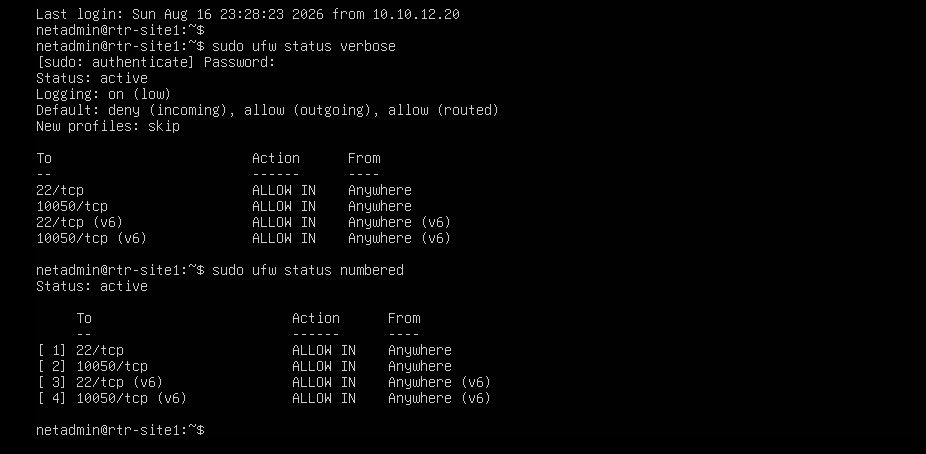
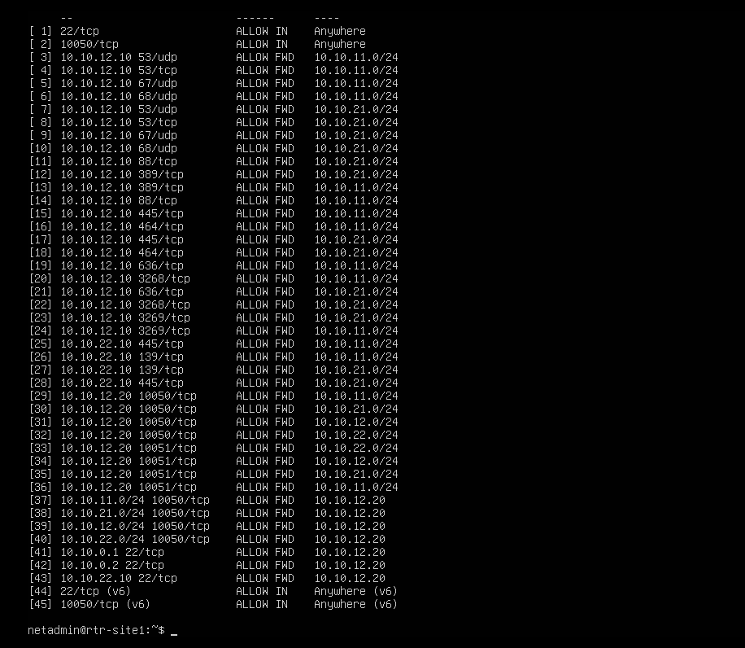
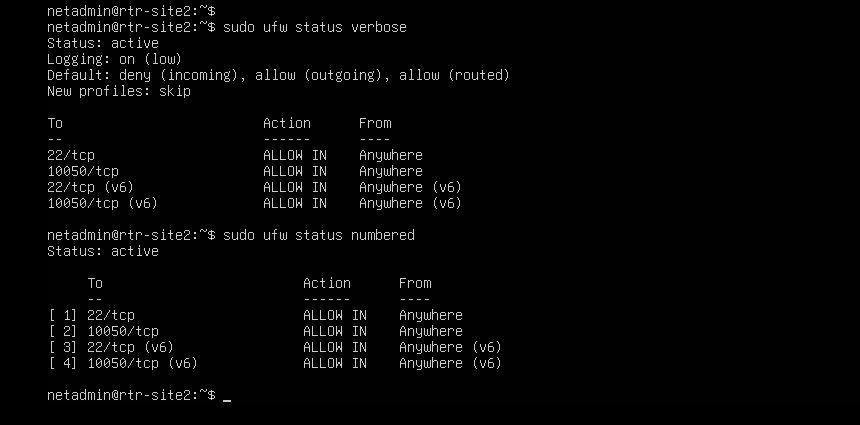
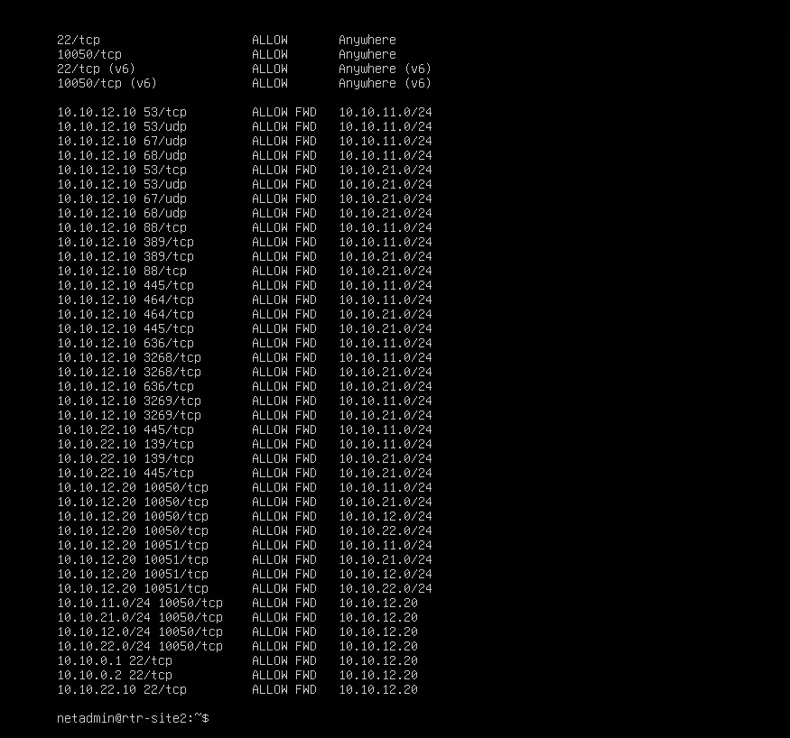

**Status:** Complete (as later revised).

## 5. Part D — ACL Gap Remediation, Service Hardening & Incident Response

### D1 — Incident: ACL broke Site 2 DHCP and AD authentication

Immediately after the ACL reload, PC-S2-USERS lost its lease (APIPA) and could not locate the domain controller. Site 1 remained healthy. ICMP and SSH from MON-SRV to both routers and SRV-S2-SERVERS continued to work, narrowing the problem to Site-2 client traffic.

**Layer 1 — missing UDP.** The original allow-list covered only TCP for AD-core ports. CLDAP (UDP 389) and Kerberos (UDP 88) were denied.

```bash
sudo ufw route allow proto udp from 10.10.11.0/24 to 10.10.12.10 port 88
sudo ufw route allow proto udp from 10.10.21.0/24 to 10.10.12.10 port 88
sudo ufw route allow proto udp from 10.10.11.0/24 to 10.10.12.10 port 389
sudo ufw route allow proto udp from 10.10.21.0/24 to 10.10.12.10 port 389
sudo ufw route allow proto udp from 10.10.11.0/24 to 10.10.12.10 port 464
sudo ufw route allow proto udp from 10.10.21.0/24 to 10.10.12.10 port 464
sudo ufw reload
```

`nltest /dsgetdc:ans.local` began succeeding, but DHCP still failed.

**Layer 2 — DHCP relay reply path.** `isc-dhcp-relay` sets `giaddr` to its own client-facing interface (10.10.21.1), not the WAN address. Replies therefore target the VLAN gateway, a path the original ACL never permitted.

```bash
sudo ufw route allow proto udp from 10.10.12.10 to 10.10.11.1 port 67
sudo ufw route allow proto udp from 10.10.12.10 to 10.10.21.1 port 67
sudo ufw reload
```

Verification:

```powershell
ipconfig /renew          # → 10.10.21.100, gateway 10.10.21.1, DNS 10.10.12.10
nltest /dsgetdc:ans.local
dir \\SRV-S1-SERVERS\TechShare
```

All three succeeded. While verifying, a stale TempNAT A record (192.168.100.20) left from Phase 3 was discovered against both the domain root and the DC host name and removed.

Documented as ServiceNow INC0010003.

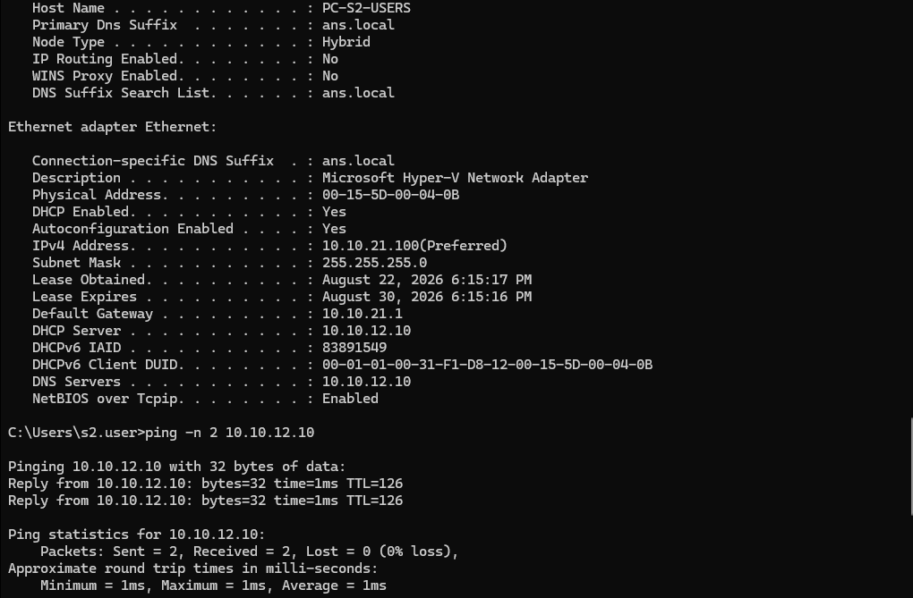
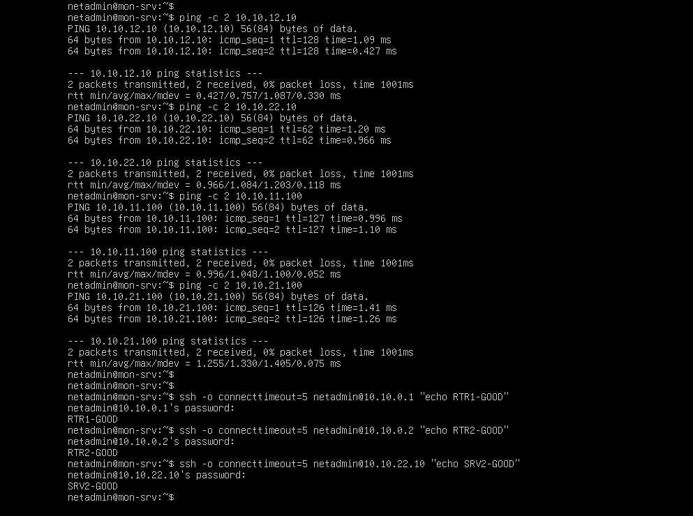
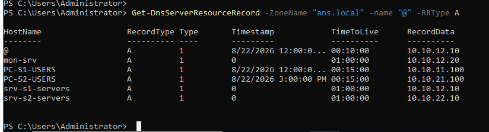

### D2 — SSH key-based authentication (RTR-SITE1)

Key generation and deployment from MON-SRV:

```bash
ssh-keygen -t ed25519 -C "netadmin@mon-srv" -f ~/.ssh/id_ed25519 -N ""
ssh-copy-id netadmin@10.10.0.1
```

sshd_config lockdown:

```bash
sudo sed -i 's/^#\?PasswordAuthentication.*/PasswordAuthentication no/' /etc/ssh/sshd_config
sudo sed -i 's/^#\?PubkeyAuthentication.*/PubkeyAuthentication yes/' /etc/ssh/sshd_config
sudo systemctl restart ssh
```

Password login still succeeded. Effective config revealed the override:

```bash
sudo sshd -T | grep -i passwordauthentication
# → passwordauthentication yes
```

Root cause: `/etc/ssh/sshd_config.d/50-cloud-init.conf` (first-match-wins) still set `PasswordAuthentication yes`.

```bash
sudo sed -i 's/^PasswordAuthentication.*/PasswordAuthentication no/' /etc/ssh/sshd_config.d/50-cloud-init.conf
sudo systemctl restart ssh
sudo sshd -T | grep -i passwordauthentication
# → passwordauthentication no
```

Final verification:

```bash
ssh -o PreferredAuthentications=publickey -o PasswordAuthentication=no netadmin@10.10.0.1 "echo KEY-LOGIN-OK"
# → KEY-LOGIN-OK
ssh -o PreferredAuthentications=password -o PubkeyAuthentication=no netadmin@10.10.0.1
# → Permission denied (publickey)
```

Documented as ServiceNow change ticket.

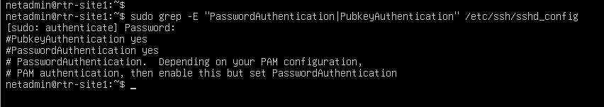
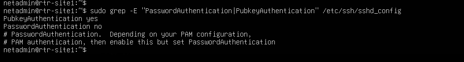
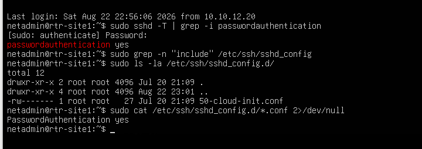
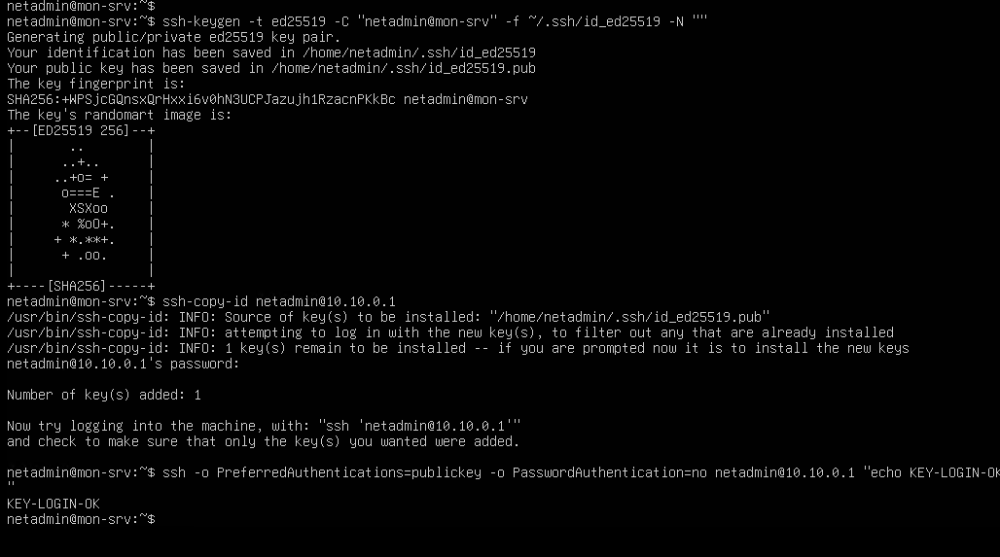
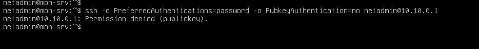

### D3 — Domain Controller hardening confirmation

```powershell
Get-Service wuauserv
# → Running, Automatic

Get-ADDefaultDomainPasswordPolicy | Select LockoutThreshold
# → 5
```

Both settings remained stable after the ACL work. Documented as ServiceNow problem ticket.

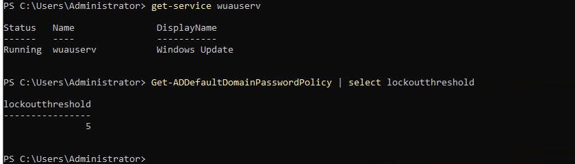

### D4 — zabbix sudoers cleanup (already performed in audit)

The passwordless `nmap -O *` grant was renamed out of `/etc/sudoers.d/` during the Part B audit and re-confirmed. Documented as ServiceNow problem/security ticket.

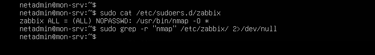
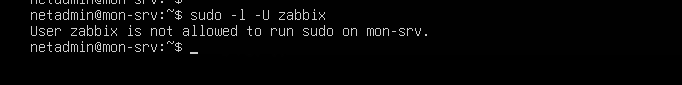

### ITIL ticketing summary

| # | Number | Intended type | Short description (abridged) | Priority |
|---|---|---|---|---|
| 1 | INC0010003 | Incident | Site 2 DHCP / AD broken by ACL | High |
| 2 | INC0010004 | Problem | DC Windows Update service disabled ~4 years | High |
| 3 | INC0010005 | Problem/Security | Undocumented zabbix sudoers entry | Moderate |
| 4 | INC0010006 | Incident | SRV-S2-SERVERS kernel deadlock during scan | Moderate |
| 5 | INC0010007 | Change | SSH key-based authentication on infrastructure host | Moderate |

Each ticket contains chronological Work Notes and an explicit Root Cause / Resolution split. Screenshots of form, work notes and resolution captured for every ticket.

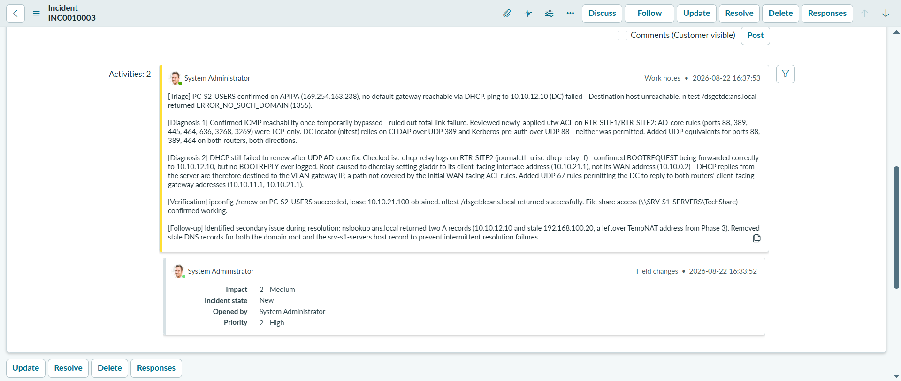
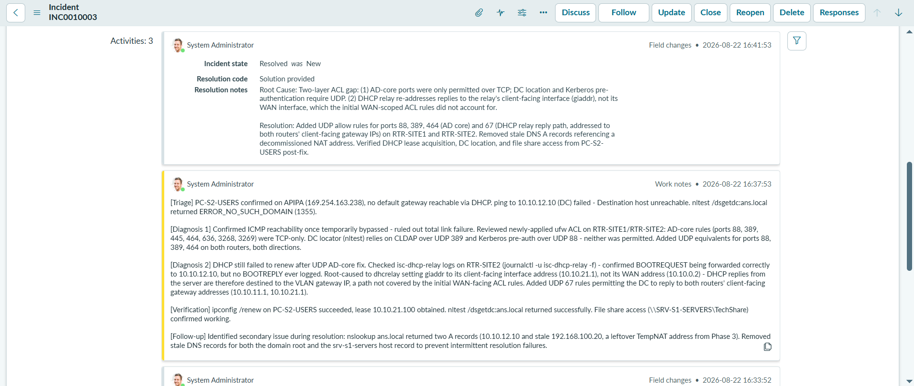
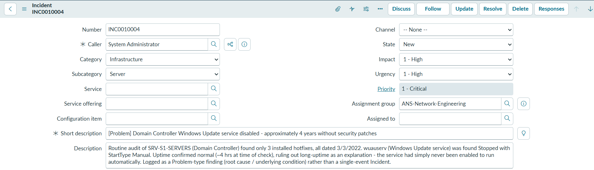
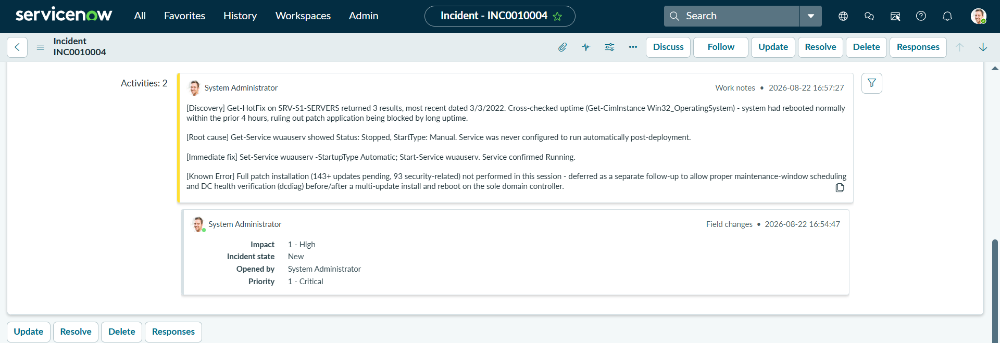
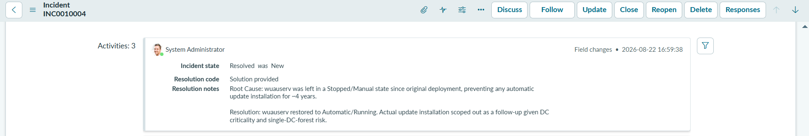
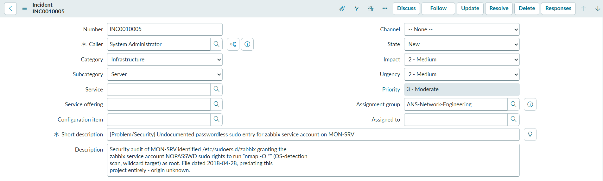
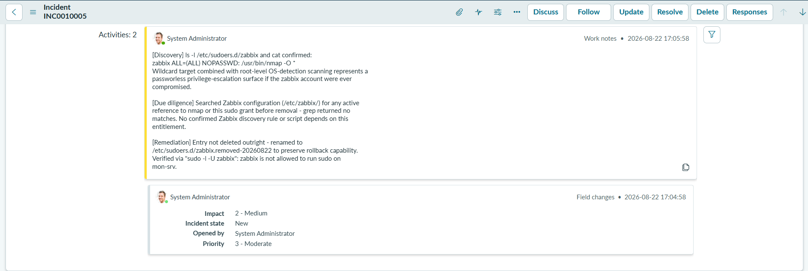
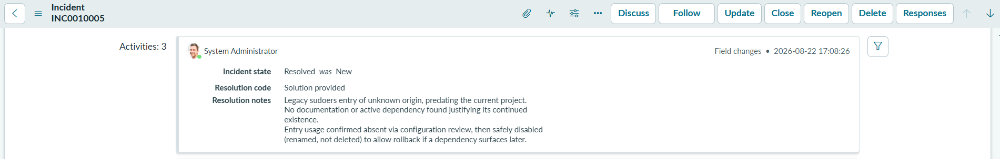
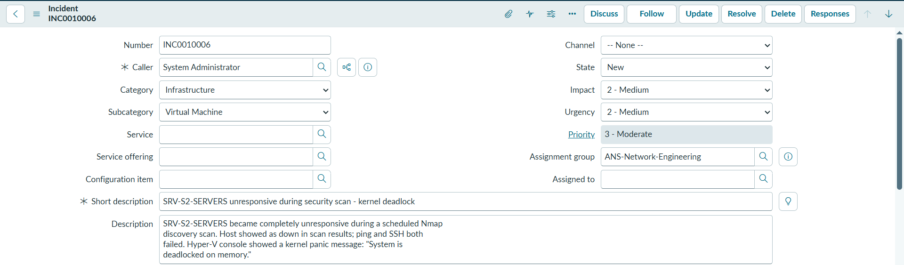
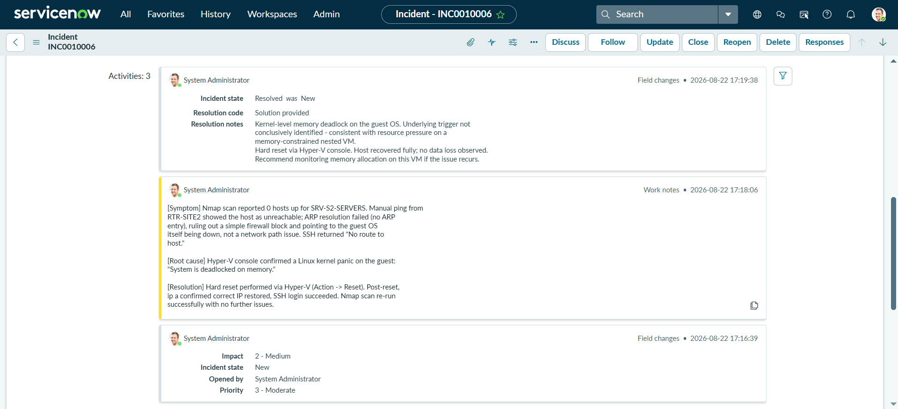
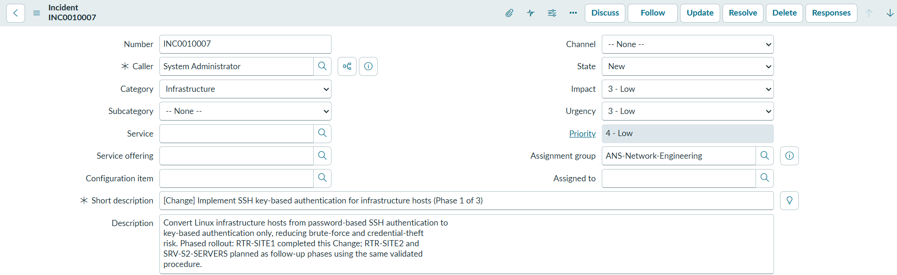
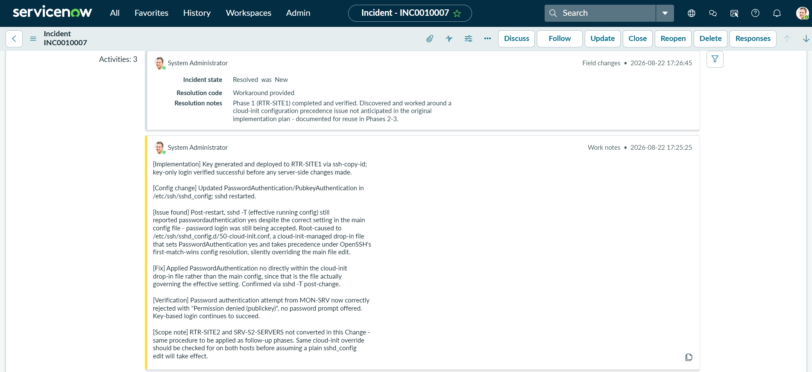

### Final checkpoint

```powershell
Checkpoint-VM -Name <vm> -SnapshotName "phase4-tickets-complete"
```

Taken on all seven VMs after every ticket was closed and the final ACL state verified.

**Status:** Phase 4 build and validation complete.

## 6. Validation

#### Test 1 — Site 2 DHCP and AD authentication restored

**Objective:** Confirm the two-layer ACL fix restored full client functionality on Site 2.

**Method:**
```powershell
ipconfig /renew
nltest /dsgetdc:ans.local
dir \\SRV-S1-SERVERS\TechShare
```

**Result:** Lease obtained (10.10.21.100), DC located, file share accessible.

**Evidence:** 

#### Test 2 — Inter-VLAN and inter-site services still function under the allow-list

**Objective:** Prove the hardened routers still permit the traffic Phase 2 and Phase 3 depend on.

**Method:** From both Users VLANs — domain authentication, DNS resolution, file-share access, Zabbix agent check-ins observed in the monitoring UI.

**Result:** All critical paths succeed; unsolicited ports remain blocked by default deny.

**Evidence:** (combined with Test 1 and monitoring dashboard checks)

#### Test 3 — SSH key-only authentication on RTR-SITE1

**Objective:** Confirm password authentication is rejected and key authentication succeeds.

**Method:**
```bash
ssh -o PreferredAuthentications=publickey -o PasswordAuthentication=no netadmin@10.10.0.1 "echo KEY-LOGIN-OK"
ssh -o PreferredAuthentications=password -o PubkeyAuthentication=no netadmin@10.10.0.1
```

**Result:** Key login succeeds; password login returns “Permission denied (publickey)”.

**Evidence:**  

#### Test 4 — DC hardening settings persist

**Objective:** Confirm wuauserv and lockout policy remain correctly configured after subsequent work.

**Method:**
```powershell
Get-Service wuauserv
Get-ADDefaultDomainPasswordPolicy | Select LockoutThreshold
```

**Result:** Running/Automatic; LockoutThreshold = 5.

**Evidence:** 

#### Test 5 — zabbix sudoers grant removed

**Objective:** Confirm the passwordless nmap grant no longer exists.

**Method:**
```bash
sudo -l -U zabbix
ls /etc/sudoers.d/
```

**Result:** No elevated privileges for the zabbix account; original file renamed out of the directory.

**Evidence:** 

#### Test 6 — ServiceNow tickets complete

**Objective:** Confirm five tickets exist with Work Notes and Resolution notes.

**Method:** Visual inspection of each ticket form, work-notes timeline and resolution fields.

**Result:** All five tickets closed with “Solution provided” and full chronological evidence.

**Evidence:** Ticket screenshots phase4-15 through phase4-26.

## 7. Troubleshooting & Issues

### Issue 1 — SRV-S2-SERVERS appeared down during Nmap

**Where:** SRV-S2-SERVERS, Part B scan

**Symptom:** Host unreachable; ARP failed on RTR-SITE2; SSH returned “No route to host”.

**Root cause:** Guest OS kernel panic — “System is deadlocked on memory” (visible on Hyper-V console). Not a network or firewall issue.

**Fix:** Hard reset via Hyper-V (Action → Reset). Confirmed recovery with `ip a` and successful SSH. Nmap re-run succeeded.

**Lesson:** When a single host suddenly becomes unreachable while the rest of the topology is healthy, check the hypervisor console for guest-level faults before assuming a routing or ACL problem.

### Issue 2 — Routers have no default route (intentional)

**Where:** RTR-SITE1 / RTR-SITE2

**Symptom:** `apt update` and `ping 8.8.8.8` fail with “Network is unreachable”.

**Root cause:** No default route is configured. A NAT-capable interface exists in netplan but the adapter is not attached in Hyper-V. MON-SRV is the sole internet-egress host by design.

**Fix:** None required — documented as intentional topology.

**Lesson:** Confirm design intent before treating a missing default route as a defect.

### Issue 3 — Port 5040 flagged as unknown

**Where:** PC-S1-USERS / PC-S2-USERS

**Symptom:** Nmap reported 5040/tcp as “unknown”.

**Root cause:** CDPSvc (Connected Devices Platform / Nearby Sharing), running in a shared svchost. Benign.

**Fix:** Left running; no change required.

**Lesson:** Not every unexpected open port is malicious — identify the owning process before acting.

### Issue 4 — MySQL X Protocol port open on MON-SRV

**Where:** MON-SRV

**Symptom:** Nmap showed 33060/tcp (mysqlx) open.

**Root cause:** Feature enabled by default in MySQL 8; unused by Zabbix or any other service in the lab.

**Fix:**
```bash
# under [mysqld] in /etc/mysql/mysql.conf.d/mysqld.cnf
mysqlx=0
sudo systemctl restart mysql
```
Port confirmed closed; MySQL remained healthy.

**Lesson:** Default-on features that the lab never uses should be turned off once discovered.

### Issue 5 — Domain Controller Windows Update service stopped

**Where:** SRV-S1-SERVERS

**Symptom:** Only three hotfixes, all dated March 2022, despite normal uptime.

**Root cause:** `wuauserv` StartType = Manual and Status = Stopped.

**Fix:**
```powershell
Set-Service wuauserv -StartupType Automatic
Start-Service wuauserv
```

**Lesson:** A domain controller that has not received security updates for years is a high-priority finding even in a lab; the service state is the first place to look.

### Issue 6 — Account lockout threshold was zero

**Where:** SRV-S1-SERVERS (domain policy)

**Symptom:** `LockoutThreshold: 0` — account lockout effectively disabled.

**Root cause:** Policy had never been configured (default AD behaviour when unset).

**Fix:**
```powershell
Set-ADDefaultDomainPasswordPolicy -Identity ans.local `
  -LockoutThreshold 5 `
  -LockoutDuration 00:30:00 `
  -LockoutObservationWindow 00:30:00
```

**Lesson:** Default domain password policy should be reviewed as part of any domain-controller audit; zero lockout is a common oversight.

### Issue 7 — Undocumented zabbix sudoers grant

**Where:** MON-SRV

**Symptom:** `/etc/sudoers.d/zabbix` granted the zabbix service account NOPASSWD root for `nmap -O *`.

**Root cause:** File dated 2018-04-28, pre-dates the entire lab; origin unknown. No active Zabbix discovery configuration referenced it.

**Fix:**
```bash
sudo mv /etc/sudoers.d/zabbix /etc/sudoers.d/zabbix.removed-$(date +%F)
sudo -l -U zabbix   # confirmed no remaining privileges
```

**Lesson:** Service accounts should never hold passwordless root-equivalent rights without a documented, currently active need.

### Issue 8 — ACL missing UDP for AD-core services

**Where:** Both routers, immediately after Part C

**Symptom:** Site 2 clients could not locate the domain controller (`ERROR_NO_SUCH_DOMAIN`); Site 1 unaffected.

**Root cause:** Allow-list contained only TCP rules for ports 88/389/464. CLDAP and Kerberos pre-authentication require UDP.

**Fix:** Matching UDP allow rules added for the same source/destination pairs; `ufw reload`.

**Lesson:** When writing ACLs for Active Directory, always include the UDP counterparts of the well-known AD ports; TCP-only rules are incomplete.

### Issue 9 — ACL missing DHCP-relay reply path

**Where:** Both routers, after UDP fix

**Symptom:** `ipconfig /renew` still timed out; `isc-dhcp-relay` logs showed BOOTREQUEST forwarded but no BOOTREPLY.

**Root cause:** dhcrelay sets `giaddr` to its client-facing interface address (the VLAN gateway). Replies are therefore destined to 10.10.11.1 / 10.10.21.1, not the router WAN addresses that the original ACL permitted.

**Fix:**
```bash
sudo ufw route allow proto udp from 10.10.12.10 to 10.10.11.1 port 67
sudo ufw route allow proto udp from 10.10.12.10 to 10.10.21.1 port 67
sudo ufw reload
```

**Lesson:** Relay protocols re-address traffic using their own interface. ACL rules scoped only to “client subnet” or “router WAN address” will miss the reply path. Always verify with live logs before declaring an ACL complete.

### Issue 10 — cloud-init override kept password authentication enabled

**Where:** RTR-SITE1

**Symptom:** After editing `/etc/ssh/sshd_config` and restarting ssh, password login still succeeded.

**Root cause:** `/etc/ssh/sshd_config.d/50-cloud-init.conf` sets `PasswordAuthentication yes` and is evaluated under first-match-wins precedence.

**Fix:** Edit the drop-in file itself; confirm effective configuration with `sshd -T`.

**Lesson:** On cloud-init-provisioned Ubuntu hosts, never trust the main sshd_config alone. Always verify the running configuration with `sshd -T` after any authentication change.

**Overall summary:** Every issue was either an incomplete first-pass configuration or a pre-existing latent condition. The final ACL, SSH, and policy state is stable and still permits every service the earlier phases depend on.
